> ⚠️🏗️🚧🦺🧱🪵🪨🪚🛠️👷
> 
> This is a working draft in progress
> 
> 
>
> gif image is provided by [Giphy](https://giphy.com/gifs/spongebob-spongebob-squarepants-season-6-xT3i1dp3WjezioIadi)
> 
> ⚠️🏗️🚧🦺🧱🪵🪨🪚🛠️👷

----

# CHANGE_ME

Click to show/hide the full disclaimer.

   
> <ins>📢 **Disclaimer** 🚨</ins>
>
> This document contains my personal notes on the topic,
> compiled from publicly available documentation and various cited sources.
> The materials are intended for 👨‍🎓 <ins>educational purposes</ins> 👨‍🎓 (<ins>:trollface:sometimes, entertainment purposes:trollface:</ins>), 📖 <ins> personal study </ins> 📖, and 🔖 <ins> reference </ins> 🔖.
> The content is dual-licensed:
> 1. **MIT License:** Applies to all code implementations (Swift, Mermaid, and other programming languages).
> 2. **Creative Commons Attribution-ShareAlike 4.0 International License (CC BY-SA 4.0):** Applies to all non-code content, including text, explanations, diagrams, and illustrations.

-----

This document is a court order from the United States District Court, Northern District of California, in the case of *Andrea Bartz, Charles Graeber, and Kirk Wallace Johnson v. Anthropic PBC* (Case No. C 24-05417 WHA). The order, dated June 23, 2025, addresses Anthropic's motion for summary judgment on the issue of "fair use" under Section 107 of the Copyright Act.

Let's break down the complex details of this case and the court's decision. 🧐

----

## 🏛️ Case Overview: Authors vs. AI Firm

The core of the lawsuit involves authors whose copyrighted books were used by the AI firm Anthropic to train its Large Language Models (LLMs), particularly the one powering its AI service, Claude.

---

## 📚 Anthropic's Acquisition and Use of Books

Anthropic amassed a vast collection of books through various means to create a "central library" intended to be kept "forever." This library served as a resource for training its LLMs. The process involved several stages of copying:

1.  **Acquisition for Central Library**:
	*   **Pirated Sources**: Downloading millions of books from known pirate sites like Books3, Library Genesis (LibGen), and Pirate Library Mirror (PiLiMi). Anthropic knew these were unauthorized copies. 🏴‍☠️
	*   **Purchased and Scanned**: Buying millions of print books (often used), then "destructively scanning" them (removing bindings, scanning pages, discarding physical originals) to create digital PDF copies. 📄➡️💻

2.  **Use of Central Library for LLM Training**:
	*   Engineers selected sets/subsets of books from this central library.
	*   These selections formed "data mixes" for training different LLM versions.

3.  **Copying Stages During Training**:
	*   **Working Copy**: Copying selected works from the central library to a training set.
	*   **Cleaned Copy**: Removing extraneous text (headers, footers).
	*   **Tokenized Copy**: Translating text into numerical sequences ("tokens").
	*   **Compressed/Memorized Copy**: The court takes for granted the authors' contention that the trained LLM itself retained "compressed" or "memorized" copies of the training works.

4.  **Output via Claude**:
	*   The Claude service used filtering software to prevent the LLM from outputting infringing copies to users. The plaintiffs did **not** allege that Claude's outputs were infringing.

This data pipeline can be visualized as follows:

```mermaid
---
title: "Anthropic's Acquisition and Use of Books"
author: "Cong Le"
version: "1.0"
license(s): "MIT, CC BY-SA 4.0"
copyright: "Copyright (c) 2025 Cong Le. All Rights Reserved."
config:
  layout: elk
  theme: base
  look: handDrawn
---
%%%%%%%% Mermaid version v11.4.1-b.14
%%%%%%%% Available curve styles include the following keywords:
%% basis, bumpX, bumpY, cardinal, catmullRom, linear, monotoneX, monotoneY, natural, step, stepAfter, stepBefore.
%%{
  init: {
    'flowchart': { 'htmlLabels': true, 'curve': 'basis' },
    'fontFamily': 'American Typewriter, monospace',
    'logLevel': 'fatal',
    'themeVariables': {
      'primaryColor': '#22BB',
      'primaryTextColor': '#F8B229',
      'lineColor': '#F8B229',
      'primaryBorderColor': '#27AE60',
      'secondaryColor': '#E2F1',
      'secondaryTextColor': '#6C3483',
      'secondaryBorderColor': '#A569BD',
      'fontSize': '20px'
    }
  }
}%%
flowchart TD
    subgraph Acquisition["Acquisition"]
    style Acquisition fill:#F2F2,stroke:#333,stroke-width:1px, color: #FFFF
        A["Pirate Sites <br/> (Books3, LibGen, PiLiMi)"] --"download<br/>(e.g., .epub, .pdf, .txt)"--> C{"Central Research Library <br/> (Digital, 'Store Forever')"}
        A_authors["Authors' Works<br/>(e.g., Bartz, Graeber, Johnson)"] --> A & B_Physical
        B_Physical["Book Distributors/Retailers"] --"Purchase Print Books"--> B_Process["Destructive Scanning <br/> (Strip Bindings, Scan, Discard Print)"]
        B_Process --"create PDF copies"--> C
    end

    subgraph LLM_Training["LLM Training"]
    style LLM_Training fill:#22F2,stroke:#333,stroke-width:1px, color: #FFFF
        C --"Select Subsets for Training Mixes<br/>(Copy 1)"--> D["Training Set"]
        D --"Clean Text<br/>(Copy 2)"--> E["Cleaned Data"]
        E --"Tokenize<br/>(Copy 3)"--> F["Tokenized Data"]
        F --"Iterative Training <br/> (Statistical Relationships)"--> G["Trained LLM <br/> (Contains 'Compressed'/'Memorized' Works - Copy 4)"]
    end

    subgraph User_Interaction["User Interaction"]
    style User_Interaction fill:#2BB2,stroke:#333,stroke-width:1px, color: #FFFF
        G --"powers Claude service"--> H{"Claude AI Service"}
        I["User Prompt"] --> H
        H --"filtered output<br/>(Non-Infringing)"--> J["Text Response to User"]
    end

    C --> K["Other Potential Uses <br/> (Not LLM Training, <br/> General Research)"]

    style A fill:#f2d2,stroke:#333,stroke-width:2px
    style B_Physical fill:#d22d,stroke:#333,stroke-width:2px
    style C fill:#lightgrey,stroke:#333,stroke-width:2px
    style G fill:#22BB,stroke:#333,stroke-width:2px
    style J fill:#192B,stroke:#333,stroke-width:2px
```

---

## ⚖️ The Legal Framework: Fair Use

The central question is whether Anthropic's uses of the copyrighted books qualify as "fair use" under Section 107 of the Copyright Act (17 U.S.C. §107). This section outlines four non-exclusive factors to consider:

The court emphasized that if a work is "used in multiple ways," each use must be evaluated separately for fair use. *Warhol*, 598 U.S. at 533. The critical uses identified and analyzed were:
1.  Using copies to train specific LLMs.
2.  Using purchased library copies converted from print to digital for the central library.
3.  Using pirated library copies for the central library.

## 📊 Court's Fair Use Analysis and Rulings

The court analyzed each use against the four fair use factors:

| Use Case                                          | Factor 1 (Purpose/Character)                       | Factor 2 (Nature of Work)          | Factor 3 (Amount/Substantiality)         | Factor 4 (Market Effect)                   | Court's Overall Finding on Fair Use |
| :------------------------------------------------ | :------------------------------------------------- | :--------------------------------- | :--------------------------------------- | :----------------------------------------- | :---------------------------------- |
| **1. Training Copies for LLMs**                   | Transformative 👍 ("Spectacularly so")          | Creative 👎 (Authors' works)  | Reasonable for purpose 👍 (Whole work, no infringing output) | No cognizable harm 👍 (No market usurpation for training itself) | **Fair Use** ✅                     |
| **2. Purchased Library Copies (Print-to-Digital Conversion for Central Library)** | Transformative 👍 (Space-saving, searchability, format shift only, original destroyed) | Creative 👎 (Authors' works)  | Reasonable for purpose 👍 (Whole work, 1-to-1 replacement) | Neutral 🤷 (No new market usurped by format shift of owned copy) | **Fair Use** ✅                     |
| **3. Pirated Library Copies (For Central Library)** | Not Transformative 👎 (Substitute for paid copies) | Creative 👎 (Authors' works)  | Unreasonable 👎 (Whole work, general unspecified use) | Direct Market Harm 👎 (Displaced sales) | **NOT Fair Use** ❌                 |

Here's a breakdown of the reasoning for each:

### 1. Copies Used to Train Specific LLMs 🤖

*   **Factor 1 (Purpose and Character): Transformative.** The court found this use "spectacularly so." Training LLMs to generate new text based on statistical patterns is fundamentally different from the original purpose of the books (reading). The court noted that Authors did not allege infringing outputs to users. Arguments that this is like training humans, or that it memorizes creative elements, were unavailing because copyright doesn't protect methods or concepts, and no infringing public reproduction occurred.
*   **Factor 2 (Nature of Work): Against fair use.** Authors' works are creative and expressive, close to copyright's core.
*   **Factor 3 (Amount and Substantiality): Favors fair use.** While entire works were copied, this was deemed reasonable for the transformative purpose of training, especially since no infringing output was made accessible to the public. The vast amount of text needed for LLM training made using many works, including these, reasonable.
*   **Factor 4 (Market Effect): Favors fair use.** The training process itself doesn't substitute for the original books. An emerging market for licensing works *specifically for training LLMs* isn't a market copyright law entitles authors to exploit if the use is otherwise transformative and non-infringing in output.
*   **Conclusion:** The use of books to train Claude was **FAIR USE**. 👍

### 2. Purchased Library Copies Converted from Print to Digital 📚➡️💾

This pertains to books Anthropic bought in print and then scanned, destroying the print original to create a digital copy for its library.
*   **Factor 1 (Purpose and Character): Transformative.** The court found this transformative for a narrower reason: format-shifting for storage and searchability. Citing cases like *Texaco* and *Sony Betamax*, where space-shifting or time-shifting was considered, the court found that replacing a purchased print copy with a digital one (and destroying the original) without external distribution was a fair use. It did not create new copies to share or sell.
	*   The court distinguished this from Anthropic's broader argument that any library use was transformative *because* it led to LLM training.
*   **Factor 2 (Nature of Work): Against fair use.** Creative works.
*   **Factor 3 (Amount and Substantiality): Favors fair use.** Copying the entire work was necessary for the purpose of creating a digital replacement for the library.
*   **Factor 4 (Market Effect): Neutral.** While authors might wish to charge more for digital versions, the mere format change of an already-owned copy (with the original destroyed and no external distribution) doesn't usurp a right protected by copyright.
*   **Conclusion:** The print-to-digital conversion of purchased books for the internal library was **FAIR USE**. 👍

### 3. Pirated Library Copies 💻🏴‍☠️

These are the millions of books Anthropic downloaded from pirate sites and kept in its central library, even if not used for training.
*   **Factor 1 (Purpose and Character): Not transformative.** Acquiring pirated copies to build a general-purpose library, as a substitute for paying for them, is not transformative. This use was distinct from the LLM training. The court rejected the idea that an intent for a future transformative use (LLM training) excuses piracy for a general library.
*   **Factor 2 (Nature of Work): Against fair use.** Creative works.
*   **Factor 3 (Amount and Substantiality): Against fair use.** Copying entire works for a general, pay-avoiding library, where not all copies were even necessary for training, was not reasonable.
*   **Factor 4 (Market Effect): Against fair use.** This practice directly displaced sales and harmed the market for Authors' books, copy for copy. The court stated, "That would destroy the [entire] publishing market if that were the case" (Tr. 53), referencing Anthropic's own counsel's hypothetical.
*   **Conclusion:** Using pirated copies to build the central library was **NOT FAIR USE**. ❌

The court highlighted Anthropic's initial intent: "to amass a central library of 'all the books in the world' to retain 'forever'" and to avoid "legal/practice/business slog."

----

## ⏳ Timeline of Key Events
s
The case timeline provides context for Anthropic's actions and the legal proceedings.

---

## 🔑 Key Distinctions and Court's Emphasis

*   **Inputs vs. Outputs**: The case primarily concerned the "inputs" (copying books for library and training). The court repeatedly stated that there were no allegations of infringing "outputs" from Claude to users. If outputs were infringing, it would be "a different case."
*   **Piracy is Not Excused by Subsequent Fair Use**: The court was clear that pirating books for a central library, even if *some* of those books were later used in a fair manner (LLM training), does not make the initial act of piracy fair.
*   **The "Central Library" Use**: The court treated the creation and maintenance of a general-purpose "research library" as a distinct use from the more specific LLM training use. Anthropic's plan to "store everything forever" (CC Br. Exh. 12 at -0144509) was a key factor for pirated copies.
*   **Bad Faith**: While Anthropic's "bad faith" in knowingly using pirated sources was noted, the court's fair use analysis focused on the objective nature of the use, following *Warhol*. However, bad faith could be relevant for willfulness in determining damages.
*   **Discovery Issues**: The court noted Anthropic's resistance in providing full details about which specific copies were used for training, stating, "All deficiencies must be held against Anthropic."

----

## 📜 Conclusion of the Order

The court:
1.  **GRANTED** summary judgment for Anthropic that the **training use** was fair use.
2.  **GRANTED** summary judgment for Anthropic that the **print-to-digital format change** of purchased books for its library was fair use.
3.  **DENIED** summary judgment for Anthropic regarding the **pirated library copies**. These are not excused as fair use.

A trial will proceed on the issue of the pirated copies used to create Anthropic's central library and the resulting damages. The court also noted that the order does not grant summary judgment for Anthropic regarding any *other* uses of central library copies not specifically for training LLMs, as the record was underdeveloped on these points due to Anthropic's discovery conduct.

This order provides a significant, albeit initial, judicial perspective on copyright and fair use in the context of training large language models. It distinguishes between the different ways copyrighted materials are handled by AI companies and suggests that the *source* and *intermediate purpose* of copies matter greatly.

----

<!-- 

---
>**Licenses:**
>
>- **MIT License:**   - Full text in [LICENSE](LICENSE) file.
>- **Creative Commons Attribution-ShareAlike 4.0 International**: [CC BY-SA 4.0](https://creativecommons.org/licenses/by-sa/4.0/)  - Legal details in [LICENSE-CC-BY-SA-4.0](THE_PAST/LICENSE-CC-BY-SA-4.0) and at [Creative Commons official site](https://creativecommons.org/licenses/by-sa/4.0/).
>
---

### Citations and References

The primary source is the court document itself: *Case 3:24-cv-05417-WHA Document 231 Filed 06/23/25*.

Key cases cited in the order include:
*   *Andy Warhol Found. for the Visual Arts, Inc. v. Goldsmith*, 598 U.S. 508 (2023).
*   *Google LLC v. Oracle Am., Inc.*, 593 U.S. 1 (2021).
*   *Campbell v. Acuff-Rose Music, Inc.*, 510 U.S. 569 (1994).
*   *Authors Guild v. Google, Inc.* (Google Books), 804 F.3d 202 (2d Cir. 2015).
*   *Authors Guild, Inc. v. HathiTrust*, 755 F.3d 87 (2d Cir. 2014).
*   *American Geophysical Union v. Texaco Inc.*, 802 F. Supp. 1 (S.D.N.Y. 1992), aff'd, 60 F.3d 913 (2d Cir. 1994).
*   *Perfect 10, Inc. v. Amazon.com, Inc.*, 508 F.3d 1146 (9th Cir. 2007).
*   *Sony Corp. of Am. v. Universal City Studios, Inc.* (Sony Betamax), 464 U.S. 417 (1984).
*   *A&M Records, Inc. v. Napster, Inc.*, 239 F.3d 1004 (9th Cir. 2001).
*   *Sega Enterprises Ltd. v. Accolade, Inc.*, 977 F.2d 1510 (9th Cir. 1992).
*   *Harper & Row, Publishers, Inc. v. Nation Enters.*, 471 U.S. 539 (1985).

And the relevant statute:
*   Copyright Act, 17 U.S.C. §101, §102(b), §106, §107, §109(a), §504(c)(2).

------
