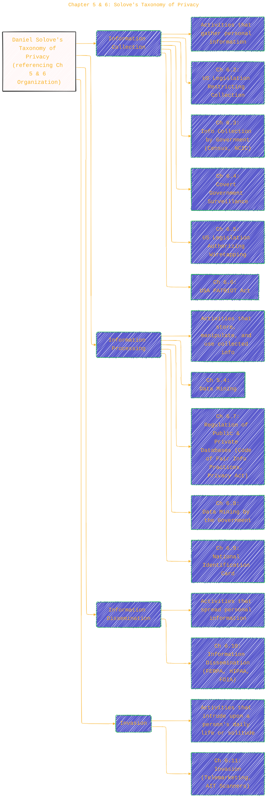

> ⚠️🏗️🚧🦺🧱🪵🪨🪚🛠️👷
> 
> This is a working draft in progress
> 
> 
>
> gif image is provided by [Giphy](https://giphy.com)
> 
> ⚠️🏗️🚧🦺🧱🪵🪨🪚🛠️👷


----


## Visualizing "Ethics for the Information Age, 8th Edition"

> **Disclaimer:**
>
> This document contains my personal notes on the topic,
> compiled from publicly available documentation and various cited sources.
> The materials are intended for educational purposes, personal study, and reference.
> The content is dual-licensed:
> 1. **MIT License:** Applies to all code implementations (Swift, Mermaid, and other programming languages).
> 2. **Creative Commons Attribution-ShareAlike 4.0 International License (CC BY-SA 4.0):** Applies to all non-code content, including text, explanations, diagrams, and illustrations.
---

This collection aims to visually represent the structure, key themes, and concepts presented in Michael J. Quinn's textbook.

### 1. Overall Book Structure 🗺️

A mindmap is a great way to get a bird's-eye view of the book's organization, including its chapters, appendices, and the insightful interviews interspersed throughout.


**Caption for Diagram 1:** This mindmap provides a hierarchical overview of "Ethics for the Information Age," 8th edition, detailing the preface, organization, chapter topics, appendices, and notable interviews. Key updates in the 8th edition are highlighted under the preface. (Source: Quinn, M. J. (2020). *Ethics for the Information Age* (8th ed.). Pearson.)

---

### 2. Concentric Rings Model of Chapters 3-10 🎯

The preface mentions that Chapters 3-10 can be thought of as "forming concentric rings around a particular computer user." This diagram illustrates that concept.

```mermaid
---
title: "Concentric Rings Model of Chapters 3-10"
author: "Cong Le"
version: "1.0"
license(s): "MIT, CC BY-SA 4.0"
copyright: "Copyright (c) 2025 Cong Le. All Rights Reserved."
config:
  layout: elk
  theme: base
  look: handDrawn
---
%%%%%%%% Mermaid version v11.4.1-b.14
%%%%%%%% Available curve styles include the following keywords:
%% basis, bumpX, bumpY, cardinal, catmullRom, linear, monotoneX, monotoneY, natural, step, stepAfter, stepBefore.
%%{
  init: {
    'flowchart': { 'htmlLabels': true, 'curve': 'basis' },
    'fontFamily': 'American Typewriter, monospace',
    'logLevel': 'fatal',
    'themeVariables': {
      'primaryColor': '#22BB',
      'primaryTextColor': '#F8B229',
      'lineColor': '#F8B229',
      'primaryBorderColor': '#27AE60',
      'secondaryColor': '#E2F1',
      'secondaryTextColor': '#6C3483',
      'secondaryBorderColor': '#A569BD',
      'fontSize': '20px'
    }
  }
}%%
flowchart TD
    subgraph ConcentricRings["Book Chapters 3-10 Organization"]
	style ConcentricRings fill:#DD22
        User["💻 Computer User"]
        Ch3["Ch 3:<br/>Networked Communications"]
        Ch4["Ch 4:<br/>Intellectual Property"]
        Ch5["Ch 5:<br/>Information Privacy"]
        Ch6["Ch 6:<br/>Privacy & the Government"]
        Ch7["Ch 7:<br/>Computer & Network Security"]
        Ch8["Ch 8:<br/>Computer Reliability"]
        Ch9["Ch 9:<br/>Professional Ethics"]
        Ch10["Ch 10:<br/>Work & Wealth"]

        User --> Ch3
        Ch3 --> Ch4
        Ch4 --> Ch5
        Ch5 --> Ch6
        Ch6 --> Ch7
        Ch7 --> Ch8
        Ch8 --> Ch9
        Ch9 --> Ch10
    end
    style User fill:#f9f2,stroke:#333,stroke-width:4px
    style Ch3 fill:#22BB
    style Ch4 fill:#22BB
    style Ch5 fill:#22BB
    style Ch6 fill:#22BB
    style Ch7 fill:#22BB
    style Ch8 fill:#22BB
    style Ch9 fill:#22BB
    style Ch10 fill:#22BB

    %% note right of Ch3
    %%    Innermost ring, focusing on
    %%    direct user communications.
    %% endnote
    %% note right of Ch10
    %%    Outer ring, focusing on
    %%    broader societal impacts.
    %% endnote
```



**Caption for Diagram 2:** This diagram visualizes the "concentric rings" model described in the preface for Chapters 3 through 10 of Quinn's textbook. It shows how the topics move from the individual user's immediate interactions outwards to broader societal and economic issues. (Source: Quinn, M. J. (2020). *Ethics for the Information Age* (8th ed.). Pearson. Preface, "Organization of the Book".)

---

### 3. Chapter 1: Milestones in Information Technology ⏳

Chapter 1 discusses the history of computing, networking, and information storage. A timeline helps visualize these parallel developments.


**Caption for Diagram 3:** This timeline illustrates key milestones in computing, networking, and information storage/retrieval as detailed in Chapter 1 ("Catalysts for Change") of Quinn's textbook. (Source: Quinn, M. J. (2020). *Ethics for the Information Age* (8th ed.). Pearson. Sections 1.2, 1.3, 1.4.)

---

### 4. Chapter 2: Overview of Ethical Theories 🧐

Chapter 2 introduces various ethical theories. This DOT graph provides a classification.


**Caption for Diagram 4:** This diagram classifies the ethical theories discussed in Chapter 2 of Quinn's textbook, outlining their core tenets and key pros/cons. Workable theories are bolded. The utilitarian calculus is conceptually represented as $U_{act} = \sum_{i} (Benefit_i - Harm_i)$. (Source: Quinn, M. J. (2020). *Ethics for the Information Age* (8th ed.). Pearson. Sections 2.2-2.10.)

---

### 5. Workable Ethical Theories: Core Focus ✨

Chapter 2 identifies five ethical theories as "workable" for analyzing moral problems. This diagram highlights their primary focus.


**Caption for Diagram 5:** This diagram compares the five workable ethical theories identified in Chapter 2.11 of Quinn's textbook, focusing on their distinct approaches to moral decision-making. (Source: Quinn, M. J. (2020). *Ethics for the Information Age* (8th ed.). Pearson. Sections 2.6-2.11.)

---

### 6. Chapter 4: Protecting Intellectual Property 🛡️

Chapter 4 discusses various ways to protect intellectual property. PlantUML can illustrate these as types.


**Caption for Diagram 6:** This diagram outlines the four primary ways of protecting intellectual property discussed in Chapter 4 of Quinn's textbook: Trade Secrets, Trademarks/Service Marks, Patents, and Copyrights, along with their key characteristics. (Source: Quinn, M. J. (2020). *Ethics for the Information Age* (8th ed.). Pearson. Section 4.3.)

---

### 7. Chapter 5 & 6: Solove's Taxonomy of Privacy 🕵️‍♀️

Chapters 5 and 6 delve into privacy issues. The preface to Chapter 6 mentions organizing the discussion using Daniel Solove's taxonomy of privacy. This can be visualized.



**Caption for Diagram 7:** This diagram illustrates Daniel Solove's taxonomy of privacy (Information Collection, Processing, Dissemination, and Invasion), which Chapter 6 of Quinn's textbook uses as an organizing principle for discussing privacy and the US government. Relevant sub-sections from Chapter 6 are mapped to this taxonomy, along with some topics from Chapter 5. (Source: Quinn, M. J. (2020). *Ethics for the Information Age* (8th ed.). Pearson. Preface to Ch 6, and sections as indicated.)

---

### 8. Chapter 8: Software Engineering Process ⚙️

Chapter 8 discusses software engineering, which includes a four-step process for software development.

```mermaid
---
title: "Chapter 8: Software Engineering Process"
author: "Cong Le"
version: "1.0"
license(s): "MIT, CC BY-SA 4.0"
copyright: "Copyright (c) 2025 Cong Le. All Rights Reserved."
config:
  layout: elk
  theme: base
  look: handDrawn
---
%%%%%%%% Mermaid version v11.4.1-b.14
%%%%%%%% Available curve styles include the following keywords:
%% basis, bumpX, bumpY, cardinal, catmullRom, linear, monotoneX, monotoneY, natural, step, stepAfter, stepBefore.
%%{
  init: {
    'flowchart': { 'htmlLabels': true, 'curve': 'basis' },
    'fontFamily': 'American Typewriter, monospace',
    'logLevel': 'fatal',
    'themeVariables': {
      'primaryColor': '#22BB',
      'primaryTextColor': '#F8B229',
      'lineColor': '#F8B229',
      'primaryBorderColor': '#27AE60',
      'secondaryColor': '#E2F1',
      'secondaryTextColor': '#6C3483',
      'secondaryBorderColor': '#A569BD',
      'fontSize': '20px'
    }
  }
}%%
flowchart LR
    A[Specification (8.9.1) <br/> Defining functions, requirements, constraints] --> B(Development (8.9.2) <br/> Producing software to meet specs, design, coding)
    B --> C(Validation (8.9.3) <br/> Testing software against specs & user needs)
    C --> D(Evolution (8.9.4) <br/> Modifying software for changing needs)
    D --> A_loop((Start New Cycle / Maintenance))
    style A fill:#cceeff
    style B fill:#cceeff
    style C fill:#cceeff
    style D fill:#cceeff
```

**Caption for Diagram 8:** This flowchart illustrates the four-step software engineering process (Specification, Development, Validation, Evolution) as described in Section 8.9 of Quinn's textbook. It emphasizes the cyclical nature of software development and maintenance. (Source: Quinn, M. J. (2020). *Ethics for the Information Age* (8th ed.). Pearson. Section 8.9.)

---

### 9. Chapter 9: Software Engineering Code of Ethics - Preamble Insights 🤔

The preamble to the Software Engineering Code of Ethics (Chapter 9) suggests questions to ask when facing ethical tensions, reflecting various ethical theories.


**Caption for Diagram 9:** This diagram highlights the key questions proposed in the preamble to the Software Engineering Code of Ethics (analyzed in Section 9.4.1 of Quinn's textbook) for guiding ethical judgment when rules conflict. Each question reflects underlying principles from different workable ethical theories. (Source: Quinn, M. J. (2020). *Ethics for the Information Age* (8th ed.). Pearson. Section 9.4.1.)

---

### 10. Appendix B: Valid Argument - Modus Ponens ⚖️

Appendix B introduces argumentation. Modus Ponens is a fundamental form of valid deductive reasoning. Logical notation can be used here.

```dot
/*
 * title: Appendix B: Valid Argument - Modus Ponens
 * author: Cong Le
 * version: 1.0
 * license(s): MIT, CC BY 4.0
 * copyright: Copyright (c) 2025 Cong Le. All Rights Reserved.
 */
digraph ModusPonens {
    rankdir=TB;
    node [shape=plaintext];

    label="Valid Argument: Modus Ponens (Affirming the Antecedent)\nAppendix B.2.1";
    fontsize=14;

    Premise1 [label="Warrant: If P, then Q  (P → Q)"];
    Premise2 [label="Grounds: P is true"];
    Conclusion [label="Therefore, Q is true"];

    edge [dir=none];
    Premise1 -> Premise2 [style=invis]; // for layout
    {Premise1, Premise2} -> Conclusion [label=" Logically Implies", dir=forward, color=blue, style=bold, labelfontcolor=blue];
}
```



**Caption for Diagram 10:** This illustrates the logical structure of *Modus Ponens* (Affirming the Antecedent), a type of valid argument discussed in Appendix B.2.1 of Quinn's textbook. If the premises ($P \rightarrow Q$ and $P$) are true, the conclusion ($Q$) must be true. (Source: Quinn, M. J. (2020). *Ethics for the Information Age* (8th ed.). Pearson. Appendix B.2.1.)

---

### 11. Appendix B: Common Fallacy - Affirming the Consequent 🚫

Appendix B also covers common logical fallacies. Affirming the Consequent is an example of an invalid argument form.

```dot
/*
 * title: Appendix B: Common Fallacy - Affirming the Consequent
 * author: Cong Le
 * version: 1.0
 * license(s): MIT, CC BY 4.0
 * copyright: Copyright (c) 2025 Cong Le. All Rights Reserved.
 */
digraph AffirmingConsequent {
    rankdir=TB;
    node [shape=plaintext];

    label="Fallacy: Affirming the Consequent\nAppendix B.4.1";
    fontsize=14;

    Premise1_F [label="Warrant: If P, then Q  (P → Q)"];
    Premise2_F [label="Grounds: Q is true"];
    Conclusion_F [label="Therefore, P is true (INVALID!)"];

    edge [dir=none];
    Premise1_F -> Premise2_F [style=invis]; // for layout
    {Premise1_F, Premise2_F} -> Conclusion_F [label=" Does NOT Logically Imply", dir=forward, color=red, style=bold, labelfontcolor=red];
}
```



**Caption for Diagram 11:** This diagram shows the structure of the fallacy of *Affirming the Consequent*, an invalid argument form discussed in Appendix B.4.1 of Quinn's textbook. Even if the premises ($P \rightarrow Q$ and $Q$) are true, the conclusion ($P$) is not necessarily true. (Source: Quinn, M. J. (2020). *Ethics for the Information Age* (8th ed.). Pearson. Appendix B.4.1.)

---

### 12. Typical Chapter Features 🧩

Many chapters in the book follow a consistent structure, including an introduction, core content, case studies, summaries, questions, and often an interview.


**Caption for Diagram 12:** This pie chart illustrates the typical components and relative emphasis found in many chapters of "Ethics for the Information Age," showcasing its pedagogical approach to exploring complex ethical issues. (Source: Observation based on the Table of Contents in Quinn, M. J. (2020). *Ethics for the Information Age* (8th ed.). Pearson.)

---

These diagrams provide a visual journey through the main themes and structure of "Ethics for the Information Age, 8th edition." They aim to make the complex interplay of technology, society, and ethics more accessible and understandable. 👍 Computer ethics is a dynamic field, and this book appears to offer a thorough grounding in its multifaceted issues.

---

```mermaid
---
title: "❓...CongLeSolutionX....❓"
author: "Cong Le"
version: "1.0"
license(s): "MIT, CC BY-SA 4.0"
copyright: "Copyright (c) 2025 Cong Le. All Rights Reserved."
config:
  theme: base
---
%%%%%%%% Mermaid version v11.4.1-b.14
%%{
  init: {
    'flowchart': { 'htmlLabels': false },
    'fontFamily': 'Bradley Hand',
    'themeVariables': {
      'primaryColor': '#fc82',
      'primaryTextColor': '#F8B229',
      'primaryBorderColor': '#27AE60',
      'secondaryColor': '#8784',
      'secondaryTextColor': '#6C3483',
      'lineColor': '#F8B229',
      'fontSize': '20px'
    }
  }
}%%
flowchart LR
    My_Meme@{ img: "https://raw.githubusercontent.com/CongLeSolutionX/CongLeSolutionX/refs/heads/main/assets/images/My-meme-questions-magnifying-glass-tangled-lines-bubble-thought.png", label: "✍️...🤔❓🤔...👨🏼‍💻", pos: "b", w: 200, h: 150, constraint: "on" }
    Link_to_my_profile{{"<a href='https://github.com/CongLeSolutionX' target='_blank'>Click here if you care about my profile</a>"}}

  Closing_quote@{ shape: braces, label: "If you understood all the world's rules,<br/>would you break them<br/>or<br/>write new ones....?"}
    
   Closing_quote ~~~ My_Meme
    
  Link_to_my_profile{{"<a href='https://github.com/CongLeSolutionX' target='_blank'>Click here if you care about my profile</a>"}}

  Closing_quote ~~~ My_Meme
  My_Meme animatingEdge@--> Link_to_my_profile
  
  animatingEdge@{ animate: true }


```

---
>**Licenses:**
>
>- **MIT License:**  [](LICENSE) - Full text in [LICENSE](LICENSE) file.
>- **Creative Commons Attribution-ShareAlike 4.0 International**: [CC BY-SA 4.0](https://creativecommons.org/licenses/by-sa/4.0/) [](https://creativecommons.org/licenses/by-sa/4.0/) - Legal details in [LICENSE-CC-BY-SA-4.0](THE_PAST/LICENSE-CC-BY-SA-4.0) and at [Creative Commons official site](https://creativecommons.org/licenses/by-sa/4.0/).
>
---


**References (Primary):**

*   Quinn, M. J. (2020). *Ethics for the Information Age* (8th ed.). Pearson. (All diagrams are interpretations based on the Table of Contents and Preface of this book.)

----

