> ⚠️🏗️🚧🦺🧱🪵🪨🪚🛠️👷
> 
> This is a working draft in progress
> 
> 
>
> gif image is provided by [Giphy](https://giphy.com)
> 
> ⚠️🏗️🚧🦺🧱🪵🪨🪚🛠️👷


----


## Chapter 1: Catalysts for Change – A Detailed Exploration
<<<<<<< HEAD
=======

>>>>>>> main
> <ins>📢 **Disclaimer** 🚨</ins>
>
> This document contains my personal notes on the topic,
> compiled from publicly available documentation and various cited sources.
> The materials are intended for educational purposes, personal study, and reference.
> The content is dual-licensed:
> 1. **MIT License:** Applies to all code implementations (Swift, Mermaid, and other programming languages).
> 2. **Creative Commons Attribution-ShareAlike 4.0 International License (CC BY-SA 4.0):** Applies to all non-code content, including text, explanations, diagrams, and illustrations.
---

This chapter sets the stage by exploring the historical evolution of computing, networking, and information storage, and introduces the complex interplay between technology and society.

---

### 1.1 Introduction: The Dawning of the Information Age 🌅

The introduction of Chapter 1 establishes that we are living in the **Information Age**, primarily driven by two catalysts: **low-cost computers** and **high-speed communication networks**. These have given rise to transformative technologies like smartphones and self-driving cars.

Quinn emphasizes that our relationship with technology is intricate:
*   We **create and adopt** technology.
*   Technology, once adopted, **transforms us** and our societal interactions.

These transformations can be:
*   **Physical:** Citing studies on **neuroplasticity** (e.g., London taxi drivers' hippocampi changing with experience) and how digital interactions (Web browsing, social media) can trigger dopamine releases, potentially leading to addictive behaviors.
*   **Perceptual:** The example of cell phones making users feel safer, but also more vulnerable if lost, is given. It also touches on how providing cell phones to children for safety might implicitly teach them not to rely on strangers.
*   **Social:** The **Amish** community is presented as a case study in deliberate technology adoption. Their guiding question, "Does it bring us together, or draw us apart?", exemplifies a conscious approach to integrating technology based on its impact on family and community values.

A core theme is the **dual nature of technology**:
*   **Problem Solver:** Technologies are adopted to solve problems and improve lives (e.g., advances in healthcare like CT/MRI scanners).
*   **Problem Creator:** New technologies often introduce unforeseen challenges (e.g., automobiles providing freedom but causing traffic congestion, or Waze creating new traffic issues). The Web offers vast information but also exposes children to inappropriate content.

The chapter stresses human **agency**: we have control over whether to adopt technologies (e.g., the slowdown in US nuclear power plant construction after Three Mile Island) and can influence the rate of technological development through societal structures like intellectual property laws.

The section concludes by highlighting that understanding IT's history, current issues, and ethics is crucial for making informed decisions about technology use.

**Diagram: The Dual Nature & Impact of Technology (Conceptual)**

```mermaid
---
title: "The Dawning of the Information Age 🌅"
author: "Cong Le"
version: "1.0"
license(s): "MIT, CC BY-SA 4.0"
copyright: "Copyright (c) 2025 Cong Le. All Rights Reserved."
config:
  layout: elk
  theme: base
  look: handDrawn
---
%%%%%%%% Mermaid version v11.4.1-b.14
%%%%%%%% Available curve styles include the following keywords:
%% basis, bumpX, bumpY, cardinal, catmullRom, linear, monotoneX, monotoneY, natural, step, stepAfter, stepBefore.
%%{
  init: {
    'flowchart': { 'htmlLabels': true, 'curve': 'basis' },
    'fontFamily': 'American Typewriter, monospace',
    'logLevel': 'fatal',
    'themeVariables': {
      'primaryColor': '#22BB',
      'primaryTextColor': '#F8B229',
      'lineColor': '#F8B229',
      'primaryBorderColor': '#27AE60',
      'secondaryColor': '#E2F1',
      'secondaryTextColor': '#6C3483',
      'secondaryBorderColor': '#A569BD',
      'fontSize': '20px'
    }
  }
}%%
flowchart TD
    A[Technology Adoption] -->|Solves Existing Problems| B(Benefits & Improvements <br/> e.g., Healthcare Advances, Travel Freedom)
    A -->|Creates New Challenges| C(Unforeseen Problems & Ethical Dilemmas <br/> e.g., Traffic Congestion, Content Control, Job Displacement)

    D[Human Society] <-->|Develops & Adopts| A
    A <-->|Transforms| D

    D --> E{Societal Impact}
    E --> E_PHY[Physical Changes <br/> e.g., Neuroplasticity]
    E --> E_PER[Perceptual Changes <br/> e.g., Feelings of Safety/Vulnerability]
    E --> E_SOC[Social Changes <br/> e.g., Amish Selectivity, Community Structures]

    style A fill:#A2DAFF,stroke:#333,stroke-width:2px
    style D fill:#F2B3AE,stroke:#333,stroke-width:2px
    style B fill:#C2F2AE,stroke:#333,stroke-width:1px
    style C fill:#F2C2AE,stroke:#333,stroke-width:1px
    style E fill:#FFFFAA,stroke:#333,stroke-width:1px
```



**Caption for Diagram 1:** This diagram illustrates the core themes from Section 1.1: technology is developed and adopted by society, leading to both benefits and new challenges. This adoption, in turn, transforms society physically, perceptually, and socially. (Source: Quinn, M. J. (2020). *Ethics for the Information Age* (8th ed.). Pearson. Section 1.1.)

---

### 1.2 Milestones in Computing 🧮➡️💻

This section traces the evolution of computing devices, noting their drivers (commerce, government, science, war) and societal impacts.

*   **Aids to Manual Calculating (Ancient - 19th C):**
	*   **Tablets, Abacus:** Essential for commerce beyond basic counting.
	*   **Mathematical Tables (Logarithms - 17th C):** Time-savers but prone to errors, motivating automation.
*   **Mechanical Calculators (17th C - 19th C):**
	*   **Pascal & Leibniz:** Early attempts (adder, Step Reckoner for +,-,*,/). Not commercially successful due to reliability.
	*   **Arithmometer (de Colmar, 19th C):** First commercially successful calculator, used by insurance companies.
	*   **Difference Engine (Babbage, Scheutz):** Aimed to automate table calculation and typesetting. Scheutz's version was used for astronomical calculations.
	*   **Gilded Age Impact (Late 1800s, USA):** Rapid industrialization and larger corporations needed better info processing.
	*   **Burroughs Adding Machine Co.:** Dominated due to manufacturing and marketing.
	*   **Social Impact:** Led to "de-skilling" and "feminization" of bookkeeping, as calculators made clerks more productive and wages were lowered.
*   **Cash Register (Ritty, 1879):**
	*   Addressed accounting and embezzlement in stores.
	*   Provided itemized receipts, transaction logs, and improved sales records.
*   **Punched-Card Tabulation (Hollerith, late 1800s):**
	*   **Driver:** US Census Bureau's need to process vast data.
	*   **Innovation:** Cards could be sorted for subtotaling. Saved millions in 1890 census.
	*   **Adoption:** Railroads, retail (Marshall Field's), heavy industries for cost accounting.
	*   **IBM's Roots:** Hollerith's company evolved into IBM.
	*   **Dark Side:** IBM machines (via Dehomag) were crucial for the Nazi government in identifying and persecuting Jews during the Holocaust.
*   **Precursors of Commercial Computers (WWII Era):**
	*   **Atanasoff-Berry Computer (1939-41):** First electronic device with vacuum tubes (not programmable).
	*   **ENIAC (Mauchly, Eckert, 1946):** Electronic, programmable (by rewiring), 2,400x faster than desk calculators. For artillery tables. *(Figure 1.6 in the book shows female programmers)*.
	*   **EDVAC (Concept):** Improvement over ENIAC, notably the stored-program concept.
	*   **Small-Scale Experimental Machine (Manchester, 1948):** First operational, fully electronic computer with stored program and data (used Williams Tube CRT storage).
*   **First Commercial Computers (1951 onwards):**
	*   **Ferranti Mark 1 (UK, 1951):** World's first commercial computer.
	*   **UNIVAC I (Eckert-Mauchly/Remington Rand, 1951):** Sold to US Census Bureau. Famously predicted 1952 Eisenhower election landslide. Sold 46 units.
	*   **IBM Enters (1953):** Initially inferior, but strong sales, marketing, and R&D led to market dominance by mid-1960s.
*   **Programming Languages and Time-Sharing (1950s-60s):**
	*   **Assembly Language:** Symbolic representation of machine code.
	*   **Sort-Merge Generator (Holberton, UNIVAC, 1951):** Early automation.
	*   **A-0 System (Hopper, Remington Rand):** Linked subroutines.
	*   **FORTRAN (Backus, IBM, 1957):** For scientific applications, efficient code generation, increased programmer productivity significantly.
	*   **COBOL (Committee, 1959):** For business, pushed by US Dept. of Defense for compatibility.
	*   **Dartmouth Time-Sharing System (DTSS) & BASIC (Kemeny, Kurtz, early 1960s):** Made computers accessible to more people by sharing costs and providing an easy-to-learn language.
*   **Transistor and Integrated Circuit (1948 onwards):**
	*   **Transistor (Bell Labs, Shockley, 1948):** Semiconductor substitute for vacuum tubes (less power, heat, more reliable). Driven by AT&T's network needs.
	*   **Fairchild Semiconductor (Noyce, Moore, 1957):** Founded by "traitorous eight" from Shockley Semi.
	*   **Integrated Circuit (IC) (Noyce at Fairchild, Kilby at TI, independently):** Miniaturized electronic components.
	*   **Cold War Impact:** Minuteman II missile program was a major consumer/driver of IC tech (1962-65), improving ruggedness and reliability.
	*   **Moore's Law (Moore, 1965):** Observation that transistor count on ICs doubles approx. every two years.
*   **IBM System/360 (1964):**
	*   Series of compatible mainframes.
	*   Allowed businesses to upgrade without rewriting software, crucial as software investment grew.
*   **Microprocessor (Hoff, Mazor, Faggin at Intel, 1971):**
	*   **Intel 4004:** World's first microprocessor, general-purpose chip. Computing power of ENIAC in a tiny chip.
	*   Enabled integration of computers into everyday devices.
*   **Personal Computer (1970s onwards):**
	*   **Counterculture Influence (SF Bay Area):** Do-it-yourself idealism.
		*   *Whole Earth Catalog (Brand, 1968):* "Google in paperback form," tools for individual transformation.
		*   *People's Computer Company:* Educate people on computer use, free software sharing.
		*   *Homebrew Computer Club (1975):* Hobbyists building PCs.
	*   **Altair 8800 (MITS, 1975):** Early PC kit.
	*   **Altair BASIC (Gates, Allen / Micro-Soft):** Software theft controversy arose ("Open Letter to Hobbyists").
	*   **Apple Computer (Wozniak, Jobs):**
		*   *Apple I:* Powerful, keyboard input, TV output.
		*   *Apple II:* Hugely popular.
	*   **Business Adoption Drivers:**
		*   *VisiCalc (Bricklin, Frankston, 1979):* First spreadsheet program, a "killer app" for Apple II.
		*   *IBM PC (1981):* Open architecture, legitimized PCs for business. Fueled Microsoft's growth (DOS royalties).

**Diagram: Key Developments in Computing History (Simplified Flow)**

```mermaid
---
title: "Milestones in Computing 🧮➡️💻"
author: "Cong Le"
version: "1.0"
license(s): "MIT, CC BY-SA 4.0"
copyright: "Copyright (c) 2025 Cong Le. All Rights Reserved."
config:
  layout: elk
  theme: base
  look: handDrawn
---
%%%%%%%% Mermaid version v11.4.1-b.14
%%%%%%%% Available curve styles include the following keywords:
%% basis, bumpX, bumpY, cardinal, catmullRom, linear, monotoneX, monotoneY, natural, step, stepAfter, stepBefore.
%%{
  init: {
    'flowchart': { 'htmlLabels': true, 'curve': 'basis' },
    'fontFamily': 'American Typewriter, monospace',
    'logLevel': 'fatal',
    'themeVariables': {
      'primaryColor': '#22BB',
      'primaryTextColor': '#F8B229',
      'lineColor': '#F8B229',
      'primaryBorderColor': '#27AE60',
      'secondaryColor': '#E2F1',
      'secondaryTextColor': '#6C3483',
      'secondaryBorderColor': '#A569BD',
      'fontSize': '20px'
    }
  }
}%%
flowchart LR
    subgraph Early_Aids ["Manual & Mechanical Era"]
        M_CALC["Aids to Manual Calculation <br/> (Abacus, Tables)"] --> MECH_CALC["Mechanical Calculators <br/> (Pascal, Leibniz, Arithmometer)"]
        MECH_CALC --> CASH_REG["Cash Register <br/> (Ritty)"]
        MECH_CALC --> PUNCH_CARD["Punched-Card Tabulation <br/> (Hollerith - precursor to IBM) <br/> <i>Impact: Census, Business, Holocaust</i>"]
    end

    subgraph Electronic_Revolution ["Electronic & Programmatic Era"]
        PUNCH_CARD --> PRE_COMM["Precursors of Commercial Computers <br/> (Atanasoff-Berry, ENIAC, EDVAC, SSEM) <br/> <i>Impact: Calculation Speed, Stored Program</i>"]
        PRE_COMM --> FIRST_COMM["First Commercial Computers <br/> (Ferranti Mark 1, UNIVAC I) <br/> <i>Impact: Mainstream Business Use</i>"]
        FIRST_COMM --> LANG_TS["Programming Languages & Time-Sharing <br/> (FORTRAN, COBOL, BASIC) <br/> <i>Impact: Accessibility, Productivity</i>"]
    end

    subgraph Miniaturization_Personalization ["Miniaturization & Personalization Era"]
        TRANS_IC["Transistor (1948) & Integrated Circuit (IC) <br/> (Bell Labs, Fairchild, TI) <br/> <i>Driven by: Network Needs, Cold War (Minuteman II)</i>"] --> IBM360["IBM System/360 (1964) <br/> <i>Impact: Software Compatibility</i>"]
        TRANS_IC --> MICROPROC["Microprocessor (Intel 4004, 1971) <br/> <i>Impact: Embedded Computing</i>"]
        MICROPROC --> PC["Personal Computer (1970s) <br/> (Altair, Apple, IBM PC) <br/> <i>Drivers: Hobbyists, Counterculture, VisiCalc</i>"]
    end

    Early_Aids --> Electronic_Revolution
    Electronic_Revolution --> Miniaturization_Personalization

    style PUNCH_CARD fill:#FFB6C1,stroke:#A52A2A
    style PRE_COMM fill:#ADD8E6
    style LANG_TS fill:#ADD8E6
    style TRANS_IC fill:#LIGHTGREEN
    style PC fill:#LIGHTGREEN
```



**Caption for Diagram 1.2:** A simplified flowchart showing key milestones in the history of computing, from manual aids to the personal computer, highlighting some drivers and impacts as discussed in Section 1.2 of Quinn's textbook. (Source: Quinn, M. J. (2020). *Ethics for the Information Age* (8th ed.). Pearson. Section 1.2.)

---

### 1.3 Milestones in Networking 🔗🌍

This section details the progression of communication technologies that laid the groundwork for today's interconnected world.

*   **Context (Early 19th C):** USA lagged Europe in networking (Europe had semaphore telegraphs). Samuel Morse proposed an electric telegraph.
*   **Electricity and Electromagnetism (17th C - 1830):**
	*   **Volta (1799):** Battery (chemical electricity generation).
	*   **Oersted (1820):** Electric current creates a magnetic field.
	*   **Sturgeon (1825):** Electromagnet.
	*   **Henry (1830):** Demonstrated telegraph potential with electromagnet and bell.
*   **Telegraph (Morse, 1837 onwards):**
	*   Patented 1838; first line Washington-Baltimore (1844).
	*   Rapid expansion; transcontinental line (1861) ended Pony Express.
	*   Used for fire alarms by 1870.
*   **Telephone (Bell, 1876):**
	*   Evolved from work on harmonic telegraph (sending multiple messages over one wire).
	*   Initially for business, home use grew after first patent expired (1890s).
	*   **Social Impact:** Blurred private/public boundaries, eroded social hierarchies (e.g., citizens calling governor), raised privacy concerns (eavesdropping), created first "online" communities (party lines), real-time election returns (1896).
*   **Typewriter and Teletype (1867, 1908):**
	*   **Typewriter (Sholes, Glidden, Soule, 1867; Remington commercialized 1873):** Produced typeset-like documents.
	*   **Teletype (Krum brothers, 1908):** Modified typewriter printing messages transmitted over telegraph line. Used by news orgs, Wall Street.
*   **Radio (Late 19th C - 20th C):**
	*   **Maxwell:** Mathematical theory of electromagnetism, predicted electromagnetic waves.
	*   **Hertz (1885):** Generated electromagnetic waves, proving Maxwell.
	*   **Marconi (1895):** Practical radio signal transmission; saw radio as wireless telegraphy.
	*   **Sarnoff (1916):** Envisioned radio as a "household utility" for entertainment.
	*   **Mass Communication Power:** Orson Welles's "War of the Worlds" (1938) caused panic, demonstrating radio's impact.
*   **Television (1927 onwards):**
	*   **Farnsworth (1927):** First completely electronic TV transmission.
	*   Popularized in US post-1950s.
	*   **Global Reach:** Moon landing broadcast (1969).
	*   **Exit Polling Issues:** 2000 US Presidential election, Voter News Service's premature (and wrong) call for Gore based on flawed data/model.
*   **Remote Computing (Stibitz, 1940):**
	*   Bell Labs' Complex Number Calculator used a teletype for I/O, demonstrated remote operation from Dartmouth to NYC.
*   **ARPANET (1960s):**
	*   **Driver:** US DOD's ARPA, reaction to Sputnik, Licklider's "galactic network" vision.
	*   **Packet-Switched Network:** Alternative to circuit-switched. Developed independently by Davies & Scantlebury (NPL), Baran (RAND), Kleinrock (MIT).
	*   **Decentralized Design:** Crucial decision driven by fear of nuclear attack, ensuring network resilience.
	*   **Interface Message Processor (IMP):** Built by BBN; first four nodes at UCLA, SRI, UCSB, U. Utah (1969).
*   **Email (Tomlinson, 1972):**
	*   Tomlinson (BBN) wrote software for sending/receiving messages on ARPANET.
	*   Roberts created first "killer app" email utility. Became most popular network application.
*   **Internet (1983 onwards):**
	*   **Open Architecture Networking (Kahn):** Connect disparate networks.
	*   **TCP/IP (Cerf, Kahn):** Protocol suite.
		*   *TCP (Transmission Control Protocol):* Divides/reassembles packets.
		*   *IP (Internet Protocol):* Routes data.
	*   **"Birth" of Internet:** Jan 1, 1983 (ARPANET hosts converted to TCP/IP).
*   **NSFNET (Mid-1980s - 1995):**
	*   NSF created TCP/IP network for academia.
	*   Encouraged universities to find commercial customers for regional networks, stimulating private Internet connections.
	*   NSF ceased funding backbone in 1995; commercial providers took over.
*   **Broadband (Ongoing):**
	*   High-speed Internet, enabling large file transfers (images, music, video).
	*   US ranks behind countries like South Korea, Norway, Sweden in average speed.
*   **Wireless Networks (1973 onwards):**
	*   **Cell Phones (Motorola demo, 1973):** Radio-linked calls. Modern smartphones offer diverse services.
	*   **Social Impact:** Dramatic, esp. in developing countries (e.g. M-PESA).
	*   **Wi-Fi (Hotspots, 1993 concept):** Wireless Local Area Networks using radio waves.
*   **Cloud Computing (Modern Era):**
	*   Remote computing resources over Internet.
	*   **Enablers:** High-speed networks, fast/cheap microprocessors & storage, virtualization.
	*   **Providers (e.g., AWS, Azure, Google Cloud):** Offer Software as a Service (SaaS) and Infrastructure as a Service (IaaS).

**Diagram: Evolution of Networking Technologies**


**Caption for Diagram 1.3:** This timeline highlights significant milestones in the development of networking technologies, from foundational discoveries in electricity to modern cloud computing, as presented in Section 1.3 of Quinn's textbook. (Source: Quinn, M. J. (2020). *Ethics for the Information Age* (8th ed.). Pearson. Section 1.3.)

---

### 1.4 Milestones in Information Storage and Retrieval 📜💾🔍

This section covers how humanity has stored and accessed information over millennia.

*   **Greek Alphabet (circa 750 BC):**
	*   First true alphabet (vowels & consonants). Efficient transformation of spoken to written word. Key for transition from oral to written culture.
*   **Codex and Paper (2nd-4th C AD onwards):**
	*   **Codex:** Rectangular pages sewn together (parchment/vellum). More durable and easier to navigate than scrolls. Promoted by the Church for sacred texts.
	*   **Paper (from China, widely adopted by 15th C Europe):** Replaced parchment in less expensive codices.
*   **Gutenberg's Printing Press (1436-1455):**
	*   Used movable metal type. First major work: Gutenberg Bible (1455).
	*   **Impact:** Increased book circulation, lowered prices, increased literacy. Powerful for mass communication (e.g., Martin Luther's Reformation theses, 300,000 copies 1517-1520).
*   **Newspapers (17th C onwards):**
	*   Enabled by printing press. Allowed private citizens to voice views.
	*   **Impact:** Served as counterweight to government. In America, helped unify colonies and sway opinion towards independence.
*   **Hypertext (Conceptual Roots):**
	*   **Vannevar Bush ("As We May Think", 1945):** Described **Memex**, a conceptual information retrieval system with associative links, simulating mind's associative memory.
	*   **Ted Nelson (1965):** Coined "hypertext." Proposed **Xanadu** (1967), a worldwide network of connected literature (never completed).
*   **Graphical User Interface (GUI):**
	*   **Douglas Engelbart (Augmentation Research Center, 1960s):**
		*   Read Bush's article. Vision: augment human intellect.
		*   Developed **NLS (oNLine System)**.
		*   **"Mother of all demos" (1968):** Showcased windows, email, mouse, live videoconferencing. Way ahead of its time.
	*   **Xerox PARC (Palo Alto Research Center, 1970s):**
		*   **Alan Kay** (inspired by Engelbart).
		*   Created **Alto** (small, single-user minicomputer with bitmapped display, keyboard, mouse). Developed intuitive GUI.
		*   Created **Ethernet** for linking Altos.
		*   Xerox failed to successfully market a commercial PC.
	*   **Apple Computer (Late 1970s - 1984):**
		*   Steve Jobs visited Xerox PARC, committed to GUI.
		*   **Lisa (1983):** GUI computer, expensive, slow, not commercially successful.
		*   **Macintosh (1984):** Faster, cheaper ($2,495) GUI computer, instant hit.
	*   **Microsoft Windows 3.0 (1990):** Successful GUI for IBM PCs, gained near monopoly.
*   **Single-Computer Hypertext Systems (1980s):**
	*   **Guide (Peter Brown, Univ. of Kent, 1982):** Commercialized for Mac & PC.
	*   **HyperCard (Apple, 1987):** Stacks of "cards" with text/images, linked by "buttons." Used for games like Myst.
*   **Networked Hypertext: World Wide Web (Berners-Lee, 1989-91):**
	*   **Tim Berners-Lee (CERN):** Inspired by father's discussions of brain-like computer connections. Wrote Enquire (1980).
	*   Proposed networked hypertext system for CERN documentation (1989).
	*   Implemented on NeXT computer. **Key difference:** allowed links between information on *different*_ networked computers (built on TCP/IP).
	*   First Web browser **WorldWideWeb** (Christmas 1990), released at CERN (March 1991).
	*   **Mosaic (Univ. of Illinois):** First widely used Web browser.
*   **Search Engines (Modern Era):**
	*   Accept keywords, search database of documents (Web pages), return relevant matches.
	*   **Google:** Most popular. High precision due to **PageRank** algorithm (assumes importance/quality by how often other sites link to a page).
*   **Cloud Storage (Modern Era):**
	*   Storing data remotely on servers accessed via Internet (e.g., Dropbox, Google Drive, iCloud).
	*   **Benefits:** Access from multiple devices, easy sharing, automatic backups.

**Diagram: Information Storage & Retrieval - From Codex to Cloud**

```mermaid
---
title: "Milestones in Information Storage and Retrieval 📜💾🔍"
author: "Cong Le"
version: "1.0"
license(s): "MIT, CC BY-SA 4.0"
copyright: "Copyright (c) 2025 Cong Le. All Rights Reserved."
config:
  layout: elk
  theme: base
  look: handDrawn
---
%%%%%%%% Mermaid version v11.4.1-b.14
%%%%%%%% Available curve styles include the following keywords:
%% basis, bumpX, bumpY, cardinal, catmullRom, linear, monotoneX, monotoneY, natural, step, stepAfter, stepBefore.
%%{
  init: {
    'flowchart': { 'htmlLabels': true, 'curve': 'basis' },
    'fontFamily': 'American Typewriter, monospace',
    'logLevel': 'fatal',
    'themeVariables': {
      'primaryColor': '#22BB',
      'primaryTextColor': '#F8B229',
      'lineColor': '#F8B229',
      'primaryBorderColor': '#27AE60',
      'secondaryColor': '#E2F1',
      'secondaryTextColor': '#6C3483',
      'secondaryBorderColor': '#A569BD',
      'fontSize': '20px'
    }
  }
}%%
flowchart TD
    A["Ancient Writing <br/> Greek Alphabet"] --> B("Codex & Paper <br/> <i>Improved Durability & Access</i>")
    B --> C("Gutenberg's Printing Press <br/> ~1450s <br/> <i>Mass Communication, Literacy</i>")
    C --> D["Newspapers <br/> <i>Public Discourse, Unifying Force</i>"]
    
    subgraph Digital_Hypertext_Era["Digital & Hypertext Era"]
        E["Hypertext Concepts <br/> Bush (Memex, 1945) <br/> Nelson (Xanadu, 1967)"]
        F["Graphical User Interface (GUI) <br/> Engelbart (NLS, 1968) <br/> Xerox PARC (Alto) <br/> Apple (Macintosh, 1984) <br/> Microsoft (Windows, 1990)"]
        G["Single-Computer Hypertext <br/> Guide, HyperCard (1980s)]
        H[World Wide Web <br/> Berners-Lee (1990) <br/> <i>Networked Hypertext</i>"]
        I["Search Engines <br/> Google (PageRank) <br/> <i>Information Discovery</i>"]
        J["Cloud Storage <br/> <i>Remote Data Access & Sharing</i>"]
    end

    D --> E;
    E --> F;

	%% GUI also built on earlier document concepts
    D --> F
    
    F --> G;
    G --> H;
    H --> I;
    I --> J;

	%% WWW enables cloud storage
    H -.-> J

    style C fill:#FFD700
    style F fill:#ADD8E6
    style H fill:#90EE90
    style J fill:#E6E6FA
```



**Caption for Diagram 1.4:** This diagram charts the evolution of information storage and retrieval from ancient writing systems to modern cloud storage, as covered in Section 1.4 of Quinn's textbook. Key innovations and their impacts are noted. (Source: Quinn, M. J. (2020). *Ethics for the Information Age* (8th ed.). Pearson. Section 1.4.)

---

### Interplay: Social Conditions 🔄 Technology

Throughout Sections 1.1-1.4, a recurring theme is the dynamic interplay where **social conditions drive technological development**, and **new technologies, in turn, reshape society.**

```mermaid
---
title: "Interplay: Social Conditions 🔄 Technology"
author: "Cong Le"
version: "1.0"
license(s): "MIT, CC BY-SA 4.0"
copyright: "Copyright (c) 2025 Cong Le. All Rights Reserved."
config:
  layout: elk
  theme: base
  look: handDrawn
---
%%%%%%%% Mermaid version v11.4.1-b.14
%%%%%%%% Available curve styles include the following keywords:
%% basis, bumpX, bumpY, cardinal, catmullRom, linear, monotoneX, monotoneY, natural, step, stepAfter, stepBefore.
%%{
  init: {
    'flowchart': { 'htmlLabels': true, 'curve': 'basis' },
    'fontFamily': 'American Typewriter, monospace',
    'logLevel': 'fatal',
    'themeVariables': {
      'primaryColor': '#22BB',
      'primaryTextColor': '#F8B229',
      'lineColor': '#F8B229',
      'primaryBorderColor': '#27AE60',
      'secondaryColor': '#E2F1',
      'secondaryTextColor': '#6C3483',
      'secondaryBorderColor': '#A569BD',
      'fontSize': '20px'
    }
  }
}%%
flowchart LR
    subgraph Cycle["Social Conditions ↔ Technology Cycle"]
        SC["Social Needs & Conditions <br/>(e.g., Commerce, War, Census, Communication Demands, <br/> Desire for Efficiency/Knowledge Sharing)"]
        TD["Technological Development & Innovation <br/>(e.g., Calculators, Computers, Networks, Printing Press, GUI)"]
        TA["Technology Adoption & Use"]
        SI["Societal Impact & Transformation <br/>(e.g., De-skilling, New Industries, Changed Communication Norms, <br/> Information Access, New Ethical Dilemmas)"]

        SC --"Drive/Motivate"--> TD
        TD --"Leads to"--> TA
        TA --"Results in"--> SI
        SI --"Creates New"--> SC
    end

    style SC fill:#FADBD8
    style TD fill:#D4E6F1
    style TA fill:#D1F2EB
    style SI fill:#FCF3CF
```



**Caption for Diagram - Interplay:** This conceptual diagram illustrates the cyclical relationship between social conditions and technological advancement as implicitly and explicitly discussed throughout Chapter 1. Societal needs motivate technological innovation, the adoption of which transforms society, creating new conditions and needs. (Source: Synthesized from Quinn, M. J. (2020). *Ethics for the Information Age* (8th ed.). Pearson. Sections 1.1-1.4.)

**Examples from the Text:**
*   **Census Needs (Social Condition) → Punched-Card Tabulators (Technology Development)**
*   **WWII (Social Condition) → Advancements in Radar & Early Computers (Technology Development)**
*   **Printing Press (Technology) → Increased Literacy & Reformation (Societal Impact)**
*   **Telephone (Technology) → Blurred Public/Private Boundaries (Societal Impact)**
*   **Desire for Efficient Calculation in Gilded Age (Social Condition) → Commercial Calculators (Technology Development)**
*   **Counterculture's Desire for Empowerment (Social Condition) → Personal Computers (Technology Development)**

---

### 1.5 Contemporary Information Technology Issues ❓🤔

Section 1.5 lists several pressing questions raised by the growth of IT, setting the stage for the rest of the book.

*   **Intellectual Property Rights:** What are reasonable rights in the digital age? How should laws adapt to easy copying (e.g., *Game of Thrones* piracy, Windows 10 for pirated copies)?
*   **Cloud Storage:** Reliability and security concerns for remotely stored data.
*   **Credit Card Information:** Balancing convenience with risks of theft (e.g., Target breach) and privacy implications of purchase tracking. Who owns transaction data?
*   **IT in Loan Applications:** Shift from personal interviews to credit bureau consultations – advantages and disadvantages?
*   **Software Errors & Liability:** Who is liable when bugs in critical systems (e.g., traffic signals, pacemakers) cause harm or death?
*   **Employee Monitoring:** Impact of tracking calls, keystrokes, web visits, email. Does it create unacceptable stress?
*   **Telecommuting:** Advantages and disadvantages.
*   **IT Industry Decentralization & Job Shifts:** Movement of IT jobs from Silicon Valley to other global hotspots (e.g., India, China). Impact on US jobs.
*   **Labor Conditions in Tech Manufacturing:** Ethical sourcing, exemplified by criticisms of Foxconn (manufacturer for Apple, Amazon, etc.). Consumer boycotts – effective or harmful?
*   **"Fake News" & Democracy:** Can the free exchange of information via new tech strengthen or undermine democracies?

**Diagram: Landscape of Contemporary IT Issues (from Section 1.5)**


**Caption for Diagram 1.5:** This mindmap categorizes the contemporary information technology issues raised in Section 1.5 of Quinn's textbook, highlighting the ethical questions spurred by modern IT advancements. (Source: Quinn, M. J. (2020). *Ethics for the Information Age* (8th ed.). Pearson. Section 1.5.)

---

### Summary of Chapter 1 Insights 💡

The chapter summary reinforces key takeaways:
1.  **Evolution, Not Revolution:** Most innovations are evolutionary steps building on prior work.
2.  **Long History of IT Impact:** Significant social changes from technologies like the telegraph, telephone, and radio predate PCs and the Web.
3.  **New Ethical Questions:** Rapid tech change raises many new questions testing our values.
4.  **Human Agency (Papert's Quote):** We have control over how we use technology. The key is not to predict the future but to *make* it responsibly.

**Diagram: Seymour Papert's Quote - Human Agency in Technology**

```mermaid
---
title: "Summary of Chapter 1 Insights 💡"
author: "Cong Le"
version: "1.0"
license(s): "MIT, CC BY-SA 4.0"
copyright: "Copyright (c) 2025 Cong Le. All Rights Reserved."
config:
  layout: elk
  theme: base
  look: handDrawn
---
%%%%%%%% Mermaid version v11.4.1-b.14
%%%%%%%% Available curve styles include the following keywords:
%% basis, bumpX, bumpY, cardinal, catmullRom, linear, monotoneX, monotoneY, natural, step, stepAfter, stepBefore.
%%{
  init: {
    'flowchart': { 'htmlLabels': true, 'curve': 'basis' },
    'fontFamily': 'American Typewriter, monospace',
    'logLevel': 'fatal',
    'themeVariables': {
      'primaryColor': '#22BB',
      'primaryTextColor': '#F8B229',
      'lineColor': '#F8B229',
      'primaryBorderColor': '#27AE60',
      'secondaryColor': '#E2F1',
      'secondaryTextColor': '#6C3483',
      'secondaryBorderColor': '#A569BD',
      'fontSize': '20px'
    }
  }
}%%
flowchart LR
    subgraph PapertQuote ["Seymour Papert's Insight on Technology"]
        Q1["The question is not: <br/> 'What will the computer do to us?'"]
        Q2["The question is: <br/> 'What will <b>we make</b> of the computer?'"]
        M["The point is not to <b>predict</b> the computer future. <br/> The point is to <b>make</b> it."]

        Q1 --> Q2;
        Q2 --> M;
    end
    style Q2 fill:#D5F5E3,stroke-width:2px,stroke:#2ECC71
    style M fill:#E8DAEF,stroke-width:2px,stroke:#8E44AD
```



**Caption for Diagram - Papert:** Illustrating Seymour Papert's influential quote from the chapter summary, emphasizing human agency and responsibility in shaping the technological future. (Source: Quinn, M. J. (2020). *Ethics for the Information Age* (8th ed.). Pearson. Summary, citing Papert, S. (1990).)

---

### An Interview with Dalton Conley: The "Elsewhere Ethic" 📱🌍

The chapter concludes with an interview featuring sociologist Dalton Conley, who discusses his concept of the "Elsewhere Ethic."

**Key Concepts from Dalton Conley:**
*   **"Elsewhere Ethic":** A shift from the traditional imperative to "find oneself" (individualism) to a new imperative to "manage one's selves" (intravidualism). Constant connectivity blurs private/public "backstage" spaces, requiring management of multiple data streams and identities.
*   **Drivers of the Elsewhere Ethic:**
	*   Communications technology (constant connectivity).
	*   Rising income inequality and economic anxiety.
	*   Increased work-life tension (e.g., working mothers).
*   **Youth as "Digital Natives":** Often fully socialized within this new normative context, while older generations are caught between old and new ethics.
*   **Technology & Social Change Feedback Loop:** A Marxist view might say tech drives social change. Others, tech reflects social change. Conley suggests a feedback loop: tech alters the social landscape (erasing boundaries like home/office, work/leisure), but tech development also reacts to social changes (e.g., two-working-parent families needing more connectivity).
*   **No Going Back (Easily):** While a conscious choice to "drop out" is possible, it's against intense societal forces.
*   **Moving Forward - "Weisure":** Embracing the blend of work and leisure. Success lies in bending and blending boundaries, not erecting rigid ones (e.g., telecommuting, on-site daycare like Google's).

**Diagram: Dalton Conley's "Elsewhere Ethic" (Conceptual)**

```mermaid
---
title: "An Interview with Dalton Conley: The 'Elsewhere Ethic' 📱🌍"
author: "Cong Le"
version: "1.0"
license(s): "MIT, CC BY-SA 4.0"
copyright: "Copyright (c) 2025 Cong Le. All Rights Reserved."
config:
  layout: elk
  theme: base
  look: handDrawn
---
%%%%%%%% Mermaid version v11.4.1-b.14
%%%%%%%% Available curve styles include the following keywords:
%% basis, bumpX, bumpY, cardinal, catmullRom, linear, monotoneX, monotoneY, natural, step, stepAfter, stepBefore.
%%{
  init: {
    'flowchart': { 'htmlLabels': true, 'curve': 'basis' },
    'fontFamily': 'American Typewriter, monospace',
    'logLevel': 'fatal',
    'themeVariables': {
      'primaryColor': '#22BB',
      'primaryTextColor': '#F8B229',
      'lineColor': '#F8B229',
      'primaryBorderColor': '#27AE60',
      'secondaryColor': '#E2F1',
      'secondaryTextColor': '#6C3483',
      'secondaryBorderColor': '#A569BD',
      'fontSize': '20px'
    }
  }
}%%
flowchart TD
    A["<b>Traditional Ethic:</b> <br/> Find Oneself (Individualism) <br/> <i>(Solitude, Authentic Self, Backstage)</i>"] --> B["<b>Modern 'Elsewhere Ethic':</b> <br/> Manage One's Selves (Intravidualism) <br/> <i>(Multiple Avatars, Data Streams, Blurred Boundaries)</i>"];

    C[Drivers of Change] --> B;
    C --> CC1["📡 Constant Connectivity <br/> (Tech-driven)"];
    C --> CC2["😟 Economic Anxiety & Inequality <br/> (Socio-economic)"];
    C --> CC3["⚖️ Work-Life Tension <br/> (Social Structure)"];

    B --> D["Social Impact: <br/> - Blurring of Public/Private <br/> - Altered Self-Perception"];
    D --> E["Coping Strategy: <br/> 'Weisure' (Work + Leisure Blend) <br/> Flexible Boundaries"];

    F["Technology ⇄ Social Change <br/> (Feedback Loop)"]

    style A fill:#AED6F1,stroke:#333,stroke-width:2px
    style B fill:#FADBD8,stroke:#333,stroke-width:2px
    style C fill:#D5F5E3,stroke:#333,stroke-width:1px
    style E fill:#FCF3CF,stroke:#333,stroke-width:1px
    style F fill:#E8DAEF,stroke:#333,stroke-width:1px
```



**Caption for Diagram - Conley:** This diagram summarizes key aspects of Dalton Conley's "Elsewhere Ethic" as discussed in the interview in Chapter 1. It highlights the shift in self-perception, the drivers of this change, and the concept of "weisure." (Source: Quinn, M. J. (2020). *Ethics for the Information Age* (8th ed.). Pearson. An Interview with Dalton Conley.)

---

This detailed exploration of Chapter 1 provides a foundational understanding of how information technology has evolved historically and how it continues to shape our society, setting the stage for the ethical discussions in subsequent chapters. 🧐

---

```mermaid
---
title: "❓...CongLeSolutionX....❓"
author: "Cong Le"
version: "1.0"
license(s): "MIT, CC BY-SA 4.0"
copyright: "Copyright (c) 2025 Cong Le. All Rights Reserved."
config:
  theme: base
---
%%%%%%%% Mermaid version v11.4.1-b.14
%%{
  init: {
    'flowchart': { 'htmlLabels': false },
    'fontFamily': 'Bradley Hand',
    'themeVariables': {
      'primaryColor': '#fc82',
      'primaryTextColor': '#F8B229',
      'primaryBorderColor': '#27AE60',
      'secondaryColor': '#8784',
      'secondaryTextColor': '#6C3483',
      'lineColor': '#F8B229',
      'fontSize': '20px'
    }
  }
}%%
flowchart LR
    My_Meme@{ img: "https://raw.githubusercontent.com/CongLeSolutionX/CongLeSolutionX/refs/heads/main/assets/images/My-meme-questions-magnifying-glass-tangled-lines-bubble-thought.png", label: "✍️...🤔❓🤔...👨🏼‍💻", pos: "b", w: 200, h: 150, constraint: "on" }
    Link_to_my_profile{{"<a href='https://github.com/CongLeSolutionX' target='_blank'>Click here if you care about my profile</a>"}}

  Closing_quote@{ shape: braces, label: "If you understood all the world's rules,<br/>would you break them<br/>or<br/>write new ones....?"}
    
   Closing_quote ~~~ My_Meme
    
  Link_to_my_profile{{"<a href='https://github.com/CongLeSolutionX' target='_blank'>Click here if you care about my profile</a>"}}

  Closing_quote ~~~ My_Meme
  My_Meme animatingEdge@--> Link_to_my_profile
  
  animatingEdge@{ animate: true }


```

---
>**Licenses:**
>
>- **MIT License:**  [](LICENSE) - Full text in [LICENSE](LICENSE) file.
>- **Creative Commons Attribution-ShareAlike 4.0 International**: [CC BY-SA 4.0](https://creativecommons.org/licenses/by-sa/4.0/) [](https://creativecommons.org/licenses/by-sa/4.0/) - Legal details in [LICENSE-CC-BY-SA-4.0](THE_PAST/LICENSE-CC-BY-SA-4.0) and at [Creative Commons official site](https://creativecommons.org/licenses/by-sa/4.0/).
>
---


**References (Main Text for this response):**
*   Quinn, M. J. (2020). Chapter 1: Catalysts for Change. In *Ethics for the Information Age* (8th ed., pp. 1-48). Pearson.
*   (Specific citations within the chapter, like [1] Jabr, [2] Bromberg-Martin, etc., are as per Quinn's original text.)

----
