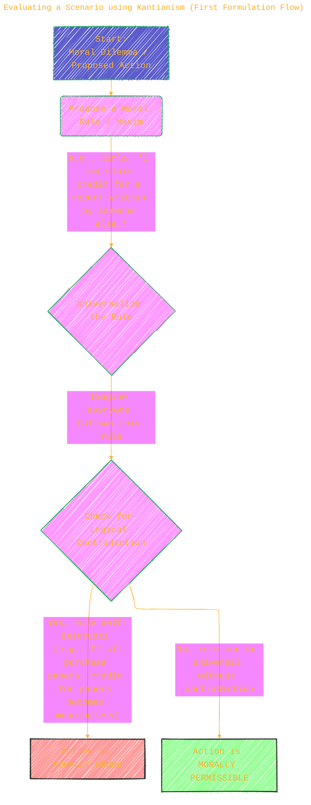
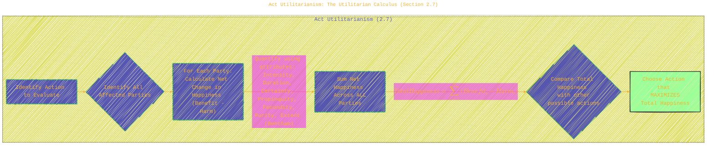
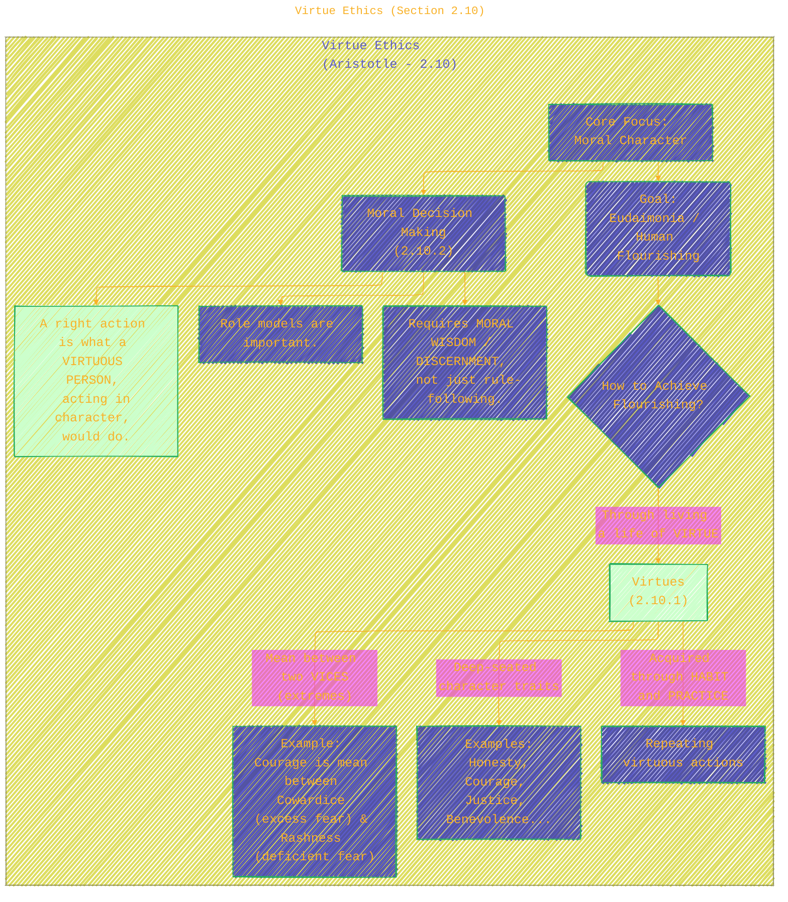

> ⚠️🏗️🚧🦺🧱🪵🪨🪚🛠️👷
> 
> This is a working draft in progress
> 
> 
>
> gif image is provided by [Giphy](https://giphy.com)
> 
> ⚠️🏗️🚧🦺🧱🪵🪨🪚🛠️👷


----


# Chapter 2: Introduction to Ethics – A Visual Exploration
> <ins>📢 **Disclaimer** 🚨</ins>
>
> This document contains my personal notes on the topic,
> compiled from publicly available documentation and various cited sources.
> The materials are intended for educational purposes, personal study, and reference.
> The content is dual-licensed:
> 1. **MIT License:** Applies to all code implementations (Swift, Mermaid, and other programming languages).
> 2. **Creative Commons Attribution-ShareAlike 4.0 International License (CC BY-SA 4.0):** Applies to all non-code content, including text, explanations, diagrams, and illustrations.
---

This chapter lays the foundational groundwork for ethical reasoning in the context of information technology. It defines key terms, introduces multiple ethical theories, evaluates their strengths and weaknesses, and provides a framework for analyzing moral dilemmas.

---

## 1. Chapter 2 Overview: Journey into Ethical Theories 🗺️

This mindmap provides a high-level structure of Chapter 2, highlighting the progression from basic definitions to the evaluation and comparison of nine ethical theories, culminating in a discussion on the morality of breaking the law.

```mermaid
---
title: "Chapter 2 Overview: Journey into Ethical Theories"
author: "Cong Le"
version: "1.0"
license(s): "MIT, CC BY-SA 4.0"
copyright: "Copyright (c) 2025 Cong Le. All Rights Reserved."
config:
  theme: base
---
%%%%%%%% Mermaid version v11.4.1-b.14
%%{
  init: {
    'fontFamily': 'Andale Mono, monospace',
    'mindmap': {
	    'nodeAlign': 'center',
	    'padding': 20
    },
    'themeVariables': {
      'primaryColor': '#FC82',
      'primaryTextColor': '#F8B229',
      'primaryBorderColor': '#27AE60',
      'secondaryColor': '#EBF3',
      'secondaryTextColor': '#6C3483',
      'secondaryBorderColor': '#A569BD',
      'fontSize': '20px'
    }
  }
}%%
mindmap
  root)"**Ch 2**:<br/> **Introduction to Ethics**"(
    2_1))"**2.1 Introduction**"((
      ::icon(fa fa-info-circle)
      2.1.1 Defining Terms
        Society
        Morality
        Ethics
      2.1.2 Four Scenarios (Initial dilemmas)
      2.1.3 Overview of Ethical Theories
    Ethical_Relativism))"**Ethical Relativism (No universal moral norms)**"((
      ::icon(fa fa-users-cog)
      2.2 Subjective Relativism
        Definition: Each person decides right/wrong
        Case For
        Case Against --> Rejected
      2.3 Cultural Relativism
        Definition: Society's guidelines define right/wrong
        Case For
        Case Against --> Rejected
    Objectivist_Theories{{"**Objectivist Theories** <br/>(Attempting Universal Principles)"}}
      ::icon(fa fa-globe)
      2_4))"2.4 Divine Command Theory"((
        Definition: Good = Aligned with God's will
        Case For
        Case Against --> Rejected
      2_5))"2.5 Ethical Egoism"((
        Definition: Focus on self-interest
        Case For
        Case Against --> Rejected
      2_6))"2.6 Kantianism (WORKABLE)"((
        ::icon(fa fa-balance-scale-left)
        Definition: Duty-based, universal moral laws
        Good Will & Categorical Imperative
          Formulation 1: Universalizability
          Formulation 2: Treat humanity as an end
        Evaluating a Scenario (Carla's Purchased Report)
        Case For
        Case Against
      2_7))"2.7 Act Utilitarianism (WORKABLE)"((
        ::icon(fa fa-chart-pie)
        Definition: Maximize overall happiness for each act
        Principle of Utility (Greatest Happiness Principle)
        Evaluating a Scenario (Highway Construction)
        Case For
        Case Against
      2_8))"2.8 Rule Utilitarianism (WORKABLE)"((
        ::icon(fa fa-list-alt)
        Definition: Follow rules that maximize happiness if universally adopted
        Basis of Rule Utilitarianism
        Evaluating a Scenario (Nachi Antiworm)
        Case For
        Case Against Utilitarianism (General)
      2_9))"2.9 Social Contract Theory (WORKABLE)"((
        ::icon(fa fa-handshake)
        Definition: Morality by agreement for mutual benefit
        The Social Contract (Hobbes, Rousseau)
        Rawls’s Theory of Justice
          Veil of Ignorance
          Two Principles of Justice
        Rights: Negative, Positive, Absolute, Limited
        Evaluating a Scenario (Customer Profiling)
        Case For
        Case Against
      2_10))"2.10 Virtue Ethics (WORKABLE)"((
        ::icon(fa fa- seedling)
        Definition: Focus on character, virtues for flourishing
        Virtues and Vices (Aristotle)
        Making a Decision (Josh's Capstone Dilemma)
        Case For
        Case Against
    2_11))"**2.11 Comparing Workable Ethical Theories**"((
      ::icon(fa fa-compress-arrows-alt)
      Kantianism
      Act Utilitarianism
      Rule Utilitarianism
      Social Contract Theory
      Virtue Ethics
    2_12))"**2.12 Morality of Breaking the Law**"((
      ::icon(fa fa-gavel)
      Social Contract Theory Perspective
      Kantian Perspective
      Rule-Utilitarian Perspective
      Act-Utilitarian Perspective
      Conclusion
    Summary & Further Resources
    Interview))"**Interview**: <br/>*James Moor*"((
      ::icon(fa fa-microphone)
      Just Consequentialism
```



**Caption for Diagram 1:** A mindmap detailing the sections and key topics covered in Chapter 2 ("Introduction to Ethics") of Quinn's textbook. It shows the flow from basic definitions through various ethical theories (noting which are deemed workable) to an analysis of breaking the law. (Source: Quinn, M. J. (2020). *Ethics for the Information Age* (8th ed.). Pearson. Chapter 2 Contents.)

---

## 2. Core Definitions: Society, Morality, Ethics (Section 2.1.1) 🧱

Understanding the basic terminology is crucial before delving into specific theories.

```mermaid
---
title: "Core Definitions: Society, Morality, Ethics (Section 2.1.1) 🧱"
author: "Cong Le"
version: "1.0"
license(s): "MIT, CC BY-SA 4.0"
copyright: "Copyright (c) 2025 Cong Le. All Rights Reserved."
config:
  layout: elk
  theme: base
  look: handDrawn
---
%%%%%%%% Mermaid version v11.4.1-b.14
%%%%%%%% Available curve styles include the following keywords:
%% basis, bumpX, bumpY, cardinal, catmullRom, linear, monotoneX, monotoneY, natural, step, stepAfter, stepBefore.
%%{
  init: {
    'flowchart': { 'htmlLabels': true, 'curve': 'basis' },
    'fontFamily': 'American Typewriter, monospace',
    'logLevel': 'fatal',
    'themeVariables': {
      'primaryColor': '#22BB',
      'primaryTextColor': '#F8B229',
      'lineColor': '#F8B229',
      'primaryBorderColor': '#27AE60',
      'secondaryColor': '#E2F1',
      'secondaryTextColor': '#6C3483',
      'secondaryBorderColor': '#A569BD',
      'fontSize': '20px'
    }
  }
}%%
flowchart TD
    A["Society (2.1.1)"] -- "System of rules for common good" --> B("Morality (2.1.1)")
    B -- "Rules of conduct (ought/ought not)" --> C("Ethics (2.1.1)")
    C -- "Philosophical study of morality" --> D{"Rational examination of moral beliefs & behavior"}

    A_Def["Association of people <br/>organized under rules <br/>to advance members' good over time."]
    B_Def["Rules describing what people <br/>ought and ought not to do <br/>in various situations."]
    C_Def["The philosophical study of morality, <br/>a rational examination into people’s <br/>moral beliefs and behavior."]

    A --> A_Def
    B --> B_Def
    C --> C_Def

    style A fill:#e6f2ff,stroke:#333,stroke-width:2px
    style B fill:#e6ffe6,stroke:#333,stroke-width:2px
    style C fill:#fff2e6,stroke:#333,stroke-width:2px
    style D fill:#f0f0f0,stroke:#333,stroke-width:1px,rx:5px,ry:5px
    style A_Def fill:#e6f2ff,stroke:#333,stroke-width:1px,stroke-dasharray: 5 5
    style B_Def fill:#e6ffe6,stroke:#333,stroke-width:1px,stroke-dasharray: 5 5
    style C_Def fill:#fff2e6,stroke:#333,stroke-width:1px,stroke-dasharray: 5 5
```



**Caption for Diagram 2:** This concept map clarifies the definitions of Society, Morality, and Ethics as presented in Section 2.1.1 of Quinn's textbook. It shows the hierarchical relationship where societies have moralities, and ethics is the study of that morality. (Source: Quinn, M. J. (2020). *Ethics for the Information Age* (8th ed.). Pearson. Section 2.1.1.)

---

## 3. Categorization of Ethical Theories (Section 2.1.3 and onward) 🧭

The chapter discusses several ethical theories, which can be broadly categorized.


**Caption for Diagram 3:** This diagram categorizes ethical theories from Chapter 2 into Ethical Relativism and Ethical Objectivism. It further highlights theories Quinn evaluates as workable for ethical analysis (Kantianism, Act & Rule Utilitarianism, Social Contract Theory, Virtue Ethics) versus those rejected for this purpose (Subjective & Cultural Relativism, Divine Command Theory, Ethical Egoism). (Source: Quinn, M. J. (2020). *Ethics for the Information Age* (8th ed.). Pearson. Sections 2.2-2.11.)

---

## 4. Kantianism (Section 2.6) ⚖️

Kantianism is a duty-based ethical theory. Its cornerstone is the Categorical Imperative.

### 4.1 The Categorical Imperative - Two Formulations

```plantuml
/'
title: The Categorical Imperative - Two Formulations
author: Cong Le
version: 1.0
license(s): MIT, CC BY-SA 4.0
copyright: Copyright (c) 2025 Cong Le. All Rights Reserved.
'/
@startuml Kantianism_CategoricalImperative
skinparam handwritten true
scale 0.9

object "Kantianism (2.6)" as Kant {
  + Core Principle: Act based on duty and universal moral laws.
  + Focus: The will behind the action.
}

package "Categorical Imperative (Unconditional Moral Rule)" {
  object "First Formulation (2.6.1)" as CI1 {
    description = Act only from moral rules that you can \n at the same time will to be universal moral laws.
    test = Universalizability Test
    math_concept = "Can ('∀x Maxim(x)') be willed without logical contradiction?"
  }
  note right of CI1 : Leads to perfect duties (e.g., "Do not lie.").

  object "Second Formulation (2.6.1)" as CI2 {
    description = Act so that you always treat both yourself and other people \n as ends in themselves, and never only as a means to an end.
    focus = Respect for persons, autonomy, dignity.
  }
  note right of CI2 : Highlights impermissibility of "using" people.
}

Kant --> CI1
Kant --> CI2
@enduml
```



**Caption for Diagram 4.1:** This diagram details the two main formulations of Kant's Categorical Imperative as explained in Section 2.6.1. The First Formulation emphasizes universalizability ($$\forall x \text{ Maxim}(x)$$), while the Second Formulation focuses on treating humanity as an end in itself. (Source: Quinn, M. J. (2020). *Ethics for the Information Age* (8th ed.). Pearson. Section 2.6.1.)

### 4.2 Evaluating a Scenario using Kantianism (First Formulation Flow)

The text describes evaluating Carla's purchase of a term paper using Kantianism (2.6.2). The first formulation can be visualized as a decision process.



**Caption for Diagram 4.2:** A flowchart illustrating the process of applying the First Formulation of Kant's Categorical Imperative (Universalizability Test) to evaluate the morality of an action, as might be done for scenarios like Carla's in Section 2.6.2. (Source: Based on the principles in Quinn, M. J. (2020). *Ethics for the Information Age* (8th ed.). Pearson. Section 2.6.1-2.6.2.)

---

## 5. Utilitarianism: Act vs. Rule (Sections 2.7 & 2.8) ⚖️

Utilitarianism focuses on consequences, specifically maximizing happiness.

### 5.1 Act Utilitarianism: The Utilitarian Calculus (Section 2.7)



**Caption for Diagram 5.1:** This flowchart illustrates the process of Act Utilitarianism (Section 2.7). It involves identifying affected parties, calculating the net happiness ($$TotalHappiness = \sum_{i=1}^{n} (Benefit_i - Harm_i)$$) for each action, and choosing the action that yields the greatest overall happiness. Bentham's seven attributes for weighing pleasure/pain are also noted. (Source: Quinn, M. J. (2020). *Ethics for the Information Age* (8th ed.). Pearson. Section 2.7.1.)

### 5.2 Rule Utilitarianism (Section 2.8)

Rule Utilitarianism applies the Principle of Utility to moral rules rather than individual acts.


**Caption for Diagram 5.2:** This diagram outlines the process of Rule Utilitarianism (Section 2.8). It involves proposing a moral rule, assessing the consequences of its universal adoption, and choosing rules that maximize overall happiness. An action is right if it conforms to such a beneficial rule. (Source: Quinn, M. J. (2020). *Ethics for the Information Age* (8th ed.). Pearson. Section 2.8.1.)

---

## 6. Social Contract Theory & Rawls's Theory of Justice (Section 2.9) 📜🤝

This theory posits that morality arises from an agreement among rational individuals for mutual benefit.


**Caption for Diagram 6:** This diagram explains Social Contract Theory (Section 2.9), highlighting its core idea, the influential concepts from John Rawls's Theory of Justice (Veil of Ignorance, Two Principles of Justice including the Difference Principle), and types of rights. (Source: Quinn, M. J. (2020). *Ethics for the Information Age* (8th ed.). Pearson. Sections 2.9.1, 2.9.2.)

---

## 7. Virtue Ethics (Section 2.10) 🌿🌟

Virtue ethics shifts the focus from actions or rules to the character of the moral agent.



**Caption for Diagram 7:** This concept map illustrates Virtue Ethics (Section 2.10), emphasizing its focus on moral character, virtues as means to human flourishing (eudaimonia), the development of virtues through habit, and the idea that a right action is what a virtuous person would do. (Source: Quinn, M. J. (2020). *Ethics for the Information Age* (8th ed.). Pearson. Sections 2.10.1, 2.10.2.)

---

## 8. Comparing Workable Ethical Theories: A Quick Reference (Section 2.11) ⚙️

The chapter concludes that Kantianism, Act Utilitarianism, Rule Utilitarianism, Social Contract Theory, and Virtue Ethics are workable. This table summarizes their key distinctions.

```mermaid
---
title: "Comparing Workable Ethical Theories: A Quick Reference (Section 2.11)"
author: "Cong Le"
version: "1.0"
license(s): "MIT, CC BY-SA 4.0"
copyright: "Copyright (c) 2025 Cong Le. All Rights Reserved."
config:
  layout: elk
  theme: base
  look: handDrawn
---
%%%%%%%% Mermaid version v11.4.1-b.14
%%%%%%%% Available curve styles include the following keywords:
%% basis, bumpX, bumpY, cardinal, catmullRom, linear, monotoneX, monotoneY, natural, step, stepAfter, stepBefore.
%%{
  init: {
    'flowchart': { 'htmlLabels': true, 'curve': 'basis' },
    'fontFamily': 'American Typewriter, monospace',
    'logLevel': 'fatal',
    'themeVariables': {
      'primaryColor': '#22BB',
      'primaryTextColor': '#F8B229',
      'lineColor': '#F8B229',
      'primaryBorderColor': '#27AE60',
      'secondaryColor': '#E2F1',
      'secondaryTextColor': '#6C3483',
      'secondaryBorderColor': '#A569BD',
      'fontSize': '20px'
    }
  }
}%%
quadrantChart
    title Workable Ethical Theories Comparison (Sec 2.11)
    x-axis Rule-Based --> Action-Based
    y-axis Agent-Focused --> Act/Rule/Consequence-Focused
    quadrant-top-left "Virtue Ethics <br/> (Character, Flourishing)"
    quadrant-top-right " "فريغ
    quadrant-bottom-left "Kantianism <br/> (Duty, Universal Rules) <br/><br/> Rule Utilitarianism <br/> (Consequences of Universal Rules) <br/><br/> Social Contract Theory <br/> (Rights, Agreements)"
    quadrant-bottom-right "Act Utilitarianism <br/> (Consequences of Specific Acts)"
    points
        Kantianism: [0.2, 0.25]
        RuleUtilitarianism: [0.2, 0.15]
        SocialContractTheory: [0.2, 0.05]
        ActUtilitarianism: [0.8, 0.15]
        VirtueEthics: [0.2, 0.75]
```

*(Note: The quadrant chart is a conceptual visualization of primary focus. Theories can have nuanced overlaps.)*

Alternatively, a more traditional comparison:

| Feature                 | Kantianism (2.6)                         | Act Utilitarianism (2.7)      | Rule Utilitarianism (2.8)        | Social Contract Theory (2.9)    | Virtue Ethics (2.10)               |
| :---------------------- | :--------------------------------------- | :---------------------------- | :------------------------------- | :------------------------------ | :--------------------------------- |
| **Primary Focus**       | Duty, Will, Universal Rules            | Consequences of specific Acts | Consequences of universal Rules  | Rights, Agreements, Fairness    | Character, Virtues, Flourishing    |
| **Moral Evaluation Of** | The Maxim/Rule behind the action         | The individual action         | The moral rule                   | The action's respect for rights | The agent performing the action    |
| **Decision Basis**      | Categorical Imperative                   | Principle of Utility          | Principle of Utility (for rules) | Rational agreement, Justice     | Virtuous character, Moral wisdom   |
| **Treatment of Others** | As Ends, Never Merely Means              | Impartially count happiness   | Impartially count happiness      | Respect rights & agreements   | As befits a virtuous relationship  |
| **Key Strength**        | Universal, Respects Persons            | Practical, Focus on Happiness | Solves some Act-U problems     | Language of Rights, Justifies Law | Holistic, Role of Emotions/Context |
| **Key Weakness**        | Conflicting duties, No exceptions      | Can justify unjust acts       | Rule worship, Unjust distribution| Implicit contract, Conflicting rights| Disagreement on "flourishing"    |

**Caption for Diagram 8:** This comparison chart (and conceptual quadrant diagram) highlights the distinct focuses and characteristics of the five workable ethical theories discussed in Chapter 2 (Section 2.11) of Quinn's textbook. (Source: Quinn, M. J. (2020). *Ethics for the Information Age* (8th ed.). Pearson. Sections 2.6-2.11.)

---

## 9. Morality of Breaking the Law (Section 2.12) - A Multi-Perspective Analysis 🚨

The chapter ends by applying the workable theories to the specific question of breaking a (just) law, using CD copying as an example.


**Caption for Diagram 9:** This diagram summarizes how different workable ethical theories from Chapter 2 might evaluate the morality of breaking a just law, using the example of illegally copying a copyrighted CD (Section 2.12). It shows varying conclusions based on the theories' core tenets. (Source: Quinn, M. J. (2020). *Ethics for the Information Age* (8th ed.). Pearson. Section 2.12.)


---

```mermaid
---
title: "❓...CongLeSolutionX....❓"
author: "Cong Le"
version: "1.0"
license(s): "MIT, CC BY-SA 4.0"
copyright: "Copyright (c) 2025 Cong Le. All Rights Reserved."
config:
  theme: base
---
%%%%%%%% Mermaid version v11.4.1-b.14
%%{
  init: {
    'flowchart': { 'htmlLabels': false },
    'fontFamily': 'Bradley Hand',
    'themeVariables': {
      'primaryColor': '#fc82',
      'primaryTextColor': '#F8B229',
      'primaryBorderColor': '#27AE60',
      'secondaryColor': '#8784',
      'secondaryTextColor': '#6C3483',
      'lineColor': '#F8B229',
      'fontSize': '20px'
    }
  }
}%%
flowchart LR
    My_Meme@{ img: "https://raw.githubusercontent.com/CongLeSolutionX/CongLeSolutionX/refs/heads/main/assets/images/My-meme-questions-magnifying-glass-tangled-lines-bubble-thought.png", label: "✍️...🤔❓🤔...👨🏼‍💻", pos: "b", w: 200, h: 150, constraint: "on" }
    Link_to_my_profile{{"<a href='https://github.com/CongLeSolutionX' target='_blank'>Click here if you care about my profile</a>"}}

  Closing_quote@{ shape: braces, label: "If you understood all the world's rules,<br/>would you break them<br/>or<br/>write new ones....?"}
    
   Closing_quote ~~~ My_Meme
    
  Link_to_my_profile{{"<a href='https://github.com/CongLeSolutionX' target='_blank'>Click here if you care about my profile</a>"}}

  Closing_quote ~~~ My_Meme
  My_Meme animatingEdge@--> Link_to_my_profile
  
  animatingEdge@{ animate: true }


```

---
>**Licenses:**
>
>- **MIT License:**  [](LICENSE) - Full text in [LICENSE](LICENSE) file.
>- **Creative Commons Attribution-ShareAlike 4.0 International**: [CC BY-SA 4.0](https://creativecommons.org/licenses/by-sa/4.0/) [](https://creativecommons.org/licenses/by-sa/4.0/) - Legal details in [LICENSE-CC-BY-SA-4.0](THE_PAST/LICENSE-CC-BY-SA-4.0) and at [Creative Commons official site](https://creativecommons.org/licenses/by-sa/4.0/).
>
---
