> ⚠️🏗️🚧🦺🧱🪵🪨🪚🛠️👷
> 
> This is a working draft in progress
> 
> 
>
> gif image is provided by [Giphy](https://giphy.com)
> 
> ⚠️🏗️🚧🦺🧱🪵🪨🪚🛠️👷


----


# Chapter 3: Networked Communications - An Overview

> **Disclaimer:**
>
> This document contains my personal notes on the topic,
> compiled from publicly available documentation and various cited sources.
> The materials are intended for educational purposes, personal study, and reference.
> The content is dual-licensed:
> 1. **MIT License:** Applies to all code implementations (Swift, Mermaid, and other programming languages).
> 2. **Creative Commons Attribution-ShareAlike 4.0 International License (CC BY-SA 4.0):** Applies to all non-code content, including text, explanations, diagrams, and illustrations.
---

This chapter tackles a wide array of impacts and ethical challenges stemming from our interconnected world.

## 1. Chapter 3 Structure & Key Topics 🗺️

A mindmap can help us visualize the main sections and their ethical concerns.


**Caption for Diagram 1:** This mindmap provides an overview of the key themes and sub-sections covered in Chapter 3 ("Networked Communications") of Quinn's textbook, from the pervasive issue of spam to the complexities of internet addiction and political manipulation online. (Source: Quinn, M. J. (2020). *Ethics for the Information Age* (8th ed.). Pearson. Chapter 3.)

---

## 2. Section 3.2: Spam - Ethical Layers 🍰

The case study of "Ann the Acme Accountant" illustrates how even seemingly minor actions like sending a cookie sales email can have multiple ethical dimensions. This layered diagram shows the different ethical evaluations.

```plantuml
/'
title: Section 3.2: Spam - Ethical Layers
author: Cong Le
version: 1.0
license(s): MIT, CC BY-SA 4.0
copyright: Copyright (c) 2025 Cong Le. All Rights Reserved.
'/
@startuml SpamCaseStudyEthics
skinparam handwritten true
setLabelFillColor white

package "Case Study: Ann the Acme Accountant (3.2.3)" {
  cloud "Action: Ann sends Girl Scout cookie email to coworkers using company email." as Action
  node "Ethical Question: Did Ann do anything wrong?" as Question

  package "Evaluations" {
    node "Kantian (3.2.3)" as Kantian {
      Focus: Respect for autonomy, means vs. ends
      Conclusion: Not strictly wrong, but "opt-in" better.
      <i>"She didn't misrepresent... could simply delete."</i>
      <i>"opt in approach would have been better..."</i>
    }
    node "Act Utilitarian (3.2.3)" as ActU {
      Focus: Benefits vs. Harms ($-quantified)
      Benefit (Girl Scouts): $108
      Harm (Acme Lost Productivity): $70
      Conclusion: Good ($108 > $70).
      <i>"...benefit of $108 exceeds the cost of $70..."</i>
    }
    node "Rule Utilitarian (3.2.3)" as RuleU {
      Focus: Consequences if everyone did it
      Universal Rule: "Everyone uses company email for solicitations."
      Harms > Benefits (Lowered morale, wasted time, ban on personal emails)
      Conclusion: Wrong.
      <i>"Because the harms are much greater than the benefits, it is wrong..."</i>
    }
    node "Social Contract (3.2.3)" as SCT {
      Focus: Rights, implicit agreements
      Company policy allows personal email.
      Ann didn't disguise identity, allowing response.
      Conclusion: Nothing wrong (within existing 'rules').
      <i>"...Ann did not disguise her identity... Ann did nothing wrong."</i>
    }
    node "Virtue Ethics (3.2.3)" as Virtue {
      Focus: Character traits (Honesty, Fairness, Respect)
      Parental role vs. Coworker role.
      Unfair/disrespectful to coworkers; poor judgment.
      Could have involved daughter more.
      Conclusion: Actions not fully characteristic of a good coworker or parent.
      <i>"...it wasn't fair or respectful for Ann to use the email system..."</i>
      <i>"...Ann should have found another way to advertise..."</i>
    }
  }
  Question --> Kantian
  Question --> ActU
  Question --> RuleU
  Question --> SCT
  Question --> Virtue
}
@enduml
```

**Caption for Diagram 2:** This diagram illustrates the various ethical evaluations applied to the "Ann the Acme Accountant" case study in Section 3.2.3 of Quinn's textbook. It showcases how different ethical theories (Kantianism, Act & Rule Utilitarianism, Social Contract Theory, and Virtue Ethics) can lead to nuanced, and sometimes differing, conclusions about the morality of an action. (Source: Quinn, M. J. (2020). *Ethics for the Information Age* (8th ed.). Pearson. Section 3.2.3.)

---

## 3. Section 3.5: Political Impact of Social Media 🌪️

This section has profound implications for democracy. A concept map shows the interconnected issues.

```mermaid
---
title: "Section 3.5: Political Impact of Social Media 🌪️"
author: "Cong Le"
version: "1.0"
license(s): "MIT, CC BY-SA 4.0"
copyright: "Copyright (c) 2025 Cong Le. All Rights Reserved."
config:
  layout: elk
  theme: base
  look: handDrawn
---
%%%%%%%% Mermaid version v11.4.1-b.14
%%%%%%%% Available curve styles include the following keywords:
%% basis, bumpX, bumpY, cardinal, catmullRom, linear, monotoneX, monotoneY, natural, step, stepAfter, stepBefore.
%%{
  init: {
    'flowchart': { 'htmlLabels': true, 'curve': 'basis' },
    'fontFamily': 'American Typewriter, monospace',
    'logLevel': 'fatal',
    'themeVariables': {
      'primaryColor': '#22BB',
      'primaryTextColor': '#F8B229',
      'lineColor': '#F8B229',
      'primaryBorderColor': '#27AE60',
      'secondaryColor': '#E2F1',
      'secondaryTextColor': '#6C3483',
      'secondaryBorderColor': '#A569BD',
      'fontSize': '20px'
    }
  }
}%%
flowchart TD
    A["Political Impact of Social Media & Online Advertising (3.5)"] --> B(Political Activism);
    A --> C(Monetization & Misinformation);
    A --> D(Threats to Democracy);
    A --> E(Impact on Traditional Media);

    B --> B1["Social media as organizing tool <br/> e.g., Arab Spring (3.5.1)"];
    B --> B2["Weak ties vs. Strong ties argument (Gladwell)"];
    B --> B3["Astroturfing: <br/> Fake grassroots support (e.g., Mass. Senate election)"];

    C --> C1["Macedonian Entrepreneurs (3.5.2) <br/> Fake news for ad revenue (Google AdSense, Facebook Shares)"];
    C --> C2["Internet Research Agency (IRA) (3.5.3) <br/> Foreign election interference <br/> Inflammatory posts, organizing rallies"];

    D --> D1["Echo Chambers & Filter Bubbles (3.5.4) <br/> Facebook algorithms reinforcing existing views"];
    D --> D2["Undermining trust & shared reality (Sunstein's concerns)"];
    D --> D3["Passive reception of filtered content vs. active choice"];

    E --> E1["Decline of Print Newspapers (3.5.5) <br/> Advertising revenue shift to online (Facebook, Google)"];
    E --> E2["Impact on the Fourth Estate <br/> Reduced investigative journalism?"];

    style A fill:#ffcc99,stroke:#333,stroke-width:2px
```



**Caption for Diagram 3:** This concept map explores the political impacts of social media and online advertising described in Section 3.5 of Quinn's textbook. It covers the use of these platforms for activism, the proliferation of misinformation for profit or political gain (e.g., Macedonian entrepreneurs, Internet Research Agency), potential threats to democratic processes via echo chambers, and the decline of traditional news media. (Source: Quinn, M. J. (2020). *Ethics for the Information Age* (8th ed.). Pearson. Section 3.5.)

---

## 4. Section 3.6: Censorship - Ethical Perspectives ⚖️

Kant and Mill offered distinct but converging arguments against censorship, while Mill also introduced the Principle of Harm.

```dot
/'
title: Section 3.6: Censorship - Ethical Perspectives
author: Cong Le
version: 1.0
license(s): MIT, CC BY-SA 4.0
copyright: Copyright (c) 2025 Cong Le. All Rights Reserved.
'/
digraph CensorshipEthics {
    rankdir=TB;
    node [shape=box, style="rounded,filled"];
    edge [arrowhead=vee];

    title = "Ethical Perspectives on Censorship (3.6.5)";

    Censorship [label="Censorship Issues"];

    subgraph cluster_Kant {
        label="Immanuel Kant's View";
        fillcolor=lightblue;
        K1 [label="Motto: 'Have courage to use your own reason'"];
        K2 [label="Opposed censorship as backward step"];
        K3 [label="Believed institutional control (aristocracy, Church)\n hindered independent thought."];
        K1 -> K2;
        K2 -> K3;
    }

    subgraph cluster_Mill {
        label="John Stuart Mill's View";
        fillcolor=lightgreen;
        M1 [label="Championed freedom of expression"];
        M2 [label="Reasons against Censorship:\n1. Silenced opinion may be true (no one infallible).\n2. Erroneous opinion may contain partial truth.\n3. Truth needs debate for rational validation (else prejudice).\n4. Tested opinions have vital effect on character."];
       MilliPoH [label="Mill's Principle of Harm:\n'The only purpose for which power can be rightfully\nexercised over any member of a civilized community,\nagainst his will, is to prevent harm to others.'", shape=parallelogram];
        M1 -> M2;
        M1 -> MilliPoH;
    }

    Censorship -> K1 [style=dashed];
    Censorship -> M1 [style=dashed];

    note right of M2 {
        Applying to the Web:
        Would likely support free exchange
        and oppose government censorship.
    }
    note right of MilliPoH {
        Example Application (Pornography):
        Govt. should not intervene in private adult viewing,
        as primary harm is to self, not others.
        (Debatable if applied to public access)
    }
}
```

**Caption for Diagram 4:** This diagram contrasts the ethical perspectives of Immanuel Kant and John Stuart Mill on censorship, as discussed in Section 3.6.5 of Quinn's textbook. Both philosophers largely opposed censorship, emphasizing individual reason (Kant) and the societal benefits of a free exchange of ideas (Mill). Mill's Principle of Harm is also highlighted as a criterion for justifiable government intervention. (Source: Quinn, M. J. (2020). *Ethics for the Information Age* (8th ed.). Pearson. Section 3.6.5.)

---

## 5. Section 3.7: Freedom of Expression - Case Study: Kate's Blog 📝

This case involves posting a photo without permission and is analyzed through multiple ethical lenses.

```mermaid
---
title: "Section 3.7: Freedom of Expression - Case Study: Kate's Blog 📝"
author: "Cong Le"
version: "1.0"
license(s): "MIT, CC BY-SA 4.0"
copyright: "Copyright (c) 2025 Cong Le. All Rights Reserved."
config:
  layout: elk
  theme: base
  look: handDrawn
---
%%%%%%%% Mermaid version v11.4.1-b.14
%%%%%%%% Available curve styles include the following keywords:
%% basis, bumpX, bumpY, cardinal, catmullRom, linear, monotoneX, monotoneY, natural, step, stepAfter, stepBefore.
%%{
  init: {
    'flowchart': { 'htmlLabels': true, 'curve': 'basis' },
    'fontFamily': 'American Typewriter, monospace',
    'logLevel': 'fatal',
    'themeVariables': {
      'primaryColor': '#22BB',
      'primaryTextColor': '#F8B229',
      'lineColor': '#F8B229',
      'primaryBorderColor': '#27AE60',
      'secondaryColor': '#E2F1',
      'secondaryTextColor': '#6C3483',
      'secondaryBorderColor': '#A569BD',
      'fontSize': '20px'
    }
  }
}%%
flowchart TD
    subgraph KatesBlog ["Case Study: Kate's Blog (3.7.4)"]
        direction LR
        Scenario["Kate posts blog photo of friend Jerry in gag T-shirt <br/>from private party without his permission."] --> EthicalQuestion{"Was Kate's action wrong?"}

        EthicalQuestion --> Kantian["<b>Kantian Analysis:</b> <br/> Wrong. Treated Jerry as means (to increase blog readership), <br/> not an end. Violated autonomy."]
        EthicalQuestion --> SocialContract["<b>Social Contract Analysis:</b> <br/> Wrong. Violated Jerry's right to privacy <br/>(expectation of privacy in private setting)."]
        EthicalQuestion --> ActU["<b>Act Utilitarian Analysis:</b> <br/> Good (net benefit $17 - 1 = +16$). <br/> Kate's blog popular (+10), Jerry popular (+10), Jerry upset briefly (-5), future harm low prob (-1). <br/> (+17 × 100%) + (-100 × 50% × 20% × 10%) = +16"]
        EthicalQuestion --> RuleU["<b>Rule Utilitarian Analysis:</b> <br/> Wrong. Universal rule of posting all photos without permission <br/> leads to negative consequences (loss of privacy, self-consciousness)."]
        EthicalQuestion --> VirtueEth["<b>Virtue Ethics Analysis:</b> <br/> Wrong. Kate's actions (deceit, lack of trust) not characteristic <br/> of a good friend (trust, reciprocity, honesty)."]
    end
    style Scenario fill:#f9f,stroke:#333,stroke-width:2px
```



**Caption for Diagram 5:** This diagram summarizes the ethical analyses (Kantian, Social Contract, Act Utilitarian, Rule Utilitarian, and Virtue Ethics) applied to the "Kate's Blog" case study in Section 3.7.4 of Quinn's textbook, where a photo was posted online without explicit consent. (Source: Quinn, M. J. (2020). *Ethics for the Information Age* (8th ed.). Pearson. Section 3.7.4.)

---

## 6. Section 3.8: Children and Inappropriate Content - CIPA Evaluation 🛡️👶

The Child Internet Protection Act (CIPA) is evaluated from several ethical standpoints.


**Caption for Diagram 6:** This diagram outlines the ethical evaluations (Kantian, Act Utilitarian, Social Contract Theory) of the Child Internet Protection Act (CIPA) as discussed in Section 3.8.3 of Quinn's textbook. Different theories highlight various ethical concerns and potential outcomes of mandating web filters in public libraries. (Source: Quinn, M. J. (2020). *Ethics for the Information Age* (8th ed.). Pearson. Section 3.8.3.)

---

## 7. Section 3.9: Breaking Trust - Spectrum of Issues 💔

This section covers a range of ethically challenging online behaviors.

```mermaid
---
title: "Section 3.9: Breaking Trust - Spectrum of Issues 💔"
author: "Cong Le"
version: "1.0"
license(s): "MIT, CC BY-SA 4.0"
copyright: "Copyright (c) 2025 Cong Le. All Rights Reserved."
config:
  layout: elk
  theme: base
  look: handDrawn
---
%%%%%%%% Mermaid version v11.4.1-b.14
%%%%%%%% Available curve styles include the following keywords:
%% basis, bumpX, bumpY, cardinal, catmullRom, linear, monotoneX, monotoneY, natural, step, stepAfter, stepBefore.
%%{
  init: {
    'flowchart': { 'htmlLabels': true, 'curve': 'basis' },
    'fontFamily': 'American Typewriter, monospace',
    'logLevel': 'fatal',
    'themeVariables': {
      'primaryColor': '#22BB',
      'primaryTextColor': '#F8B229',
      'lineColor': '#F8B229',
      'primaryBorderColor': '#27AE60',
      'secondaryColor': '#E2F1',
      'secondaryTextColor': '#6C3483',
      'secondaryBorderColor': '#A569BD',
      'fontSize': '20px'
    }
  }
}%%
flowchart LR
    subgraph BreakingTrust ["Breaking Trust Online (3.9)"]
        direction TB
        A["Identity Theft (3.9.1)"] --> A1["Misuse of personal info (credit cards, SSN)<br/>Phishing & Low-tech methods"]
        B["Fake Reviews (3.9.2)"] --> B1["Fraudulent positive/negative reviews<br/>Undermines consumer trust"]
        C["Online Predators (3.9.3)"] --> C1["Using apps (e.g., Kik, Whisper) to find minors<br/>Police Sting Operations (3.9.4) <br/>Ethical Eval: Utilitarian, Kantian, Social Contract"]
        D["False Information (3.9.5)"] --> D1["Varying quality of web info<br/>Challenge of discerning reliability (Google PageRank as a tool)"]
        E["Cyberbullying (3.9.6)"] --> E1["Inflicting psychological harm online<br/>Group harassment, severe consequences (e.g., Megan Meier)"]
        F["Revenge Porn (3.9.7)"] --> F1["Non-consensual posting of intimate images<br/>Criminalization efforts, platform responses (Reddit, Twitter, Google)"]
    end
    style A fill:#ffcccc
    style B fill:#ffddcc
    style C fill:#ffeecc
    style D fill:#ffffcc
    style E fill:#eeffcc
    style F fill:#ddffcc
```



**Caption for Diagram 7:** This diagram categorizes the various ways trust is broken online, as detailed in Section 3.9 of Quinn's textbook. These range from identity theft and fake reviews to more malicious activities like online predation, cyberbullying, and revenge porn, along with ethical considerations for countermeasures like police stings. (Source: Quinn, M. J. (2020). *Ethics for the Information Age* (8th ed.). Pearson. Section 3.9.)

---

This detailed exploration of Chapter 3 highlights the expansive and often unsettling ethical landscape of networked communications. The chapter systematically dissects how technology facilitates both great benefits and significant harms, using established ethical frameworks to analyze complex situations. 🌐🤔🚨


---

```mermaid
---
title: "❓...CongLeSolutionX....❓"
author: "Cong Le"
version: "1.0"
license(s): "MIT, CC BY-SA 4.0"
copyright: "Copyright (c) 2025 Cong Le. All Rights Reserved."
config:
  theme: base
---
%%%%%%%% Mermaid version v11.4.1-b.14
%%{
  init: {
    'flowchart': { 'htmlLabels': false },
    'fontFamily': 'Bradley Hand',
    'themeVariables': {
      'primaryColor': '#fc82',
      'primaryTextColor': '#F8B229',
      'primaryBorderColor': '#27AE60',
      'secondaryColor': '#8784',
      'secondaryTextColor': '#6C3483',
      'lineColor': '#F8B229',
      'fontSize': '20px'
    }
  }
}%%
flowchart LR
    My_Meme@{ img: "https://raw.githubusercontent.com/CongLeSolutionX/CongLeSolutionX/refs/heads/main/assets/images/My-meme-questions-magnifying-glass-tangled-lines-bubble-thought.png", label: "✍️...🤔❓🤔...👨🏼‍💻", pos: "b", w: 200, h: 150, constraint: "on" }
    Link_to_my_profile{{"<a href='https://github.com/CongLeSolutionX' target='_blank'>Click here if you care about my profile</a>"}}

  Closing_quote@{ shape: braces, label: "If you understood all the world's rules,<br/>would you break them<br/>or<br/>write new ones....?"}
    
   Closing_quote ~~~ My_Meme
    
  Link_to_my_profile{{"<a href='https://github.com/CongLeSolutionX' target='_blank'>Click here if you care about my profile</a>"}}

  Closing_quote ~~~ My_Meme
  My_Meme animatingEdge@--> Link_to_my_profile
  
  animatingEdge@{ animate: true }


```

---
>**Licenses:**
>
>- **MIT License:**  [](LICENSE) - Full text in [LICENSE](LICENSE) file.
>- **Creative Commons Attribution-ShareAlike 4.0 International**: [CC BY-SA 4.0](https://creativecommons.org/licenses/by-sa/4.0/) [](https://creativecommons.org/licenses/by-sa/4.0/) - Legal details in [LICENSE-CC-BY-SA-4.0](THE_PAST/LICENSE-CC-BY-SA-4.0) and at [Creative Commons official site](https://creativecommons.org/licenses/by-sa/4.0/).
>
---


**Primary Reference for all diagrams and interpretations:**

*   Quinn, M. J. (2020). *Ethics for the Information Age* (8th ed.). Pearson. Chapter 3 and its constituent sections.

----

