> ⚠️🏗️🚧🦺🧱🪵🪨🪚🛠️👷
> 
> This is a working draft in progress
> 
> 
>
> gif image is provided by [Giphy](https://giphy.com)
> 
> ⚠️🏗️🚧🦺🧱🪵🪨🪚🛠️👷


----

# Chapter 4: Intellectual Property – A Visual Exploration
> <ins>📢 **Disclaimer** 🚨</ins>
>
> This document contains my personal notes on the topic,
> compiled from publicly available documentation and various cited sources.
> The materials are intended for educational purposes, personal study, and reference.
> The content is dual-licensed:
> 1. **MIT License:** Applies to all code implementations (Swift, Mermaid, and other programming languages).
> 2. **Creative Commons Attribution-ShareAlike 4.0 International License (CC BY-SA 4.0):** Applies to all non-code content, including text, explanations, diagrams, and illustrations.
---

This chapter examines the multifaceted world of intellectual property, its protections, challenges, and the ethical dilemmas arising from the impact of information technology.

## 1. Chapter 4 Overview: Intellectual Property 🗺️

This mindmap details the structure of Chapter 4.

```mermaid
---
title: "Chapter 4 Overview: Intellectual Property"
author: "Cong Le"
version: "1.0"
license(s): "MIT, CC BY-SA 4.0"
copyright: "Copyright (c) 2025 Cong Le. All Rights Reserved."
config:
  theme: base
---
%%%%%%%% Mermaid version v11.4.1-b.14
%%{
  init: {
    'fontFamily': 'American Typewriter, monospace',
    'logLevel': 'fatal',
    'mindmap': {
	    'nodeAlign': 'center',
	    'padding': 15
    },
    'themeVariables': {
      'primaryColor': '#FC82',
      'primaryTextColor': '#F8B229',
      'primaryBorderColor': '#27AE60',
      'secondaryColor': '#EBF3',
      'secondaryTextColor': '#6C3483',
      'secondaryBorderColor': '#A569BD',
      'fontSize': '15px'
    }
  }
}%%
mindmap
  root)"**Ch 4**:<br/> **Intellectual Property**"(
    4_1))"**4.1 Introduction**"((
      ::icon(fa fa-lightbulb)
      Game of Thrones piracy example
      YouTube music uploads
      RIAA lawsuits
      Balancing creator rights & public access
    4_2))"**4.2 Intellectual Property Rights**"((
      ::icon(fa fa-balance-scale-right)
      4.2.1 Property Rights (Locke's Theory)
        Right to own person
        Right to own labor
        Right to things removed from Nature via labor
        Conditions: No more than usable, plenty left for others
      4.2.2 Extending Argument to IP
        Analogy: Writing a play vs. making a belt buckle
        Paradox 1: Simultaneous independent creation (Shakespeare vs. Jonson's Hamlet)
        Paradox 2: Copying IP vs. stealing physical object
      4.2.3 Benefits of IP Protection
        Encourages creativity & innovation
        Financial rewards for creators
      4.2.4 Limits to IP Protection
        Tension: Creator rights vs. public dissemination
        Limited time for exclusive rights (public domain)
        "Happy Birthday to You" case
    4_3))"**4.3 Protecting Intellectual Property**"((
      ::icon(fa fa-shield-alt)
      4.3.1 Trade Secrets
        Confidential info, competitive advantage (e.g., Coca-Cola formula)
        No expiration, but vulnerable to reverse engineering/employee moves
      4.3.2 Trademarks and Service Marks
        Identify goods/services, brand_name (e.g., Kleenex®)
        Registration, risk of becoming generic
      4.3.3 Patents
        Protects_inventions["Protects inventions (machines, systems) for 20 years"]
        Public document, prevents others from making/using/selling
        Polaroid v. Kodak, Microsoft ClearType
      4.3.4 Copyrights
        Protects original works (books, music, software expression)
        5 Rights: Reproduce, Distribute, Display, Perform, Derive
        Copyright industries' economic impact
        Key Cases/Acts:
          Gershwin Publishing v. Columbia Artists
          Davey Jones Locker (BBS)
          No Electronic Theft Act (1997)
          Sonny Bono Copyright Term Extension Act (CTEA, "Copyright Creep")
          Eldred v. Ashcroft (CTEA upheld)
      4.3.5 Case Study: The Database Guru (Rajiv)
    4_4))"**4.4 Fair Use**"((
      ::icon(fa fa-gavel)
      Reproducing copyrighted work without permission under certain conditions
      Section_107_of_Copyright_Act("Section 107 of Copyright Act (4 factors):")
        1. Purpose/character of use (transformative, non-commercial favored)
        2. Nature of work (nonfiction, published favored)
        3. Amount used (brief excerpts favored)
        4. Effect on market (out-of-print favored)
      4.4.1 Sony v. Universal City Studios (Time-shifting is fair use)
      4.4.2 Audio Home Recording Act of 1992 (SCMS, royalties)
      4.4.3 RIAA v. Diamond Multimedia (Space-shifting MP3s is fair use)
      4.4.4 Kelly v. Arriba Soft (Thumbnail images transformative, fair use)
      4.4.5 Authors Guild v. Google (Google Books scanning transformative, fair use)
      4.4.6 Mashups (Audio collages vs. A vs. B)
    4_5))"**4.5 Digital Media**"((
      ::icon(fa fa-compact-disc)
      Digital copies are perfect; broadband facilitates sharing
      4.5.1 Digital Rights Management (DRM)
        Aims to track/control content use
        Encryption, digital marks
      4.5.2 Digital Millennium Copyright Act (DMCA, 1998)
        Anti-circumvention, OSP liability
      4.5.3 Secure Digital Music Initiative (SDMI)
        Failed effort for copy-protected CDs
        "Hack SDMI" challenge
      4.5.4 Sony BMG Music Entertainment Rootkit
        Secretly installed, compromised security
      4.5.5 Criticisms of DRM
        Technological fixes often fail
        Undermines fair use
        Prevents accessibility formatting
        Never expires (unlike copyright)
        Privacy concerns (tracking)
      4.5.6 Online Music Stores Drop DRM
        Apple FairPlay -> DRM-free
      4.5.7 Microsoft Xbox One
        Initial restrictive DRM, consumer backlash led to reversal
    4_6))"**4.6 Peer-to-Peer Networks and Cyberlockers**"((
      ::icon(fa fa-users)
      P2P: Transient networks for file access
      Cyberlockers: File-hosting services for sharing
      4.6.1 RIAA Lawsuits (Napster, Grokster, Kazaa)
        Early P2P challenges
      4.6.2 MGM v. Grokster (Inducement to infringe)
      4.6.3 BitTorrent
        Efficient large file sharing (fragmentation)
      4.6.4 Legal Action Against The Pirate Bay
      4.6.5 PRO-IP Act (Domain name seizures)
      4.6.6 Megaupload Shutdown
      4.6.7 Legal Online Access to Entertainment
        Streaming services (Spotify, Netflix)
    4_7))"**4.7 Protections for Software**"((
      ::icon(fa fa-code)
      4.7.1 Software Copyrights (Protects expression, not idea; executable usually)
      4.7.2 Violations of Software Copyrights
        Copying, preloading, distributing
        Case: Apple v. Franklin (Object code copyrightable)
        Case: Sega v. Accolade (Reverse engineering for interop as fair use)
      4_7_3("4.7.3 Safe Software Development <br/>(**Clean Room** strategy)")
      4.7.4 Software Patents
        Initially refused, Diamond v. Diehr changed this
        Patent_holding_companies["Patent-holding companies (**patent trolls**)"]
        Harms["Harms:<br/>Bad/obvious patents, **patent wars**<br/> (Smartphone example)"]
        Alice_Corp_vs_CLS_Bank["Alice Corp. v. CLS Bank (Abstract ideas on computer not enough)"]
    4_8))"**4.8 Legitimacy of Intellectual Property Protection for Software**"((
      ::icon(fa fa-question-circle)
      4.8.1 Rights-Based Analysis (Locke's "just deserts", mixing labor)
        Critiques: Paradoxes of IP uniqueness & copying
      4.8.2 Utilitarian Analysis (Consequences of denying protection)
        Chain: Copying -> ↓Sales -> ↓Industry -> ↓Innovation -> Harm society
        Critiques: Links in chain debatable (copying not always lost sale, open-source motivation)
      4.8.3 Conclusion (Arguments not very strong, but law exists)
    4_9))"**4.9 Open-Source Software**"((
      ::icon(fa fa-opensource)
      4.9.1 Consequences of Proprietary Software (Stallman's critique)
      4.9.2 "Open Source" Definition (OSI criteria)
        Free redistribution, source code available, modifications allowed, etc.
      4.9.3 Beneficial Consequences of Open-Source
        Improves quality, rapid evolution, eliminates copyright tension, community property, better support
      4.9.4 Examples (BIND, Apache, Android, Firefox, Linux)
      4.9.5 The GNU Project and Linux (Stallman, Torvalds)
      4.9.6 Impact of Open-Source Software
    4_10))"**4.10 Creative Commons**"((
      ::icon(fa fa-creative-commons)
      Alternative licensing for sharing/collaboration
      "Innovation Commons" (Lessig)
      Licenses based on choices:
        Allow adaptations? (Yes, No, ShareAlike)
        Allow commercial uses? (Yes, No)
    Summary))"**Summary**"((
    Interview))"**Interview**:<br/> **June Besek** <br/>(*Termination Rights*)"((
```



**Caption for Diagram 1:** This mindmap provides a detailed breakdown of Chapter 4: "Intellectual Property" from Quinn's textbook, covering IP rights, protection mechanisms, fair use, digital media challenges, P2P networks, software protection, the open-source movement, and Creative Commons. (Source: Quinn, M. J. (2020). *Ethics for the Information Age* (8th ed.). Pearson. Chapter 4.)

---

## 2. John Locke's Theory of Property Rights (Sec 4.2.1) 🌳⛏️

Locke's theory forms a basis for understanding property rights, which the chapter then attempts to extend to intellectual property.

```mermaid
---
title: "John Locke's Theory of Property Rights (Sec 4.2.1) 🌳⛏️"
author: "Cong Le"
version: "1.0"
license(s): "MIT, CC BY-SA 4.0"
copyright: "Copyright (c) 2025 Cong Le. All Rights Reserved."
config:
  layout: elk
  theme: base
  look: handDrawn
---
%%%%%%%% Mermaid version v11.4.1-b.14
%%%%%%%% Available curve styles include the following keywords:
%% basis, bumpX, bumpY, cardinal, catmullRom, linear, monotoneX, monotoneY, natural, step, stepAfter, stepBefore.
%%{
  init: {
    'flowchart': { 'htmlLabels': true, 'curve': 'basis' },
    'fontFamily': 'American Typewriter, monospace',
    'logLevel': 'fatal',
    'themeVariables': {
      'primaryColor': '#22BB',
      'primaryTextColor': '#F8B229',
      'lineColor': '#F8B229',
      'primaryBorderColor': '#27AE60',
      'secondaryColor': '#E2F1',
      'secondaryTextColor': '#6C3483',
      'secondaryBorderColor': '#A569BD',
      'fontSize': '20px'
    }
  }
}%%
flowchart TD
    subgraph Locke_Theory["John Locke's Theory of Property Rights Sec 4.2.1"]
        A[Right to Property in Own Person] --> B(Right to Own Labor)
        B --> C{Things Removed from Nature via Labor}
        C --> D[Becomes One's Property]
        D --> E{Conditions for Just Acquisition}
        E --> F1["1. No person claims more property than they can use (No Waste)"]
        E --> F2["2. Plenty left over for others to claim through their labor (Sufficiency)"]
    end

    style A fill:#D5E8D4,stroke:#82B366,stroke-width:2px
    style B fill:#D5E8D4,stroke:#82B366,stroke-width:2px
    style C fill:#FFF2CC,stroke:#D6B656,stroke-width:2px
    style D fill:#DAE8FC,stroke:#6C8EBF,stroke-width:2px
    style E fill:#F8CECC,stroke:#B85450,stroke-width:2px
    style F1 fill:#E1D5E7,stroke:#9673A6,stroke-width:2px
    style F2 fill:#E1D5E7,stroke:#9673A6,stroke-width:2px

    %% note right of B
    %%    Example: Chopping down a tree
    %%    and making firewood from common land.
    %%    Your labor + Tree = Your Firewood.
    %% endnote
```



**Caption for Diagram 2:** John Locke's theory of property rights, as discussed in Quinn (2020, Sec. 4.2.1), emphasizes that individuals have a right to their person, their labor, and what they acquire from nature through that labor, given conditions of non-wastage and sufficiency for others. (Source: Quinn, M. J. (2020). *Ethics for the Information Age* (8th ed.). Pearson. Section 4.2.1.)

---

## 3. Extending Locke's Theory to IP & Its Paradoxes (Sec 4.2.2) 🎭🤔

The chapter explores the challenges of applying a physical property model to intellectual creations.


**Caption for Diagram 3:** This diagram illustrates the analogy used in Quinn (2020, Sec. 4.2.2) to extend Locke's theory of physical property to intellectual property (e.g., writing a play). It also highlights the two paradoxes that arise: the uniqueness of IP during simultaneous creation and the nature of copying versus physical theft. (Source: Quinn, M. J. (2020). *Ethics for the Information Age* (8th ed.). Pearson. Section 4.2.2.)

---

## 4. Four Pillars of IP Protection (Sec 4.3) 🏛️

Chapter 4.3 details the primary legal mechanisms for protecting intellectual property.

```mermaid
---
title: "Four Pillars of IP Protection (Sec 4.3) 🏛️"
author: "Cong Le"
version: "1.0"
license(s): "MIT, CC BY-SA 4.0"
copyright: "Copyright (c) 2025 Cong Le. All Rights Reserved."
config:
  layout: elk
  theme: base
  look: handDrawn
---
%%%%%%%% Mermaid version v11.4.1-b.14
%%%%%%%% Available curve styles include the following keywords:
%% basis, bumpX, bumpY, cardinal, catmullRom, linear, monotoneX, monotoneY, natural, step, stepAfter, stepBefore.
%%{
  init: {
    'flowchart': { 'htmlLabels': true, 'curve': 'basis' },
    'fontFamily': 'American Typewriter, monospace',
    'logLevel': 'fatal',
    'themeVariables': {
      'primaryColor': '#22BB',
      'primaryTextColor': '#F8B229',
      'lineColor': '#F8B229',
      'primaryBorderColor': '#27AE60',
      'secondaryColor': '#E2F1',
      'secondaryTextColor': '#6C3483',
      'secondaryBorderColor': '#A569BD',
      'fontSize': '20px'
    }
  }
}%%
flowchart TD
    IP_Protection["Protecting Intellectual Property (Sec 4.3)"] --> TS["Trade Secrets (4.3.1)"]
    IP_Protection --> TM["Trademarks / Service Marks (4.3.2)"]
    IP_Protection --> PT["Patents (4.3.3)"]
    IP_Protection --> CR["Copyrights (4.3.4)"]

    TS --> TS_Desc["Confidential info providing competitive edge (e.g., formulas, processes)<br/><b>Duration:</b> Indefinite (while secret)<br/><b>Protection:</b> Via non-disclosure, secrecy measures"]
    TM --> TM_Desc["Words, symbols identifying goods/services (e.g., Kleenex®)<br/><b>Duration:</b> Renewable indefinitely (with use)<br/><b>Protection:</b> Registration, prevents consumer confusion"]
    PT --> PT_Desc["Exclusive rights to inventions (machines, processes)<br/><b>Duration:</b> 20 years from filing<br/><b>Protection:</b> Government grant, requires public disclosure"]
    CR --> CR_Desc["Rights to original 'authored' works (text, music, software code)<br/><b>Duration:</b> Author's life + 70 years (typically for individuals)<br/><b>Protection:</b> Automatic upon creation, covers expression not idea"]

    style IP_Protection fill:#f96
    style TS fill:#D5E8D4
    style TM fill:#FFF2CC
    style PT fill:#DAE8FC
    style CR fill:#F8CECC
```



**Caption for Diagram 4:** This diagram summarizes the four main methods of protecting intellectual property discussed in Quinn (2020, Sec. 4.3): Trade Secrets, Trademarks/Service Marks, Patents, and Copyrights, including their nature, typical duration, and how protection is achieved. (Source: Quinn, M. J. (2020). *Ethics for the Information Age* (8th ed.). Pearson. Section 4.3.)

---

## 5. Copyrights: Holder's Rights & "Copyright Creep" (Sec 4.3.4) 📜⏳

Copyright law grants specific rights and has seen its duration extended over time.

```mermaid
---
title: "Copyrights: Holder's Rights & 'Copyright Creep' (Sec 4.3.4) 📜⏳"
author: "Cong Le"
version: "1.0"
license(s): "MIT, CC BY-SA 4.0"
copyright: "Copyright (c) 2025 Cong Le. All Rights Reserved."
config:
  layout: elk
  theme: base
  look: handDrawn
---
%%%%%%%% Mermaid version v11.4.1-b.14
%%%%%%%% Available curve styles include the following keywords:
%% basis, bumpX, bumpY, cardinal, catmullRom, linear, monotoneX, monotoneY, natural, step, stepAfter, stepBefore.
%%{
  init: {
    'flowchart': { 'htmlLabels': true, 'curve': 'basis' },
    'fontFamily': 'American Typewriter, monospace',
    'logLevel': 'fatal',
    'themeVariables': {
      'primaryColor': '#22BB',
      'primaryTextColor': '#F8B229',
      'lineColor': '#F8B229',
      'primaryBorderColor': '#27AE60',
      'secondaryColor': '#E2F1',
      'secondaryTextColor': '#6C3483',
      'secondaryBorderColor': '#A569BD',
      'fontSize': '20px'
    }
  }
}%%
flowchart LR
    Copyright["Copyright (Sec 4.3.4)"] --> Rights["Copyright Holder's 5 Principal Rights"]
    Rights --> R1["1. Reproduce the work"]
    Rights --> R2["2. Distribute copies"]
    Rights --> R3["3. Display copies publicly"]
    Rights --> R4["4. Perform the work publicly"]
    Rights --> R5["5. Produce derivative works"]

    Copyright --> Creep["'Copyright Creep'"]
    Creep --> C_Desc["Gradual extension of copyright term and scope over time.<br/>Example: Sonny Bono Copyright Term Extension Act of 1998.<br/>Impact: Delays works entering public domain."]
    Creep --> Motivation_C[" Motivations: <br/> - International harmonization <br/> - Response to new technologies <br/> - Lobbying (e.g., Disney)"]
    Creep --> Case_C["<i>Eldred v. Ashcroft</i>: Supreme Court upheld CTEA."]

    %% note bottom of R3
    %%    These rights can be licensed to others.
    %% endnote
```



**Caption for Diagram 5:** This diagram details the five principal rights granted to a copyright holder (Sec 4.3.4) and illustrates the concept of "Copyright Creep" – the historical extension of copyright terms, exemplified by the Sonny Bono Copyright Term Extension Act. (Source: Quinn, M. J. (2020). *Ethics for the Information Age* (8th ed.). Pearson. Section 4.3.4.)

---

## 6. Fair Use Doctrine: The Four Factors (Sec 4.4) ⚖️

Section 4.4 explains the Fair Use doctrine, which allows limited use of copyrighted material without permission.


**Caption for Diagram 6:** This diagram outlines the four factors courts consider when determining if the use of copyrighted material qualifies as "Fair Use" under Section 107 of the U.S. Copyright Act, as described in Quinn (2020, Sec. 4.4). (Source: Quinn, M. J. (2020). *Ethics for the Information Age* (8th ed.). Pearson. Section 4.4.)

---

## 7. Key Fair Use Cases & Concepts (Sec 4.4.1 - 4.4.6) 🎬🎵🖼️

Several court cases have shaped the understanding of Fair Use.


**Caption for Diagram 7:** This timeline highlights key legislative acts and court decisions that have defined or clarified aspects of Fair Use, as discussed in Quinn (2020, Sections 4.4.1-4.4.6). (Source: Quinn, M. J. (2020). *Ethics for the Information Age* (8th ed.). Pearson. Sections 4.4.1-4.4.6.)

---

## 8. Digital Media, DRM, and DMCA (Sec 4.5) 📀🔒

The digital age presents unique challenges for copyright and leads to control mechanisms like DRM.

```mermaid
---
title: "Digital Media, DRM, and DMCA (Sec 4.5) 📀🔒"
author: "Cong Le"
version: "1.0"
license(s): "MIT, CC BY-SA 4.0"
copyright: "Copyright (c) 2025 Cong Le. All Rights Reserved."
config:
  layout: elk
  theme: base
  look: handDrawn
---
%%%%%%%% Mermaid version v11.4.1-b.14
%%%%%%%% Available curve styles include the following keywords:
%% basis, bumpX, bumpY, cardinal, catmullRom, linear, monotoneX, monotoneY, natural, step, stepAfter, stepBefore.
%%{
  init: {
    'flowchart': { 'htmlLabels': true, 'curve': 'basis' },
    'fontFamily': 'American Typewriter, monospace',
    'logLevel': 'fatal',
    'themeVariables': {
      'primaryColor': '#22BB',
      'primaryTextColor': '#F8B229',
      'lineColor': '#F8B229',
      'primaryBorderColor': '#27AE60',
      'secondaryColor': '#E2F1',
      'secondaryTextColor': '#6C3483',
      'secondaryBorderColor': '#A569BD',
      'fontSize': '20px'
    }
  }
}%%
flowchart TD
    subgraph DigitalMediaChallenges ["Digital Media & Copyright (Sec 4.5)"]
        DM["Digital Media ✨<br/>(CDs, DVDs, Online Files)"] --> PerfectCopies["Problem: Enables Perfect, Easy Copying"]
        PerfectCopies --> Broadband["Problem: Broadband facilitates Rapid, Wide Dissemination"]
        Broadband --> Response["Industry/Gov Response"]

        Response --> DRM["<b>Digital Rights Management (DRM)</b> (4.5.1)<br/>Technologies to track & control content use (encryption, watermarks)"]
        Response --> DMCA["<b>Digital Millennium Copyright Act (DMCA)</b> (1998) (4.5.2)<br/>- Anti-circumvention provisions (illegal to bypass DRM)<br/>- OSP (Online Service Provider) safe harbors & takedown notices"]

        DRM_Critiques["Criticisms of DRM (4.5.5)"]
        DRM --> DRM_Critiques
        DRM_Critiques --> DCR1["Technological 'fixes' often fail/are circumvented"]
        DRM_Critiques --> DCR2["Undermines fair use"]
        DRM_Critiques --> DCR3["Hinders accessibility for disabled"]
        DRM_Critiques --> DCR4["DRM doesn't expire (unlike copyright)"]
        DRM_Critiques --> DCR5["Tracks user habits (privacy concerns)"]

        Incidents["Notable Incidents"]
        Incidents --> SDMI["SDMI Failure (4.5.3): Attempt to create secure music std. cracked."]
        Incidents --> SonyRootkit["Sony BMG Rootkit (4.5.4): Secretly installed DRM that created security vulnerabilities."]
        Incidents --> XboxOne["Microsoft Xbox One (4.5.7): Initial restrictive DRM met with consumer backlash, policies reversed."]

        Outcome_Music["Result in Music (4.5.6)"]
        DRM --> Outcome_Music
        Outcome_Music --> MusicDRMFree["Online music stores (Apple, Amazon) largely dropped DRM for music sales due to consumer demand & competition."]
    end
```



**Caption for Diagram 8:** This diagram explains how digital media amplifies copyright challenges, leading to responses like Digital Rights Management (DRM) and the Digital Millennium Copyright Act (DMCA). It also highlights criticisms of DRM and significant incidents like the Sony BMG Rootkit. (Source: Quinn, M. J. (2020). *Ethics for the Information Age* (8th ed.). Pearson. Section 4.5.)

---

## 9. Peer-to-Peer (P2P) Networks and Cyberlockers (Sec 4.6) 🔄🔗

P2P networks and cyberlockers became major avenues for file sharing, including copyrighted material.

```mermaid
---
title: "Peer-to-Peer (P2P) Networks and Cyberlockers (Sec 4.6) 🔄🔗"
author: "Cong Le"
version: "1.0"
license(s): "MIT, CC BY-SA 4.0"
copyright: "Copyright (c) 2025 Cong Le. All Rights Reserved."
config:
  layout: elk
  theme: base
  look: handDrawn
---
%%%%%%%% Mermaid version v11.4.1-b.14
%%%%%%%% Available curve styles include the following keywords:
%% basis, bumpX, bumpY, cardinal, catmullRom, linear, monotoneX, monotoneY, natural, step, stepAfter, stepBefore.
%%{
  init: {
    'flowchart': { 'htmlLabels': true, 'curve': 'basis' },
    'fontFamily': 'American Typewriter, monospace',
    'logLevel': 'fatal',
    'themeVariables': {
      'primaryColor': '#22BB',
      'primaryTextColor': '#F8B229',
      'lineColor': '#F8B229',
      'primaryBorderColor': '#27AE60',
      'secondaryColor': '#E2F1',
      'secondaryTextColor': '#6C3483',
      'secondaryBorderColor': '#A569BD',
      'fontSize': '20px'
    }
  }
}%%
flowchart TD
    P2P_Cyberlockers["P2P Networks & Cyberlockers (Sec 4.6)"]

    subgraph P2P_Section ["Peer-to-Peer (P2P) Networks"]
        direction LR
        P2P_Def["💻<-->💻<br/>Transient network for direct file access between users' computers."]
        Impact1["Napster, Grokster, Kazaa (4.6.1)<br/>Early P2P services sued by RIAA for widespread music file sharing."]
        Impact2["⚖️ MGM v. Grokster (4.6.2)<br/>Supreme Court: P2P services can be liable for copyright infringement if they <i>induce</i> or encourage users to infringe (not protected by Sony/Betamax safe harbor if intent is to foster infringement)."]
        Impact3["🚀 BitTorrent (4.6.3)<br/>Protocol dividing files into pieces, downloaded from multiple peers simultaneously. Efficient for large files."]
        Impact4["🏴‍☠️ The Pirate Bay (4.6.4)<br/>Prominent BitTorrent index site; faced legal action globally."]
    end

    subgraph Cyberlockers_Section ["Cyberlockers (File-Hosting Services)"]
        direction LR
        CL_Def["☁️<br/>Internet-based file-sharing services allowing users to upload (often password-protected) files for sharing."]
        CL_Impact1["Megaupload Shutdown (4.6.6)<br/>Major cyberlocker shut down by FBI for criminal copyright infringement and money laundering (PRO-IP Act)."]
    end

    subgraph Legal_Response_Section ["General Legal Responses"]
        LR_Impact1["PRO-IP Act (4.6.5)<br/>Gives federal law enforcement authority to seize domain names of sites facilitating copyright infringement."]
        LR_Impact2["Rise of Legal Alternatives (4.6.7)<br/>Pressure from piracy helped spur growth of legal music/video streaming services (e.g., Spotify, Netflix)."]
    end

    P2P_Cyberlockers --> P2P_Section
    P2P_Cyberlockers --> Cyberlockers_Section
    P2P_Cyberlockers --> Legal_Response_Section
```



**Caption for Diagram 9:** This diagram outlines the characteristics of Peer-to-Peer (P2P) networks and Cyberlockers, their role in file sharing (including copyrighted content), and significant legal challenges such as the RIAA lawsuits and MGM v. Grokster. It also notes legal responses like the PRO-IP act and the rise of legal streaming services. (Source: Quinn, M. J. (2020). *Ethics for the Information Age* (8th ed.). Pearson. Section 4.6.)

---

## 10. Software Protection: Copyright vs. Patent (Sec 4.7) 💻📜

Software can be protected by both copyright and patents, but they cover different aspects.


**Caption for Diagram 10:** This diagram compares software copyrights and software patents, highlighting what each protects, how protection is obtained, typical duration, and key legal precedents/challenges discussed in Quinn (2020, Sec. 4.7). (Source: Quinn, M. J. (2020). *Ethics for the Information Age* (8th ed.). Pearson. Sections 4.7, 4.3.3, 4.3.4.)

---

## 11. Arguments for Software IP Protection & Critiques (Sec 4.8) 🤔💰

Section 4.8 delves into the philosophical justifications for IP protection for software.


**Caption for Diagram 11:** This diagram dissects the rights-based and utilitarian arguments for granting IP protection to software, along with their respective critiques, as discussed in Quinn (2020, Sec. 4.8). The chapter concludes these arguments are not overwhelmingly strong, though legal frameworks are in place. (Source: Quinn, M. J. (2020). *Ethics for the Information Age* (8th ed.). Pearson. Section 4.8.)

---

## 12. Open-Source Software (Sec 4.9) 🌍🤝

Open-source presents an alternative model to proprietary software.

```mermaid
---
title: "Open-Source Software (Sec 4.9) 🌍🤝"
author: "Cong Le"
version: "1.0"
license(s): "MIT, CC BY-SA 4.0"
copyright: "Copyright (c) 2025 Cong Le. All Rights Reserved."
config:
  layout: elk
  theme: base
  look: handDrawn
---
%%%%%%%% Mermaid version v11.4.1-b.14
%%%%%%%% Available curve styles include the following keywords:
%% basis, bumpX, bumpY, cardinal, catmullRom, linear, monotoneX, monotoneY, natural, step, stepAfter, stepBefore.
%%{
  init: {
    'flowchart': { 'htmlLabels': true, 'curve': 'basis' },
    'fontFamily': 'American Typewriter, monospace',
    'logLevel': 'fatal',
    'themeVariables': {
      'primaryColor': '#22BB',
      'primaryTextColor': '#F8B229',
      'lineColor': '#F8B229',
      'primaryBorderColor': '#27AE60',
      'secondaryColor': '#E2F1',
      'secondaryTextColor': '#6C3483',
      'secondaryBorderColor': '#A569BD',
      'fontSize': '20px'
    }
  }
}%%
flowchart TD
    OSS_Title["Open-Source Software (Sec 4.9)"]

    subgraph Proprietary_Critique ["Proprietary Software Critiques (4.9.1 - Stallman)"]
        PS1["Enforcing digital copyrights leads to harsh measures, infringes liberties."]
        PS2["Copyrights should promote progress, not just wealth for authors; currently may stifle software progress."]
        PS3["'Owning' IP creates conflict between respecting rights and helping friends (cooperation > copyright)."]
    end

    subgraph OpenSource_Def ["'Open Source' Definition (OSI) (4.9.2) Key Characteristics"]
        Def1["1. Free redistribution (sell or give away)."]
        Def2["2. Source code must be included/easily available."]
        Def3["3. Modifications & derived works allowed under same license."]
        Def4["4. No restrictions on use."]
        Def5["5. Rights apply to all receiving redistributions."]
        Def6["6. License can't restrict other software in same distribution."]
    end

    subgraph OSS_Benefits_Examples ["Beneficial Consequences (4.9.3) & Examples (4.9.4)"]
        Ben1["- Anyone can improve it (fix bugs, add features)."]
        Ben2["- Rapid evolution, frequent new versions/patches."]
        Ben3["- Eliminates tension between copyright & helping others."]
        Ben4["- Community property, not tied to a single vendor's fate."]
        Ben5["- Shifts focus from manufacturing to service (better support)."]
        Ex["Examples: BIND, Apache, sendmail, Android, Chrome, Firefox, OpenOffice.org, Perl, Python, GNU compilers, Linux (4.9.5)."]
    end

    OSS_Title --> Proprietary_Critique
    OSS_Title --> OpenSource_Def
    OSS_Title --> OSS_Benefits_Examples

    style OSS_Title fill:#f96
```



**Caption for Diagram 12:** This diagram summarizes Richard Stallman's critiques of proprietary software, key characteristics of the Open Source Definition (OSI), beneficial consequences of open-source software, and lists prominent examples, as detailed in Quinn (2020, Sec. 4.9). (Source: Quinn, M. J. (2020). *Ethics for the Information Age* (8th ed.). Pearson. Section 4.9.)

---

## 13. Creative Commons (Sec 4.10) 🖼️🎶✍️

Creative Commons offers a flexible licensing framework to encourage sharing and building upon creative works.


**Caption for Diagram 13:** This diagram explains the Creative Commons (CC) licensing system (Quinn, 2020, Sec. 4.10). It shows how creators can choose from various license elements (like allowing adaptations or commercial use, always requiring attribution) to define how their work can be used by others. (Source: Quinn, M. J. (2020). *Ethics for the Information Age* (8th ed.). Pearson. Section 4.10.)

---

This detailed exploration of Chapter 4 reveals the complex legal and ethical landscape surrounding intellectual property in the digital age. The chapter effectively sets a foundation for understanding the tensions between creators' rights, technological capabilities, and the public good. 🧐 👍


---

```mermaid
---
title: "❓...CongLeSolutionX....❓"
author: "Cong Le"
version: "1.0"
license(s): "MIT, CC BY-SA 4.0"
copyright: "Copyright (c) 2025 Cong Le. All Rights Reserved."
config:
  theme: base
---
%%%%%%%% Mermaid version v11.4.1-b.14
%%{
  init: {
    'flowchart': { 'htmlLabels': false },
    'fontFamily': 'Bradley Hand',
    'themeVariables': {
      'primaryColor': '#fc82',
      'primaryTextColor': '#F8B229',
      'primaryBorderColor': '#27AE60',
      'secondaryColor': '#8784',
      'secondaryTextColor': '#6C3483',
      'lineColor': '#F8B229',
      'fontSize': '20px'
    }
  }
}%%
flowchart LR
    My_Meme@{ img: "https://raw.githubusercontent.com/CongLeSolutionX/CongLeSolutionX/refs/heads/main/assets/images/My-meme-questions-magnifying-glass-tangled-lines-bubble-thought.png", label: "✍️...🤔❓🤔...👨🏼‍💻", pos: "b", w: 200, h: 150, constraint: "on" }
    Link_to_my_profile{{"<a href='https://github.com/CongLeSolutionX' target='_blank'>Click here if you care about my profile</a>"}}

  Closing_quote@{ shape: braces, label: "If you understood all the world's rules,<br/>would you break them<br/>or<br/>write new ones....?"}
    
   Closing_quote ~~~ My_Meme
    
  Link_to_my_profile{{"<a href='https://github.com/CongLeSolutionX' target='_blank'>Click here if you care about my profile</a>"}}

  Closing_quote ~~~ My_Meme
  My_Meme animatingEdge@--> Link_to_my_profile
  
  animatingEdge@{ animate: true }


```

---
>**Licenses:**
>
>- **MIT License:**  [](LICENSE) - Full text in [LICENSE](LICENSE) file.
>- **Creative Commons Attribution-ShareAlike 4.0 International**: [CC BY-SA 4.0](https://creativecommons.org/licenses/by-sa/4.0/) [](https://creativecommons.org/licenses/by-sa/4.0/) - Legal details in [LICENSE-CC-BY-SA-4.0](THE_PAST/LICENSE-CC-BY-SA-4.0) and at [Creative Commons official site](https://creativecommons.org/licenses/by-sa/4.0/).
>
---