> ⚠️🏗️🚧🦺🧱🪵🪨🪚🛠️👷
> 
> This is a working draft in progress
> 
> 
>
> gif image is provided by [Giphy](https://giphy.com)
> 
> ⚠️🏗️🚧🦺🧱🪵🪨🪚🛠️👷


----

# Chapter 5: Information Privacy - A Deep Dive
> <ins>📢 **Disclaimer** 🚨</ins>
>
> This document contains my personal notes on the topic,
> compiled from publicly available documentation and various cited sources.
> The materials are intended for educational purposes, personal study, and reference.
> The content is dual-licensed:
> 1. **MIT License:** Applies to all code implementations (Swift, Mermaid, and other programming languages).
> 2. **Creative Commons Attribution-ShareAlike 4.0 International License (CC BY-SA 4.0):** Applies to all non-code content, including text, explanations, diagrams, and illustrations.
---

Chapter 5 of Michael J. Quinn's "Ethics for the Information Age" (8th edition) delves into the multifaceted concept of information privacy. It explores what privacy means, the ethical considerations surrounding it, how personal information is disclosed and collected (often without our full awareness), the powerful techniques of data mining, and real-world instances where privacy boundaries have been tested, leading to consumer or political backlash.

Let's break down this chapter section by section.

## Visual Overview of Chapter 5

First, a mindmap to visualize the structure and key topics covered within Chapter 5:

```mermaid
---
title: "Visual Overview of Chapter 5"
author: "Cong Le"
version: "1.0"
license(s): "MIT, CC BY 4.0"
copyright: "Copyright (c) 2025 Cong Le. All Rights Reserved."
config:
  theme: base
---
%%%%%%%% Mermaid version v11.4.1-b.14
%%{
  init: {
    'fontFamily': 'American Typewriter, monospace',
    'logLevel': 'fatal',
    'mindmap': {
	    'nodeAlign': 'center',
	    'padding': 15
    },
    'themeVariables': {
      'primaryColor': '#FC82',
      'primaryTextColor': '#F8B229',
      'primaryBorderColor': '#27AE60',
      'secondaryColor': '#EBF3',
      'secondaryTextColor': '#6C3483',
      'secondaryBorderColor': '#A569BD',
      'fontSize': '20px'
    }
  }
}%%
mindmap
  root)"**Chapter 5**: <br/>**Information Privacy**"(
    ::icon(fa fa-user-secret)
    5_1))"**5.1 Introduction**"((
      Connecting Privacy to Information Technology
      Prevalence of Data Collection
    5_2))"**5.2 Perspectives on Privacy**"((
      Def_Privacy["5.2.1 Defining Privacy"]
        Zone of Inaccessibility
        Control over Personal Info
        Public vs. Private Line
      Harms_Benefits["5.2.2 Harms and Benefits of Privacy"]
        Harms["Harms: Hiding wrongdoing, Straining family units, Isolation"]
        Benefits["Benefits: Individuation, Removing public persona, Intellectual activities, Building relationships (Ladder of Privacy)"]
      Natural_Right["5.2.3 Is There a Natural Right to Privacy?"]
        Property Rights Evolution (Locke)
        Warren_and_Brandeis["Warren & Brandeis: **Right to be let alone**"]
        Thomson["Thomson: Violation of other rights"]
        Conclusion["Conclusion: Prudential Right"]
      Privacy_Trust["**5.2.4 Privacy and Trust**"]
        Modern_life["Modern life: More privacy, less inherent trust"]
        Need for reputation, credentials
      Case_Study_Parents["5.2.5 Case Study: The New Parents"]
        Secret monitoring of a nanny
        Ethical_evaluations["Ethical evaluations (Rule-U, SCT, Kantian, Virtue)"]
    5_3))"**5.3 Information Disclosures**"((
      ::icon(fa fa-database)
      Public_Records["5.3.1 Public Records"]
        Birth certs, marriage licenses, criminal records
        Accessibility_via_IT["Accessibility via IT (e.g., Zillow)"]
      Private_Orgs_Info["5.3.2 Information Held by Private Organizations"]
        Credit cards, loyalty cards, voluntary disclosures
        Social_Intelligence_Corp["Social Intelligence Corp (background checks)"]
      FB_Tags["5.3.3 Facebook Tags"]
        Facial_recognition["Facial recognition (Tag Suggestions)"]
        Consent issues
      E911["5.3.4 Enhanced 911 Services"]
        Location tracking for emergencies
        Privacy_concerns["Privacy concerns: data selling/sharing"]
      Loyalty_Progs["5.3.5 Rewards or Loyalty Programs"]
        Tracking purchases for personalized service
        Data collection and user profiling
      Body_Scanners["5.3.6 Body Scanners (Measurements)"]
        Custom clothing, fit recommendations
        Collection of biometric data
      RFID_Tags["5.3.7 RFID Tags"]
        Inventory tracking, potential for post-purchase monitoring
        Privacy concerns
      Implanted_Chips["5.3.8 Implanted Chips"]
        Animal tracking, human medical info, convenience
        Potential for tracking
      Mobile_Apps["5.3.9 Mobile Apps"]
        Location_tracking_data_collection["Location tracking, data collection (often without explicit ongoing consent)"]
      FB_Login["5.3.10 Facebook Login"]
        Convenience vs. data access for developers
      OnStar["5.3.11 OnStar"]
        Vehicle tracking, remote listening capabilities
        Law enforcement access concerns
      Auto_Black_Boxes["5.3.12 Automobile 'Black Boxes'"]
        Recording vehicle data before accidents
      Medical_Records["5.3.13 Medical Records"]
        Electronic_Health_Records["Electronic Health Records (EHRs)"]
        HITECH_Act["Benefits vs. privacy/security risks (HITECH Act)"]
      DVRs["5.3.14 Digital Video Recorders (e.g., TiVo)"]
        Collecting viewing habits
      Cookies["5.3.15 Cookies"]
        Tracking Web visits, personalization
        GDPR impact
    5_4))"**5.4 Data Mining**"((
      ::icon(fa fa-search-plus)
      DM_Defined["5.4.1 Data Mining Defined"]
        Searching for patterns/relationships
        Building_profiles["Building profiles (Google Personalized Search, Collaborative Filtering)"]
      Opt_In_Out["5.4.2 Opt-In versus Opt-Out Policies"]
        User consent models for data sharing
      DM_Examples["5.4.3 Examples of Data Mining"]
        Targeting_pregnant_women["Targeting pregnant women (Target)"]
        Credit_Reports["Credit Reports (Credit Bureaus)"]
        Targeted_Direct_Mail_and_Data_Brokers["Targeted Direct Mail & Data Brokers (Experian, Acxiom)"]
        Microtargeting["Microtargeting (Political Campaigns)"]
      Social_Net_Analysis["5.4.4 Social Network Analysis"]
        Background checks, loan risk, influencer identification
      Anon_Datasets["5.4.5 Release of 'Anonymized' Datasets"]
        Netflix Prize, AOL Search Data
        De-anonymization risks
    5_5))"**5.5 Examples of Consumer or Political Backlash**"((
      ::icon(fa fa-angry)
      Marketplace_HH["5.5.1 Marketplace: Households (Lotus/Equifax)"]
      FB_Beacon["5.5.2 Facebook Beacon"]
      Mall_Tracking["5.5.3 Malls Track Shoppers’ Cell Phones"]
      iPhone_Apps_Addr["5.5.4 iPhone Apps Uploading Address Books (Path)"]
      Instagram_ToS["5.5.5 Instagram’s Proposed Change to Terms of Service"]
      Cambridge_Analytica["5.5.6 Cambridge Analytica"]
        Facebook data harvesting for psychographic profiling
    Summary))"**Summary**"((
    Interview))"**Interview:<br/>Michael Zimmer**"((
      Critique_of_T3_project["Critique of **Tastes, Ties, and Time** (T3) project"]
      Ethics_of_online_research_anonymity_public vs_private["Ethics of online research, anonymity, public vs. private"]
```



**Caption for Chapter 5 Overview Mindmap:** This mindmap provides a comprehensive overview of Chapter 5: Information Privacy, detailing its main sections covering perspectives on privacy, various methods of information disclosure, data mining techniques, and significant instances of consumer or political backlash related to privacy concerns. (Source: Quinn, M. J. (2020). *Ethics for the Information Age* (8th ed.). Pearson. Chapter 5.)

---

## 5.1 Introduction 🚪

Chapter 5 begins by setting the stage: in the Information Age, technology has made collecting, storing, and disseminating personal information easier than ever. Quinn highlights examples like readily available personal details via WhitePages.com or Zillow.com, and photos tagged on Facebook. He quotes Scott McNealy's famous line, "You have zero privacy anyway. Get over it," to provoke thought on whether privacy is still attainable. The introduction references an Amazon Echo incident where a private conversation was mistakenly recorded and sent, underscoring the pervasive nature of data collection by everyday devices. The chapter aims to explore the definition of privacy, its ethical value, how information leaves an "electronic trail," the role of data mining, and responses to corporate overreach. (Source: Quinn, 2020, Ch. 5.1)

---

## 5.2 Perspectives on Privacy 🧐

This section tackles the fundamental questions about privacy itself.

### 5.2.1 Defining Privacy ⚖️

Quinn presents privacy as a complex concept often revolving around **access** (physical proximity or knowledge about a person). It's a "zone of inaccessibility" where individuals seek control. This control isn't just about being alone; it extends to private relationships (physical or intellectual). The challenge lies in drawing the line between what's private and public, as crossing this line can be an affront to dignity. However, excessive privacy can also harm society by enabling illicit activities or fostering inequity if information is hoarded. (Source: Quinn, 2020, Ch. 5.2.1)

```mermaid
---
title: "Defining Privacy ⚖️"
author: "Cong Le"
version: "1.0"
license(s): "MIT, CC BY-SA 4.0"
copyright: "Copyright (c) 2025 Cong Le. All Rights Reserved."
config:
  layout: elk
  theme: base
  look: handDrawn
---
%%%%%%%% Mermaid version v11.4.1-b.14
%%%%%%%% Available curve styles include the following keywords:
%% basis, bumpX, bumpY, cardinal, catmullRom, linear, monotoneX, monotoneY, natural, step, stepAfter, stepBefore.
%%{
  init: {
    'flowchart': { 'htmlLabels': true, 'curve': 'basis' },
    'fontFamily': 'American Typewriter, monospace',
    'logLevel': 'fatal',
    'themeVariables': {
      'primaryColor': '#22BB',
      'primaryTextColor': '#F8B229',
      'lineColor': '#F8B229',
      'primaryBorderColor': '#27AE60',
      'secondaryColor': '#E2F1',
      'secondaryTextColor': '#6C3483',
      'secondaryBorderColor': '#A569BD',
      'fontSize': '20px'
    }
  }
}%%
flowchart TD
    A["Defining Privacy (5.2.1)"] --> B{Tension Point: Access Control}
    B --> C["Individual's Perspective:<br/>🛡️ Zone of Inaccessibility<br/>Control over who enters/knows"]
    B --> D["Outsider's/Society's Perspective:<br/>❓ Where is the Public/Private Line?<br/>Desire/Right/Need for Access vs. Preventing Harm"]

    C --> E["Examples:<br/>- Locking a bathroom door<br/>- Withholding SSN<br/>- Private conversations"]
    D --> F["Examples of Societal Access Needs:<br/>- Preventing crime<br/>- Ensuring fairness (e.g., preventing private clubs from creating unfair advantages)<br/>- Public interest vs. politician's privacy"]
    F --> G["Too much privacy can hide wrongdoing or foster inequity."]
```



**Caption for Defining Privacy Diagram:** This diagram illustrates the tension in defining privacy, balancing an individual's desire for a "zone of inaccessibility" against society's need or right to access certain information. (Source: Quinn, M. J. (2020). *Ethics for the Information Age* (8th ed.). Pearson. Section 5.2.1.)

### 5.2.2 Harms and Benefits of Privacy 👍👎

Quinn outlines a balanced view:

*   **Harms of Privacy:**
	*   Can conceal illegal/immoral activities.
	*   May burden nuclear families by reducing broader community support.
	*   Can mask family dysfunction (e.g., abuse).
	*   For outcasts, excessive privacy can be a curse (isolation).
*   **Benefits of Privacy:**
	*   Essential for individuation and self-development (being oneself).
	*   Allows removal of public persona, crucial for psychological health.
	*   Fosters intellectual activities (focus, creativity, spiritual growth).
	*   Enables development of relationships based on respect, love, trust (privacy as "moral capital").
	*   **"Ladder of Privacy"**: We manage different levels of information sharing with different people (e.g., spouse at the top, then perhaps family, friends, coworkers, down to marketers/government). (Source: Quinn, 2020, Ch. 5.2.2)

```mermaid
---
title: "Harms and Benefits of Privacy 👍👎"
author: "Cong Le"
version: "1.0"
license(s): "MIT, CC BY-SA 4.0"
copyright: "Copyright (c) 2025 Cong Le. All Rights Reserved."
config:
  layout: elk
  theme: base
  look: handDrawn
---
%%%%%%%% Mermaid version v11.4.1-b.14
%%%%%%%% Available curve styles include the following keywords:
%% basis, bumpX, bumpY, cardinal, catmullRom, linear, monotoneX, monotoneY, natural, step, stepAfter, stepBefore.
%%{
  init: {
    'flowchart': { 'htmlLabels': true, 'curve': 'basis' },
    'fontFamily': 'American Typewriter, monospace',
    'logLevel': 'fatal',
    'themeVariables': {
      'primaryColor': '#22BB',
      'primaryTextColor': '#F8B229',
      'lineColor': '#F8B229',
      'primaryBorderColor': '#27AE60',
      'secondaryColor': '#E2F1',
      'secondaryTextColor': '#6C3483',
      'secondaryBorderColor': '#A569BD',
      'fontSize': '20px'
    }
  }
}%%
flowchart LR
    subgraph Harms_and_Benefits["Harms & Benefits of Privacy (5.2.2)"]
        direction LR
        subgraph Harms["➖ Harms of Privacy"]
            H1[Concealment of Wrongdoing]
            H2[Burden on Nuclear Family]
            H3[Masking Dysfunction]
            H4[Isolation for Outcasts]
        end
        subgraph Benefits["➕ Benefits of Privacy"]
            B1[Individuation & Self-Development]
            B2[Removal of Public Persona]
            B3[Fosters Intellectual Activity]
            B4[Builds Trust & Relationships]
            B5["Ladder of Privacy: <br/>Selective Disclosure<br/>(Spouse > Family > Friends > Colleagues > Strangers)"]
        end
    end
```



**Caption for Harms and Benefits Diagram:** This diagram summarizes the potential harms (like concealing wrongdoing) and benefits (like fostering personal relationships and individuation) associated with granting privacy, as discussed in Quinn's textbook. The "Ladder of Privacy" illustrates how individuals manage disclosure levels. (Source: Quinn, M. J. (2020). *Ethics for the Information Age* (8th ed.). Pearson. Section 5.2.2.)

### 5.2.3 Is There a Natural Right to Privacy? 🤔

The chapter explores whether privacy is a natural right akin to life or liberty.
*   **Evolution from Property Rights**: Locke's ideas of home as a sanctuary (Third Amendment).
*   **Warren and Brandeis (1890)**: Argued for "the right to be let alone," especially against press intrusions, citing technological advancements (like cameras) that made new legal protections necessary. Their work was highly influential in establishing legal privacy rights in the US.
*   **Judith Jarvis Thomson's Critique**: Argued that there isn't a distinct "right to privacy." Instead, violations often framed as privacy breaches are actually violations of other rights (e.g., property rights, rights over one's person).
*   **Reiman's View**: Privacy is essential for personhood, enabling individuals to become and remain persons, and to form intimate relationships through controlled self-revelation. It's not about absolute secrecy but control in significant places.
*   **Conclusion: Prudential Right**: While philosophers disagree on a natural right, most agree privacy is a **prudential right** – rational agents would agree to it for societal benefit. (Source: Quinn, 2020, Ch. 5.2.3)

#### 5.2.4 Privacy and Trust 🤝

Modern society, with its increased personal privacy (single-family homes, cars, individual tech use), means we often live among strangers. This contrasts with historical small, tight-knit communities.
*   To function, society requires trust.
*   Building trust with strangers necessitates mechanisms for establishing **reputation**, often through **credentials** (driver's licenses, degrees, online ratings) or sometimes "ordeals" (lie detector tests). Information disclosure becomes necessary for trust. (Source: Quinn, 2020, Ch. 5.2.4)

### 5.2.5 Case Study: The New Parents 👶📹

*   **Scenario**: Jim and Peggy Sullivan, new parents, hire a nanny. Influenced by friends' horror stories, they secretly install "LiveSecurityWatch" software to monitor the nanny via webcam without her knowledge.
*   **Question**: Is it wrong for them to secretly monitor the nanny?
*   **Quinn's Analysis (Summary)**:
	*   **Rule-Utilitarian**: Universal secret monitoring would likely lead to nanny stress, high turnover, and potentially lower care quality. Harms outweigh benefits $\rightarrow$ *Wrong*.
	*   **Social Contract Theory**: The nanny has a reasonable expectation of privacy in the Sullivans' home. Secret monitoring violates this $\rightarrow$ *Wrong*.
	*   **Kantian**:
		*   *1st Formulation*: Universalizing "secretly monitor employees working with vulnerable people" would self-destruct (employees would expect it, so it wouldn't be secret) $\rightarrow$ *Wrong*.
		*   *2nd Formulation*: Sullivans treat the nanny as a means (to ensure baby's safety/their peace of mind) rather than an end (a rational agent deserving respect/honesty about monitoring) $\rightarrow$ *Wrong*.
	*   **Virtue Ethics**: Parents' partiality towards child's well-being is virtuous. Monitoring, born of concern, could be seen as characteristic of good parents. However, sustained secret monitoring after reassurance might indicate a lack of trust, a vice. Quinn suggests that *initial* monitoring might be seen as characteristic of good parents, but continued secrecy after confirming the nanny is fine would be questionable.
*   **Overall Conclusion**: The analyses from rule utilitarianism, social contract theory, and Kantianism suggest the Sullivans' secret monitoring is wrong. Virtue ethics offers a more nuanced view, potentially justifying initial caution but not necessarily an ongoing deception. (Source: Quinn, 2020, Ch. 5.2.5)

---

## 5.3 Information Disclosures 📤

This section details the various ways our personal information is collected and becomes part of larger data ecosystems, essentially forming an "electronic trail."

```mermaid
---
title: "Information Disclosures 📤"
author: "Cong Le"
version: "1.0"
license(s): "MIT, CC BY-SA 4.0"
copyright: "Copyright (c) 2025 Cong Le. All Rights Reserved."
config:
  layout: elk
  theme: base
  look: handDrawn
---
%%%%%%%% Mermaid version v11.4.1-b.14
%%%%%%%% Available curve styles include the following keywords:
%% basis, bumpX, bumpY, cardinal, catmullRom, linear, monotoneX, monotoneY, natural, step, stepAfter, stepBefore.
%%{
  init: {
    'flowchart': { 'htmlLabels': true, 'curve': 'basis' },
    'fontFamily': 'American Typewriter, monospace',
    'logLevel': 'fatal',
    'themeVariables': {
      'primaryColor': '#22BB',
      'primaryTextColor': '#F8B229',
      'lineColor': '#F8B229',
      'primaryBorderColor': '#27AE60',
      'secondaryColor': '#E2F1',
      'secondaryTextColor': '#6C3483',
      'secondaryBorderColor': '#A569BD',
      'fontSize': '20px'
    }
  }
}%%
flowchart TD
    subgraph InformationDisclosures ["Information Disclosures (5.3) - Our Electronic Trail"]
        direction LR
        A["Public Records (5.3.1)"] --> A1["- Birth/Marriage/Criminal records<br/>- Property deeds, Salaries of state employees<br/>- Accessible via Zillow, WhitePages.com"]
        B["Information Held by Private Organizations (5.3.2)"] --> B1["- Credit card purchases, Loyalty cards<br/>- Cell phone calls<br/>- Voluntary disclosures (surveys, contests)<br/>- Social Media (Facebook, Social Intelligence Corp. for background checks)"]
        C["Specific Technologies & Services"]
            C --> C1["Facebook Tags (5.3.3)<br/>Facial recognition, auto-tagging"]
            C --> C2["Enhanced 911 Services (5.3.4)<br/>Cell phone location tracking"]
            C --> C3["Rewards/Loyalty Programs (5.3.5)<br/>Purchase history tracking"]
            C --> C4["Body Scanners (for measurements) (5.3.6)<br/>3D body models for custom clothing"]
            C --> C5["RFID Tags (5.3.7)<br/>Item tracking, post-purchase monitoring potential"]
            C --> C6["Implanted Chips (5.3.8)<br/>Pet ID, human medical data, convenience payments"]
            C --> C7["Mobile Apps (5.3.9)<br/>Location data, address book access (e.g., Path incident)"]
            C --> C8["Facebook Login (5.3.10)<br/>Sharing profile data with third-party apps"]
            C --> C9["OnStar (5.3.11)<br/>Vehicle location, in-car listening, remote disable"]
            C --> C10["Automobile 'Black Boxes' (5.3.12)<br/>Pre-crash data recording"]
            C --> C11["Medical Records (5.3.13)<br/>Electronic Health Records (EHRs), HITECH Act, sharing vs. privacy"]
            C --> C12["Digital Video Recorders (DVRs) (5.3.14)<br/>Tracking viewing habits (e.g., TiVo)"]
            C --> C13["Cookies (5.3.15)<br/>Web visit tracking, personalization, GDPR consent"]
    end
    style A fill:#lightblue
    style B fill:#lightgreen
    style C fill:#lightyellow
```



**Caption for Information Disclosures Diagram:** This diagram categorizes various ways personal information is disclosed, forming an "electronic trail." It includes public records, data held by private organizations, and data collected through specific technologies and services like Facebook Tags, RFID, Mobile Apps, and Cookies. (Source: Quinn, M. J. (2020). *Ethics for the Information Age* (8th ed.). Pearson. Section 5.3.)

**Key Takeaways from 5.3:**
*   A vast amount of personal data is generated through everyday activities.
*   **Public records** are increasingly accessible online.
*   **Private organizations** collect data for service provision and potentially for other uses.
*   Many **technologies** (RFID, mobile apps, vehicle systems) are designed to collect data, sometimes with opaque consent mechanisms or unexpected secondary uses.
*   The line between convenience/service enhancement and privacy intrusion is often blurred.

---

## 5.4 Data Mining ⛏️📊

Data mining is the process of searching through records (often from multiple databases) to find patterns or relationships, allowing organizations to build profiles or predict future events.

### 5.4.1 Data Mining Defined 🏷️

*   **Core Idea**: Generating new information by combining facts from multiple transactions/sources.
*   **Examples**:
	*   **Google's Personalized Search**: Uses search history and clicked links to tailor future results. Operates with or without a Google account (uses cookies if not signed in). Quinn notes Google's "Privacy Checkup" tools for user control.
	*   **Collaborative Filtering**: Predicts individual preferences based on the preferences of a large group (e.g., Amazon's "customers who bought X also bought Y", Netflix recommendations). (Source: Quinn, 2020, Ch. 5.4.1)

### 5.4.2 Opt-In versus Opt-Out Policies 📝

These policies govern how organizations can share customer information.

| Feature           | Opt-In Policy (Preferred by Privacy Advocates) | Opt-Out Policy (Preferred by Direct Marketers) |
| ----------------- | ---------------------------------------------- | ---------------------------------------------- |
| **User Action**   | Consumer must **explicitly give permission** for data sharing. | Data is shared by default; consumer must **explicitly forbid** sharing. |
| **Default**       | No sharing.                                    | Sharing allowed.                               |
| **Impact for New Businesses** | Barrier (harder to get lists).                 | Easier (access to lists unless opted out).   |
| **Data as Commodity** | Restricts company's ability to treat data as a commodity. | Treats customer transaction data as a company asset. |

*Quinn notes that opt-out policies are far more common.* (Source: Quinn, 2020, Ch. 5.4.2)

### 5.4.3 Examples of Data Mining 🎯

*   **Targeting Pregnant Women (Target)**: Famously used purchase history (e.g., unscented lotion, cotton balls, supplements) to predict pregnancy and due dates, sending targeted mailers. To avoid alarming customers, these specific ads were mixed with unrelated items.
*   **Credit Reports**: Credit bureaus (Equifax, Experian, TransUnion) compile financial histories to sell to lenders. Poor reports can affect loans and even employment.
*   **Targeted Direct Mail & Data Brokers**: Companies like Acxiom and Experian create comprehensive consumer profiles by combining online and offline data, selling specialized lists for direct marketing. This includes highly sensitive categories. Online retailers may use these profiles to decide on displaying different ads or even different prices to different users.
*   **Microtargeting**: Used in political campaigns to combine voter data with consumer and geographic data to predict leanings and target messaging. (Source: Quinn, 2020, Ch. 5.4.3)

### 5.4.4 Social Network Analysis 🌐👥

Incorporates data from social networks for various purposes:
*   **Employment Screening**: Employers check social media for negative (or positive) information about candidates.
*   **Loan Risk Assessment**: Banks may use social network data combined with financial data.
*   **Identifying Influencers**: Cell phone companies analyze call patterns to identify influential subscribers and offer them promotions to prevent churn.
*   **Law Enforcement**: Police monitor social media to identify party locations or other activities. (Source: Quinn, 2020, Ch. 5.4.4)

Quinn includes a sidebar: "Controlling Your Facebook Information," offering practical steps to adjust Facebook privacy settings across various categories like friends list visibility, ad preferences, and location history.

### 5.4.5 Release of "Anonymized" Datasets 🎭❓

This section highlights the difficulty of truly anonymizing large datasets.
*   **Netflix Prize (2006)**: Netflix released 100 million "anonymized" movie ratings. Researchers at UT Austin showed it was possible to de-anonymize individuals by correlating ratings with publicly available IMDb data, potentially revealing sensitive viewing habits. This led to an FTC complaint and a lawsuit, and Netflix canceled a sequel prize.
*   **AOL Search Dataset (2006)**: AOL released 20 million search queries from 650,000 users, using an integer ID instead of names. Researchers and journalists quickly de-anonymized users (e.g., by people searching their own names, addresses). AOL faced massive backlash, removed the data, and key personnel lost their jobs.
*   **Lesson**: "Anonymization" is extremely hard to do perfectly, and even stripped data can often be re-identified when combined with other available information. (Source: Quinn, 2020, Ch. 5.4.5)

```mermaid
---
title: "5 Release of `Anonymized` Datasets 🎭❓"
author: "Cong Le"
version: "1.0"
license(s): "MIT, CC BY-SA 4.0"
copyright: "Copyright (c) 2025 Cong Le. All Rights Reserved."
config:
  layout: elk
  theme: base
  look: handDrawn
---
%%%%%%%% Mermaid version v11.4.1-b.14
%%%%%%%% Available curve styles include the following keywords:
%% basis, bumpX, bumpY, cardinal, catmullRom, linear, monotoneX, monotoneY, natural, step, stepAfter, stepBefore.
%%{
  init: {
    'flowchart': { 'htmlLabels': true, 'curve': 'basis' },
    'fontFamily': 'American Typewriter, monospace',
    'logLevel': 'fatal',
    'themeVariables': {
      'primaryColor': '#22BB',
      'primaryTextColor': '#F8B229',
      'lineColor': '#F8B229',
      'primaryBorderColor': '#27AE60',
      'secondaryColor': '#E2F1',
      'secondaryTextColor': '#6C3483',
      'secondaryBorderColor': '#A569BD',
      'fontSize': '20px'
    }
  }
}%%
flowchart TD
    subgraph DataMiningCycle ["Simplified Data Mining & Profiling Cycle (5.4)"]
        DataSources["Multiple Data Sources <br/> (Purchases, Web History, Public Records, Social Media, Location Data, Gov Records etc.)"] --> Collection["Data Collection & Aggregation <br/> (by Orgs & Data Brokers)"]
        Collection --> Processing["Data Processing & Cleaning <br/> ('Anonymization' Attempts)"]
        Processing --> Analysis["Pattern Recognition & Analysis <br/> (Algorithms, Machine Learning, Collaborative Filtering, Social Network Analysis)"]
        Analysis --> Profiling["Creation of Individual/Group Profiles <br/> (Demographics, Preferences, Predicted Behavior, Risk Scores)"]
        Profiling --> Application["Application of Profiles <br/> (Targeted Ads, Personalized Services, Credit Scoring, Microtargeting, Loan Assessment, Law Enforcement)"]
        Application --> FeedbackLoop["Feedback & New Data <br/> (User interactions generate more data)"]
        FeedbackLoop --> DataSources
    end
    style DataSources fill:#e6e6fa
    style Collection fill:#d8bfd8
    style Processing fill:#dda0dd
    style Analysis fill:#da70d6
    style Profiling fill:#ba55d3
    style Application fill:#9932cc
    style FeedbackLoop fill:#8a2be2
```



**Caption for Data Mining Cycle Diagram:** This diagram illustrates a simplified cycle of data mining and profiling. It begins with collecting data from various sources, processing and analyzing it to identify patterns, creating profiles, and then applying these profiles for various purposes, which in turn generates more data. (Source: Concepts from Quinn, M. J. (2020). *Ethics for the Information Age* (8th ed.). Pearson. Section 5.4.)

---

## 5.5 Examples of Consumer or Political Backlash 💥🗣️

This section details instances where companies' data collection or usage practices crossed a line for consumers or privacy advocates, resulting in significant negative reactions often forcing companies to change policies.


**Caption for Consumer Backlash Timeline:** This timeline highlights key incidents discussed in Quinn's textbook where corporate data practices led to significant consumer or political backlash, often resulting in policy changes or company retreats. (Source: Quinn, M. J. (2020). *Ethics for the Information Age* (8th ed.). Pearson. Section 5.5.)

---

## Summary of Chapter 5 📝

Chapter 5 of Quinn's book underscores that information privacy is a complex balancing act between individual desires for control over personal data, corporate interests in leveraging this data, and the broader societal good. The chapter defines privacy, explores its harms and benefits, and questions whether it's a natural or prudential right. A significant portion is dedicated to showcasing the myriad ways information is disclosed (public records, RFID, mobile apps, cookies, etc.) and then processed through data mining to create detailed consumer profiles. This profiling has commercial (targeted ads, personalized services) and political (microtargeting) applications. However, the limits of public tolerance are evident in several case studies where corporate actions (e.g., Facebook Beacon, Cambridge Analytica) led to substantial backlash, demonstrating an ongoing societal negotiation of privacy boundaries in the Information Age. The difficulty of truly anonymizing datasets further complicates the ethical landscape.

----

## Interview: Michael Zimmer 🎤

The chapter concludes with an interview with Dr. Michael Zimmer, a privacy scholar.
Key points from Quinn's summary of the interview often focus on:
*   **Critique of the "Tastes, Ties, and Time" (T3) research project**: Zimmer famously showed how supposedly anonymized data from a Harvard Facebook study could be de-anonymized.
*   **Ethics of Online Research**: Zimmer emphasizes the need for careful consideration of context and user expectations, arguing that "publicly available" data isn't automatically "free for the taking" without ethical scrutiny or IRB (Institutional Review Board) oversight.
*   **Informed Consent**: The importance of subject consent, especially when dealing with sensitive social media data.
*   **Challenging Public vs. Private Dichotomy**: Online spaces blur these lines, and researchers must navigate this ambiguity ethically. (Source: Quinn, 2020, Ch. 5, An Interview with Michael Zimmer)

----

This detailed exploration of Chapter 5 provides a solid foundation for understanding the nuances of information privacy in the modern era. 🌐🔐


---

```mermaid
---
title: "❓...CongLeSolutionX....❓"
author: "Cong Le"
version: "1.0"
license(s): "MIT, CC BY-SA 4.0"
copyright: "Copyright (c) 2025 Cong Le. All Rights Reserved."
config:
  theme: base
---
%%%%%%%% Mermaid version v11.4.1-b.14
%%{
  init: {
    'flowchart': { 'htmlLabels': false },
    'fontFamily': 'Bradley Hand',
    'themeVariables': {
      'primaryColor': '#fc82',
      'primaryTextColor': '#F8B229',
      'primaryBorderColor': '#27AE60',
      'secondaryColor': '#8784',
      'secondaryTextColor': '#6C3483',
      'lineColor': '#F8B229',
      'fontSize': '20px'
    }
  }
}%%
flowchart LR
    My_Meme@{ img: "https://raw.githubusercontent.com/CongLeSolutionX/CongLeSolutionX/refs/heads/main/assets/images/My-meme-questions-magnifying-glass-tangled-lines-bubble-thought.png", label: "✍️...🤔❓🤔...👨🏼‍💻", pos: "b", w: 200, h: 150, constraint: "on" }
    Link_to_my_profile{{"<a href='https://github.com/CongLeSolutionX' target='_blank'>Click here if you care about my profile</a>"}}

  Closing_quote@{ shape: braces, label: "If you understood all the world's rules,<br/>would you break them<br/>or<br/>write new ones....?"}
    
   Closing_quote ~~~ My_Meme
    
  Link_to_my_profile{{"<a href='https://github.com/CongLeSolutionX' target='_blank'>Click here if you care about my profile</a>"}}

  Closing_quote ~~~ My_Meme
  My_Meme animatingEdge@--> Link_to_my_profile
  
  animatingEdge@{ animate: true }


```

---
>**Licenses:**
>
>- **MIT License:**  [](LICENSE) - Full text in [LICENSE](LICENSE) file.
>- **Creative Commons Attribution-ShareAlike 4.0 International**: [CC BY-SA 4.0](https://creativecommons.org/licenses/by-sa/4.0/) [](https://creativecommons.org/licenses/by-sa/4.0/) - Legal details in [LICENSE-CC-BY-SA-4.0](THE_PAST/LICENSE-CC-BY-SA-4.0) and at [Creative Commons official site](https://creativecommons.org/licenses/by-sa/4.0/).
>
---