> ⚠️🏗️🚧🦺🧱🪵🪨🪚🛠️👷
> 
> This is a working draft in progress
> 
> 
>
> gif image is provided by [Giphy](https://giphy.com)
> 
> ⚠️🏗️🚧🦺🧱🪵🪨🪚🛠️👷


----


# Chapter 6: Privacy and the Government - A Visual Exploration

> <ins>📢 **Disclaimer** 🚨</ins>
>
> This document contains my personal notes on the topic,
> compiled from publicly available documentation and various cited sources.
> The materials are intended for educational purposes, personal study, and reference.
> The content is dual-licensed:
> 1. **MIT License:** Applies to all code implementations (Swift, Mermaid, and other programming languages).
> 2. **Creative Commons Attribution-ShareAlike 4.0 International License (CC BY-SA 4.0):** Applies to all non-code content, including text, explanations, diagrams, and illustrations.
---


This chapter examines how federal, state, and local governments in the United States impact the information privacy of individuals. It navigates the balance between personal privacy and public safety, exploring legislation, surveillance, data management, and more.

---

### 1. Detailed Mindmap of Chapter 6 🗺️

This mindmap outlines the structure and key topics covered within Chapter 6.


**Caption for Diagram 1 (Ch 6 Mindmap):** This mindmap details the topics and sub-topics covered in Chapter 6, "Privacy and the Government," of Quinn's textbook, including key legislation, government programs, surveillance techniques, and their societal implications. (Source: Quinn, M. J. (2020). *Ethics for the Information Age* (8th ed.). Pearson. Chapter 6 Table of Contents.)

---

### 2. Solove's Taxonomy of Privacy Applied to Chapter 6 🧩

As mentioned in the book's preface for Chapter 6 (and visualized in the previous response), Daniel Solove's taxonomy of privacy serves as an organizing principle. Here's a more focused look at its application to this chapter.

```mermaid
---
title: "Solove's Taxonomy of Privacy Applied to Chapter 6 🧩"
author: "Cong Le"
version: "1.0"
license(s): "MIT, CC BY-SA 4.0"
copyright: "Copyright (c) 2025 Cong Le. All Rights Reserved."
config:
  layout: elk
  theme: base
  look: handDrawn
---
%%%%%%%% Mermaid version v11.4.1-b.14
%%%%%%%% Available curve styles include the following keywords:
%% basis, bumpX, bumpY, cardinal, catmullRom, linear, monotoneX, monotoneY, natural, step, stepAfter, stepBefore.
%%{
  init: {
    'flowchart': { 'htmlLabels': true, 'curve': 'basis' },
    'fontFamily': 'American Typewriter, monospace',
    'logLevel': 'fatal',
    'themeVariables': {
      'primaryColor': '#22BB',
      'primaryTextColor': '#F8B229',
      'lineColor': '#F8B229',
      'primaryBorderColor': '#27AE60',
      'secondaryColor': '#E2F1',
      'secondaryTextColor': '#6C3483',
      'secondaryBorderColor': '#A569BD',
      'fontSize': '20px'
    }
  }
}%%
flowchart TD
    subgraph Solove_Taxonomy_Ch6["Daniel Solove's Taxonomy of Privacy in Chapter 6"]
    direction LR
        RootS["Solove's Taxonomy"]

        subgraph C_InfoCollection["Information Collection <br/> (Gathering Personal Info)"]
        direction TB
            C1["<b>6.2</b> US Legislation <br/>Restricting Collection <br/>(EPPA, COPPA, GINA)"]
            C2["<b>6.3</b> Gov Info Collection <br/>(Census, IRS, NCIC, OneDOJ, <br/>CCTV, License Scanners, Drones)"]
            C3["<b>6.4</b> Covert Gov Surveillance <br/>(Wiretaps, Operation Shamrock, <br/>Carnivore, Post-9/11 NSA/TALON)"]
            C4["<b>6.5</b> US Legislation <br/>Authorizing Wiretapping <br/>(Title III, FISA, ECPA, CALEA)"]
            C5["<b>6.6</b> USA PATRIOT Act <br/>(Expanded surveillance, NSLs)"]
        end

        subgraph P_InfoProcessing["Information Processing <br/> (Storing, Manipulating, Using Info)"]
        direction TB
            P1["<b>6.7</b> Regulation of Databases <br/>(Code of Fair Info Practices, Privacy Act, <br/>FCRA, FACTA, Gramm-Leach-Bliley)"]
            P2["<b>6.8</b> Data Mining by Gov <br/>(IRS Audits, Syndromic Surveillance, <br/>Predictive Policing, Profiling Harms)"]
            P3["<b>6.9</b> National ID Card <br/>(SSN, REAL ID Act)"]
        end

        subgraph D_InfoDissemination["Information Dissemination <br/> (Spreading Personal Info)"]
        direction TB
            D1["<b>6.10</b> Info Dissemination <br/>(FERPA, VPPA, HIPAA, FOIA, <br/>Tollbooth Records, Carpenter v. US)"]
        end

        subgraph I_Invasion["Invasion <br/> (Intruding on Daily Life/Solitude)"]
        direction TB
            I1["<b>6.11</b> Invasion <br/>(Telemarketing/Do Not Call, CALM Act, <br/>Pseudoephedrine ID, AIT Scanners)"]
        end

        RootS --> C_InfoCollection
        RootS --> P_InfoProcessing
        RootS --> D_InfoDissemination
        RootS --> I_Invasion
    end

    style RootS fill:#87CEEB,stroke:#333,stroke-width:2px
    style C_InfoCollection fill:#FFDAB9,stroke:#333
    style P_InfoProcessing fill:#98FB98,stroke:#333
    style D_InfoDissemination fill:#dda0dd,stroke:#333
    style I_Invasion fill:#F0E68C,stroke:#333
```



**Caption for Diagram 2 (Solove's Taxonomy):** Chapter 6 organizes its discussion of government and privacy around Daniel Solove's taxonomy: Information Collection, Information Processing, Information Dissemination, and Invasion. This diagram maps the chapter's main sections to these categories. (Source: Quinn, M. J. (2020). *Ethics for the Information Age* (8th ed.). Pearson. Preface to Ch 6, and sections as indicated.)

---

### 3. Evolution of US Wiretapping and Surveillance Legislation 🕰️

A timeline demonstrating the progression of key US laws related to government surveillance.


**Caption for Diagram 3 (Surveillance Legislation Timeline):** This timeline highlights significant US legislative acts and Supreme Court cases that have shaped the legal landscape of government wiretapping and surveillance, as discussed in Chapter 6. (Source: Quinn, M. J. (2020). *Ethics for the Information Age* (8th ed.). Pearson. Sections 6.4, 6.5, 6.6, 6.10.6.)

---

### 4. The Fourth Amendment and Its Interpretation 📜⚖️

The Fourth Amendment is central to many discussions in Chapter 6. Its interpretation has evolved, particularly concerning electronic surveillance.


**Caption for Diagram 4 (Fourth Amendment):** This diagram shows the evolution of the US Supreme Court's interpretation of the Fourth Amendment concerning electronic surveillance, highlighting key cases like *Olmstead v. US*, *Katz v. US*, and *Carpenter v. US* as discussed in Chapter 6. These cases demonstrate the shift from focusing on physical intrusion to recognizing a "reasonable expectation of privacy." (Source: Quinn, M. J. (2020). *Ethics for the Information Age* (8th ed.). Pearson. Sections 6.4.1, 6.10.6.)

---

### 5. USA PATRIOT Act: Key Impacts on Privacy 🇺🇸🔎

The USA PATRIOT Act (Section 6.6) significantly expanded government surveillance powers.

```mermaid
---
title: "USA PATRIOT Act: Key Impacts on Privacy 🇺🇸🔎"
author: "Cong Le"
version: "1.0"
license(s): "MIT, CC BY-SA 4.0"
copyright: "Copyright (c) 2025 Cong Le. All Rights Reserved."
config:
  layout: elk
  theme: base
  look: handDrawn
---
%%%%%%%% Mermaid version v11.4.1-b.14
%%%%%%%% Available curve styles include the following keywords:
%% basis, bumpX, bumpY, cardinal, catmullRom, linear, monotoneX, monotoneY, natural, step, stepAfter, stepBefore.
%%{
  init: {
    'flowchart': { 'htmlLabels': true, 'curve': 'basis' },
    'fontFamily': 'American Typewriter, monospace',
    'logLevel': 'fatal',
    'themeVariables': {
      'primaryColor': '#22BB',
      'primaryTextColor': '#F8B229',
      'lineColor': '#F8B229',
      'primaryBorderColor': '#27AE60',
      'secondaryColor': '#E2F1',
      'secondaryTextColor': '#6C3483',
      'secondaryBorderColor': '#A569BD',
      'fontSize': '20px'
    }
  }
}%%
flowchart TD
    subgraph PatriotAct["USA PATRIOT Act<br/>(2001) - Key Privacy Impacts Ch 6.6"]
        A["PATRIOT Act<br/>(Passed post-9/11)"] --> B{"Expanded Surveillance Authority"}
        B --> C["<b>Greater Monitoring</b> <br/> Pen registers for internet<br/>(URLs, email addresses) <br/> Roving wiretaps (intel, not just law enforcement)"]
        B --> D["<b>Info Access</b> <br/> Easier access to business, medical, library, educational records via National Security Letters (NSLs) <br/> NSLs often include gag orders"]
        B --> E["<b>Searches</b> <br/> 'Sneak and peek' warrants (delayed notification) <br/> Nationwide search warrants for terrorism"]
        B --> F["<b>Information Sharing</b> <br/> Enhanced ability for agencies to share info"]
        A --> G{"Responses & Concerns"}
        G --> H["Civil Liberties Concerns <br/> (1st & 4th Amendment implications)"]
        G --> I["Debate over balance: <br/> Security vs. Privacy"]
        G --> J["Reforms & Sunsets <br/> (e.g., leads to USA Freedom Act regarding bulk phone records)"]
    end
    style A fill:#ffcccc,stroke:#333,stroke-width:2px
    style B fill:#ffe0cc
    style C fill:#fff0cc
    style D fill:#fff0cc
    style E fill:#fff0cc
    style F fill:#fff0cc
    style G fill:#ccffcc
    style H fill:#e0ffcc
    style I fill:#e0ffcc
    style J fill:#e0ffcc
```



**Caption for Diagram 5 (USA PATRIOT Act):** This diagram highlights key privacy-impacting provisions of the USA PATRIOT Act, as discussed in Section 6.6 of Quinn's textbook, including expanded monitoring capabilities, easier access to records via National Security Letters, and changes to search warrant procedures, alongside the ensuing responses and concerns. (Source: Quinn, M. J. (2020). *Ethics for the Information Age* (8th ed.). Pearson. Section 6.6.)

---

### 6. Code of Fair Information Practices: Core Principles 📝

Section 6.7.1 introduces the Code of Fair Information Practices, a foundational set of principles for managing personal data.

```mermaid
---
title: "Code of Fair Information Practices: Core Principles 📝"
author: "Cong Le"
version: "1.0"
license(s): "MIT, CC BY-SA 4.0"
copyright: "Copyright (c) 2025 Cong Le. All Rights Reserved."
config:
  layout: elk
  theme: base
  look: handDrawn
---
%%%%%%%% Mermaid version v11.4.1-b.14
%%%%%%%% Available curve styles include the following keywords:
%% basis, bumpX, bumpY, cardinal, catmullRom, linear, monotoneX, monotoneY, natural, step, stepAfter, stepBefore.
%%{
  init: {
    'flowchart': { 'htmlLabels': true, 'curve': 'basis' },
    'fontFamily': 'American Typewriter, monospace',
    'logLevel': 'fatal',
    'themeVariables': {
      'primaryColor': '#22BB',
      'primaryTextColor': '#F8B229',
      'lineColor': '#F8B229',
      'primaryBorderColor': '#27AE60',
      'secondaryColor': '#E2F1',
      'secondaryTextColor': '#6C3483',
      'secondaryBorderColor': '#A569BD',
      'fontSize': '20px'
    }
  }
}%%
flowchart LR
    subgraph CFIP["Code of Fair Information Practices<br/>(Ch 6.7.1)"]
        P1["<b>No Secret Systems</b> <br/> Existence of personal data record-keeping systems must not be secret."]
        P2["<b>Right to Access & Know</b> <br/> Individuals can find out what info is in their record and how it's used."]
        P3["<b>Consent for Other Uses</b> <br/> Info obtained for one purpose cannot be used for others without consent."]
        P4["<b>Right to Correct/Amend</b> <br/> Individuals can correct or amend their records."]
        P5["<b>Assure Reliability & Prevent Misuse</b> <br/> Organizations must ensure data reliability for intended use and prevent misuse."]
    end
    style P1 fill:#e6e6fa
    style P2 fill:#e6e6fa
    style P3 fill:#e6e6fa
    style P4 fill:#e6e6fa
    style P5 fill:#e6e6fa
```



**Caption for Diagram 6 (Fair Information Practices):** This diagram lists the five core tenets of the Code of Fair Information Practices, influential principles for data privacy discussed in Section 6.7.1 of Quinn's textbook. These principles emphasize transparency, individual access, consent, accuracy, and security. (Source: Quinn, M. J. (2020). *Ethics for the Information Age* (8th ed.). Pearson. Section 6.7.1.)

---

### 7. National ID Card Debate (Section 6.9.2) 📇❓

Section 6.9.2 discusses the debate surrounding a national identification card.

| Arguments FOR National ID Card 👍                                 | Arguments AGAINST National ID Card 👎                                |
| :---------------------------------------------------------------- | :-------------------------------------------------------------------- |
| More reliable than existing IDs (SSN, driver's licenses are forgeable) | No guarantee of actual identity (fakes, insider compromise possible)   |
| Could reduce illegal immigration (harder to work without it)       | Biometric systems not 100% accurate (false positives/negatives)       |
| Could reduce crime (easier to identify suspects)                  | No evidence it reduces crime (evidence gathering is main police issue) |
| Many democracies use them (e.g., France, Germany)                | Facilitates government data mining and surveillance (Orwellian risk) |
|                                                                   | Even law-abiding citizens subject to fraud/errors in linked databases |

**Caption for Table 1 (National ID Card Debate):** This table summarizes the key arguments for and against the implementation of a national identification card in the United States, as presented in Section 6.9.2 of Quinn's textbook. (Source: Quinn, M. J. (2020). *Ethics for the Information Age* (8th ed.). Pearson. Section 6.9.2.)

---

### 8. Key Privacy-Protecting Legislation for Individuals (Info Dissemination & Collection Restriction) 📜🛡️

Chapter 6 covers several acts designed to give individuals more control over their personal information held by various entities.


**Caption for Diagram 8 (Privacy-Protecting Legislation):** This diagram highlights several key US laws discussed in Chapter 6 aimed at protecting individual privacy by restricting how organizations can collect, use, and disseminate personal information across various sectors like education (FERPA), health (HIPAA), children's online activity (COPPA), and credit reporting (FCRA/FACTA). (Source: Quinn, M. J. (2020). *Ethics for the Information Age* (8th ed.). Pearson. Sections 6.2, 6.7, 6.10, 6.11.1.)

---

The chapter concludes with an interview with **Jerry Berman**, founder of the Center for Democracy and Technology (CDT), who would likely provide expert insights into many of these governmental privacy issues discussed. 🎙️

-----

This detailed exploration of Chapter 6 should provide a good visual and conceptual understanding of "Privacy and the Government" as presented in the textbook. These diagrams aim to clarify the relationships between laws, technologies, government actions, and their impact on individual privacy.

------


```mermaid
---
title: "❓...CongLeSolutionX....❓"
author: "Cong Le"
version: "1.0"
license(s): "MIT, CC BY-SA 4.0"
copyright: "Copyright (c) 2025 Cong Le. All Rights Reserved."
config:
  theme: base
---
%%%%%%%% Mermaid version v11.4.1-b.14
%%{
  init: {
    'flowchart': { 'htmlLabels': false },
    'fontFamily': 'Bradley Hand',
    'themeVariables': {
      'primaryColor': '#fc82',
      'primaryTextColor': '#F8B229',
      'primaryBorderColor': '#27AE60',
      'secondaryColor': '#8784',
      'secondaryTextColor': '#6C3483',
      'lineColor': '#F8B229',
      'fontSize': '20px'
    }
  }
}%%
flowchart LR
    My_Meme@{ img: "https://raw.githubusercontent.com/CongLeSolutionX/CongLeSolutionX/refs/heads/main/assets/images/My-meme-questions-magnifying-glass-tangled-lines-bubble-thought.png", label: "✍️...🤔❓🤔...👨🏼‍💻", pos: "b", w: 200, h: 150, constraint: "on" }
    Link_to_my_profile{{"<a href='https://github.com/CongLeSolutionX' target='_blank'>Click here if you care about my profile</a>"}}

  Closing_quote@{ shape: braces, label: "If you understood all the world's rules,<br/>would you break them<br/>or<br/>write new ones....?"}
    
   Closing_quote ~~~ My_Meme
    
  Link_to_my_profile{{"<a href='https://github.com/CongLeSolutionX' target='_blank'>Click here if you care about my profile</a>"}}

  Closing_quote ~~~ My_Meme
  My_Meme animatingEdge@--> Link_to_my_profile
  
  animatingEdge@{ animate: true }


```

---
>**Licenses:**
>
>- **MIT License:**  [](LICENSE) - Full text in [LICENSE](LICENSE) file.
>- **Creative Commons Attribution-ShareAlike 4.0 International**: [CC BY-SA 4.0](https://creativecommons.org/licenses/by-sa/4.0/) [](https://creativecommons.org/licenses/by-sa/4.0/) - Legal details in [LICENSE-CC-BY-SA-4.0](THE_PAST/LICENSE-CC-BY-SA-4.0) and at [Creative Commons official site](https://creativecommons.org/licenses/by-sa/4.0/).
>
---