> ⚠️🏗️🚧🦺🧱🪵🪨🪚🛠️👷
> 
> This is a working draft in progress
> 
> 
>
> gif image is provided by [Giphy](https://giphy.com)
> 
> ⚠️🏗️🚧🦺🧱🪵🪨🪚🛠️👷


----


# CC-BY-NC-ND-4.0
> **Disclaimer:**
>
> This document contains my personal notes on the topic,
> compiled from publicly available documentation and various cited sources.
> The materials are intended for educational purposes, personal study, and reference.
> The content is dual-licensed:
> 1. **MIT License:** Applies to all code implementations (Swift, Mermaid, and other programming languages).
> 2. **Creative Commons Attribution-ShareAlike 4.0 International License (CC BY-SA 4.0):** Applies to all non-code content, including text, explanations, diagrams, and illustrations.
---


----

## 📜 1. Understanding the License Name: CC-BY-NC-ND 4.0 International

The name itself tells you a lot! Let's break it down:


---

## 🤝 2. Key Players & Material Flow

This license defines interactions between the person providing the work (Licensor) and the person using it (You/Licensee).

```mermaid
---
title: "Key Players & Material Flow 🤝"
author: "Cong Le"
version: "1.0"
license(s): "MIT, CC BY-SA 4.0"
copyright: "Copyright (c) 2025 Cong Le. All Rights Reserved."
config:
  layout: elk
  theme: base
  look: handDrawn
---
%%%%%%%% Mermaid version v11.4.1-b.14
%%%%%%%% Available curve styles include the following keywords:
%% basis, bumpX, bumpY, cardinal, catmullRom, linear, monotoneX, monotoneY, natural, step, stepAfter, stepBefore.
%%{
  init: {
    'flowchart': { 'htmlLabels': true, 'curve': 'basis' },
    'fontFamily': 'American Typewriter, monospace',
    'logLevel': 'fatal',
    'themeVariables': {
      'primaryColor': '#22BB',
      'primaryTextColor': '#F8B229',
      'lineColor': '#F8B229',
      'primaryBorderColor': '#27AE60',
      'secondaryColor': '#E2F1',
      'secondaryTextColor': '#6C3483',
      'secondaryBorderColor': '#A569BD',
      'fontSize': '20px'
    }
  }
}%%
flowchart TD
    A["🧑‍⚖️ Licensor <br/> (Creator/Rights Holder)"] -- Applies License --> B(("📜 Licensed Material <br/> Original Work"))
    B -- Grants Rights Under <br/> CC-BY-NC-ND 4.0 --> C["👩‍💻 You / Licensee <br/> (User of the Material)"]
    C -- Must Fulfill Condition --> D{"📝 Attribution (BY) <br/> Sec 3"}
    C -- Must Adhere To Restriction --> E{"🚫 NonCommercial (NC) <br/> Use - Sec 1(h), 2(a)"}
    C -- Must Adhere To Restriction --> F{"🛑 NoDerivatives (ND) <br/> Sharing Restriction - Sec 1(a), 2(a), 3(a)"}
    D --> A
    style A fill:#c9e4ff,stroke:#00529B,stroke-width:2px,color:#000
    style B fill:#e6ffcc,stroke:#5A7900,stroke-width:2px,color:#000
    style C fill:#fff0b3,stroke:#996515,stroke-width:2px,color:#000
    style D fill:#ffe6e6,stroke:#D8000C,stroke-width:2px,color:#000
    style E fill:#ffe6e6,stroke:#D8000C,stroke-width:2px,color:#000
    style F fill:#ffe6e6,stroke:#D8000C,stroke-width:2px,color:#000
```



---

## 🧐 3. Core Definitions (Simplified from Section 1)

The license uses specific terms. Here are some key ones and their relationships:


---

## 🚦 4. Permissions Flow: What Can You Do? (Based on Section 2a)

This flowchart helps understand your rights and limitations when using material licensed under CC-BY-NC-ND 4.0.


---

## ✅ 5. Conditions: The "BY" in CC-BY-NC-ND - Attribution Checklist (Section 3a)

If you Share the Licensed Material (the original, remember ND!), you MUST provide attribution. Here's what that generally involves:

```mermaid
---
title: "Conditions: The **BY** in CC-BY-NC-ND - Attribution Checklist (Section 3a)"
author: "Cong Le"
version: "1.0"
license(s): "MIT, CC BY 4.0"
copyright: "Copyright (c) 2025 Cong Le. All Rights Reserved."
config:
  theme: base
---
%%%%%%%% Mermaid version v11.4.1-b.14
%%{
  init: {
    'fontFamily': 'Andale Mono, monospace',
    'mindmap': {
	    'nodeAlign': 'center',
	    'padding': 20
    },
    'themeVariables': {
      'primaryColor': '#FC82',
      'primaryTextColor': '#F8B229',
      'primaryBorderColor': '#27AE60',
      'secondaryColor': '#EBF3',
      'secondaryTextColor': '#6C3483',
      'secondaryBorderColor': '#A569BD',
      'fontSize': '20px'
    }
  }
}%%
mindmap
  root)"Attribution Requirements (Sec 3a) <br/> WHEN SHARING Licensed Material"(
    ::icon(📣)
    Retain_if_supplied_by_Licensor))"Retain if supplied by Licensor"((
      ::icon(💾)
      ID_of_Creators["ID of Creator(s) & any others designated for attribution (inc. pseudonym if used)"]
      Copyright_Notice["Copyright Notice (e.g., © 2023 Creator Name)"]
      License_Notice["License Notice (referring to CC-BY-NC-ND 4.0)"]
      Disclaimer of Warranties Notice
      URI_Hyperlink_to_Licensed_Material["URI/Hyperlink to Licensed Material (🔗)"]
        (if reasonably practicable)
    Indicate))"Indicate"((
      ::icon(✏️)
      If YOU modified Licensed Material (though sharing such modifications is NOT allowed under ND for THIS license)
      Retain any indication of previous modifications
    Indicate))"Indicate"((
      ::icon(📜)
      That the Licensed Material is licensed under THIS Public License (CC-BY-NC-ND 4.0)
      Include the text OF, or the URI/hyperlink TO, this Public License
    Important_Constraint_Reminder))"Important Constraint (ND) Reminder"((
      ::icon(🛑)
      <u>Section 3.a.1.C Note:</u> "For the avoidance of doubt, You do not have permission under this Public License to Share Adapted Material."
    Manner_of_Attribution))"Manner of Attribution"((
      ::icon(⚙️)
      Any reasonable manner based on the medium, means, and context.
      (A link to a resource with all required info can be sufficient.)
    Upon_Licensor_Request))"Upon Licensor Request"((
      ::icon(🗑️)
      You must remove any of the attribution info from Section 3.a.1.A if requested by the Licensor (to the extent reasonably practicable)
```



---

## 🚫 6. The "NoDerivatives" (ND) Constraint Explained

"NoDerivatives" is a key part of this license. It means you cannot share adaptations of the work.


---

## 💰 7. The "NonCommercial" (NC) Constraint Explained

"NonCommercial" limits how the licensed work can be used, primarily preventing its use for profit.

```plantuml
/'
title: The "NonCommercial" (NC) Constraint Explained
author: Cong Le
version: 1.0
license(s): MIT, CC BY-SA 4.0
copyright: Copyright (c) 2025 Cong Le. All Rights Reserved.
'/
@startuml
!theme plain
leftheader
<font size="16" color="navy">Understanding "NonCommercial" (NC) ⚖️</font>
endheader

rectangle "Definition (Sec 1.h)" as Def {
  Not primarily intended for or directed towards:
  * Commercial advantage, OR
  * Monetary compensation.
}

rectangle "Example (Sec 1.h)" as Ex {
  Exchanging Licensed Material for other copyrighted material via
  digital file-sharing (or similar) IS NonCommercial,
  **IF** there is no payment of monetary compensation
  in connection with the exchange.
}

rectangle "Core Implication" as Imp {
  You cannot use the Licensed Material (or any adaptations you might personally make)
  in a way that's mainly for making money or for business profit. This includes,
  but is not limited to, selling the material, using it in paid services, or in advertisements
  that generate revenue.
}

Def -[hidden]down-> Ex
Ex -[hidden]down-> Imp

note "The focus is on the 'primary intention' or 'direction' of the use." as N1
note "Consult legal advice if unsure for specific scenarios." as N2

Def .. N1
Imp .. N2
@enduml
```

---

## 📊 8. Scope of Rights: Granted vs. Reserved/Not Licensed (Section 2)

This gives a clearer picture of what the license gives you versus what it doesn't.


---

## ⏳ 9. Term, Termination & Disclaimers (Sections 5 & 6)

Like any license, this one has a duration and conditions for ending. It also includes important disclaimers.

```mermaid
---
title: "Term, Termination & Disclaimers (Sections 5 & 6)"
author: "Cong Le"
version: "1.0"
license(s): "MIT, CC BY-SA 4.0"
copyright: "Copyright (c) 2025 Cong Le. All Rights Reserved."
config:
  layout: elk
  theme: base
  look: handDrawn
---
%%%%%%%% Mermaid version v11.4.1-b.14
%%%%%%%% Available curve styles include the following keywords:
%% basis, bumpX, bumpY, cardinal, catmullRom, linear, monotoneX, monotoneY, natural, step, stepAfter, stepBefore.
%%{
  init: {
    'flowchart': { 'htmlLabels': true, 'curve': 'basis' },
    'fontFamily': 'American Typewriter, monospace',
    'logLevel': 'fatal',
    'themeVariables': {
      'primaryColor': '#22BB',
      'primaryTextColor': '#F8B229',
      'lineColor': '#F8B229',
      'primaryBorderColor': '#27AE60',
      'secondaryColor': '#E2F1',
      'secondaryTextColor': '#6C3483',
      'secondaryBorderColor': '#A569BD',
      'fontSize': '20px'
    }
  }
}%%
flowchart TB
    subgraph "📜 License Term & Termination (Sec 6)"
        direction TB
        Term["Term: Duration of Copyright & Similar Rights."];
        AutoTerminate["Automatic Termination: If YOU FAIL to comply with the license, Your rights terminate IMMEDIATELY."];
        subgraph "Reinstatement Options for Terminated Rights"
            Cure["Cure Violation: If cured within 30 days of YOUR discovery of the violation."];
            Cure --> ReinstateAuto["✅ Rights reinstate AUTOMATICALLY."];
            Express["Express Reinstatement: Upon explicit permission from the Licensor."];
            Express --> ReinstateExpress["✅ Rights reinstate."];
        end
        Note1["(Termination doesn't affect Licensor's right to seek remedies for violations.)"];
        Survive["Surviving Sections After Termination: Sections 1 (Definitions), 5 (Disclaimers), 6 (Term/Termination), 7 (Other Terms), and 8 (Interpretation) continue to apply."];
    end

    subgraph "⚖️ Disclaimer of Warranties & Limitation of Liability (Sec 5)"
        direction TB
        AsIs["AS-IS & AS-AVAILABLE: Licensor offers Licensed Material on this basis."];
        NoWarranties["NO WARRANTIES: Licensor makes NO representations or warranties of any kind (express, implied, statutory, etc.). This includes title, merchantability, fitness for a particular purpose, non-infringement, accuracy, or absence of errors/defects."];
        NoLiability["LIMITATION OF LIABILITY: Licensor will NOT be liable for any losses or damages arising from the license or use of material, even if advised of such possibility (unless local law doesn't allow full limitation)."];
        InterpretationD["(Interpretation: These disclaimers should be interpreted to approximate an absolute disclaimer/waiver of liability as much as possible.)"];
    end
    
    style Term fill:#F0E68C, stroke:#BDB76B
    style AutoTerminate fill:#FFB6C1, stroke:#DC143C
    style ReinstateAuto fill:#90EE90, stroke:#2E8B57
    style ReinstateExpress fill:#90EE90, stroke:#2E8B57
    style AsIs fill:#ADD8E6, stroke:#4682B4
    style NoWarranties fill:#ADD8E6, stroke:#4682B4
    style NoLiability fill:#ADD8E6, stroke:#4682B4
```



---

## 🏢 10. Creative Commons Organization Notes

The document ends with some important clarifications about Creative Commons (the organization):
*   **Not a Party:** Creative Commons (CC) is not a party to its public licenses. It doesn't act as a licensor unless it applies a license to its own published material.
*   **License Text in Public Domain:** The text of the CC public licenses themselves is dedicated to the public domain under CC0.
*   **Trademark Use:** Using the "Creative Commons" trademark or logo requires prior written consent, except for the limited purpose of indicating material is shared under a CC license or as permitted by CC policies.
*   **Contact:** Creative Commons can be contacted via `creativecommons.org`.


---

```mermaid
---
title: "❓...CongLeSolutionX....❓"
author: "Cong Le"
version: "1.0"
license(s): "MIT, CC BY-SA 4.0"
copyright: "Copyright (c) 2025 Cong Le. All Rights Reserved."
config:
  theme: base
---
%%%%%%%% Mermaid version v11.4.1-b.14
%%{
  init: {
    'flowchart': { 'htmlLabels': false },
    'fontFamily': 'Bradley Hand',
    'themeVariables': {
      'primaryColor': '#fc82',
      'primaryTextColor': '#F8B229',
      'primaryBorderColor': '#27AE60',
      'secondaryColor': '#8784',
      'secondaryTextColor': '#6C3483',
      'lineColor': '#F8B229',
      'fontSize': '20px'
    }
  }
}%%
flowchart LR
    My_Meme@{ img: "https://raw.githubusercontent.com/CongLeSolutionX/CongLeSolutionX/refs/heads/main/assets/images/My-meme-questions-magnifying-glass-tangled-lines-bubble-thought.png", label: "✍️...🤔❓🤔...👨🏼‍💻", pos: "b", w: 200, h: 150, constraint: "on" }
    Link_to_my_profile{{"<a href='https://github.com/CongLeSolutionX' target='_blank'>Click here if you care about my profile</a>"}}

  Closing_quote@{ shape: braces, label: "If you understood all the world's rules,<br/>would you break them<br/>or<br/>write new ones....?"}
    
   Closing_quote ~~~ My_Meme
    
  Link_to_my_profile{{"<a href='https://github.com/CongLeSolutionX' target='_blank'>Click here if you care about my profile</a>"}}

  Closing_quote ~~~ My_Meme
  My_Meme animatingEdge@--> Link_to_my_profile
  
  animatingEdge@{ animate: true }


```

---
>**Licenses:**
>
>- **MIT License:**  [](LICENSE) - Full text in [LICENSE](LICENSE) file.
>- **Creative Commons Attribution-ShareAlike 4.0 International**: [CC BY-SA 4.0](https://creativecommons.org/licenses/by-sa/4.0/) [](https://creativecommons.org/licenses/by-sa/4.0/) - Legal details in [LICENSE-CC-BY-SA-4.0](THE_PAST/LICENSE-CC-BY-SA-4.0) and at [Creative Commons official site](https://creativecommons.org/licenses/by-sa/4.0/).
>
---


### 📚 Citations and Further Reading

*   **CC-BY-NC-ND 4.0 Legal Code:** [https://creativecommons.org/licenses/by-nc-nd/4.0/legalcode](https://creativecommons.org/licenses/by-nc-nd/4.0/legalcode) (Primary Source)
*   **CC-BY-NC-ND 4.0 Plain Language Deed:** [https://creativecommons.org/licenses/by-nc-nd/4.0/](https://creativecommons.org/licenses/by-nc-nd/4.0/)
*   **SPDX License List (CC-BY-NC-ND-4.0):** [https://spdx.org/licenses/CC-BY-NC-ND-4.0.html](https://spdx.org/licenses/CC-BY-NC-ND-4.0.html)
*   **SPDX License Matching Guidelines:** [https://spdx.github.io/spdx-spec/v2.3/license-matching-guidelines-and-templates/](https://spdx.github.io/spdx-spec/v2.3/license-matching-guidelines-and-templates/)
*   **Creative Commons Wiki - Considerations for Licensors:** [https://wiki.creativecommons.org/wiki/Considerations_for_licensors](https://wiki.creativecommons.org/wiki/Considerations_for_licensors)
*   **Creative Commons Wiki - Considerations for Licensees:** [https://wiki.creativecommons.org/wiki/Considerations_for_licensees](https://wiki.creativecommons.org/wiki/Considerations_for_licensees)

----
