> ⚠️🏗️🚧🦺🧱🪵🪨🪚🛠️👷
> 
> This is a working draft in progress
> 
> 
>
> gif image is provided by [Giphy](https://giphy.com)
> 
> ⚠️🏗️🚧🦺🧱🪵🪨🪚🛠️👷


----


# Creative Commons CC0 1.0 Universal: An Overview

> **Disclaimer:**
>
> This document contains my personal notes on the topic,
> compiled from publicly available documentation and various cited sources.
> The materials are intended for educational purposes, personal study, and reference.
> The content is dual-licensed:
> 1. **MIT License:** Applies to all code implementations (Swift, Mermaid, and other programming languages).
> 2. **Creative Commons Attribution-ShareAlike 4.0 International License (CC BY-SA 4.0):** Applies to all non-code content, including text, explanations, diagrams, and illustrations.
---

Creative Commons (CC) is a non-profit organization that provides standardized licenses and tools for creators to share their work on flexible terms. The CC0 1.0 Universal instrument is a way for creators to waive their copyright and related rights in their works to the fullest extent possible worldwide, effectively placing them into the public domain.

**Important Note from Creative Commons:**

> CREATIVE COMMONS CORPORATION IS NOT A LAW FIRM AND DOES NOT PROVIDE LEGAL SERVICES. DISTRIBUTION OF THIS DOCUMENT DOES NOT CREATE AN ATTORNEY-CLIENT RELATIONSHIP. CREATIVE COMMONS PROVIDES THIS INFORMATION ON AN "AS-IS" BASIS. CREATIVE COMMONS MAKES NO WARRANTIES REGARDING THE USE OF THIS DOCUMENT OR THE INFORMATION OR WORKS PROVIDED HEREUNDER, AND DISCLAIMS LIABILITY FOR DAMAGES RESULTING FROM THE USE OF THIS DOCUMENT OR THE INFORMATION OR WORKS PROVIDED HEREUNDER.

Let's break down the key components of the CC0 legal code.

----

## Key Participants and Concepts 🧑‍🤝‍🧑

The CC0 legal code revolves around a few central entities and ideas.

```mermaid
---
title: "Key Participants and Concepts 🧑‍🤝‍🧑"
config:
  layout: elk
  look: handDrawn
  theme: base
---
%%%%%%%% Mermaid version v11.4.1-b.14
%%%%%%%% Available curve styles include the following keywords:
%% basis, bumpX, bumpY, cardinal, catmullRom, linear, monotoneX, monotoneY, natural, step, stepAfter, stepBefore.
%%{
  init: {
    "classDiagram": { "htmlLabels": false },
    'fontFamily': 'Fantasy',
    'themeVariables': {
      'primaryColor': '#B2C3',
      'primaryTextColor': '#B92',
      'primaryBorderColor': '#7c2',
      'lineColor': '#F8B229'
    }
  }
}%%
classDiagram
    class Affirmer {
        +isOwnerOfRights: Boolean
        +associatesCC0WithWork()
        +relinquishesRights()
    }
    class Work {
        +originalWorkOfAuthorship: Boolean
        +database: Boolean
        +isProtectedByCRR: Boolean
    }
    class CopyrightAndRelatedRights {
        +description: "Exclusive rights of the creator/owner"
        +includesReproduction: Boolean
        +includesAdaptation: Boolean
        +includesMoralRights: Boolean
        +includesPublicityPrivacyRights: Boolean
        +includesDatabaseRights: Boolean
    }
    class Public {
        +benefitsFromWaiver: Boolean
        +canBuildUponWork: Boolean
        +canModifyWork: Boolean
        +canReuseAndRedistribute: Boolean
    }
    class Commons {
        +description: "A commons of creative, cultural, and scientific works"
        +receivesContributions: Work
    }

    Affirmer --|> Owner : "is an"
    Affirmer "1" -- "1" Work : "Applies CC0 to"
    Work "1" -- "*" CopyrightAndRelatedRights : "Protected by"
    Affirmer "1" --o "*" CopyrightAndRelatedRights : "Waives/Licenses"
    Work "1" -- "1" Commons : "Contributed to"
    Public "*" -- "1" Work : "Uses freely"
    Public "*" -- "1" Commons : "Benefits from"

    note for Affirmer "The person associating CC0 with a Work"
    note for Work "An original work of authorship and/or a database"
    note for Commons "Goal: Reliable resource for the public"
```



*   **Affirmer** 🧑‍🎨: The individual who owns the Copyright and Related Rights in a Work and voluntarily applies CC0 to it.
*   **Work** 🖼️: An original creation (e.g., text, image, music) or database that the Affirmer dedicates to the public domain using CC0.
*   **Copyright and Related Rights (CRR)** ⚖️: The bundle of exclusive legal rights automatically granted to creators/owners.
*   **Commons** 🏛️: The collective pool of creative, cultural, and scientific works that the public can freely use, build upon, and share. CC0 aims to enrich this Commons.
*   **Public** 👥: Broadly refers to anyone who might interact with the Work, benefiting from the Affirmer's dedication.

----

## Statement of Purpose 💡🎯

The CC0 legal code begins with a "Statement of Purpose," outlining the motivations behind this tool.


In essence, an Affirmer uses CC0 to:
1.  **Contribute** to a global "Commons" of knowledge and creativity.
2.  Allow the **Public** to use the Work with maximum freedom, without worrying about copyright infringement. This includes modification, reuse, and redistribution for any purpose, even commercial.
3.  Support the **ideal of a free culture** or gain wider recognition for their Work.

----

## 1. Copyright and Related Rights Covered 🛡️📝

CC0 aims to be comprehensive in the rights it addresses. These include, but are not limited to:

```mermaid
---
title: "Copyright and Related Rights Covered 🛡️📝"
author: "Cong Le"
version: "1.0"
license(s): "MIT, CC BY-SA 4.0"
copyright: "Copyright (c) 2025 Cong Le. All Rights Reserved."
config:
  layout: elk
  theme: base
  look: handDrawn
---
%%%%%%%% Mermaid version v11.4.1-b.14
%%%%%%%% Available curve styles include the following keywords:
%% basis, bumpX, bumpY, cardinal, catmullRom, linear, monotoneX, monotoneY, natural, step, stepAfter, stepBefore.
%%{
  init: {
    'flowchart': { 'htmlLabels': true, 'curve': 'basis' },
    'fontFamily': 'American Typewriter, monospace',
    'logLevel': 'fatal',
    'themeVariables': {
      'primaryColor': '#22BB',
      'primaryTextColor': '#F8B229',
      'lineColor': '#F8B229',
      'primaryBorderColor': '#27AE60',
      'secondaryColor': '#E2F1',
      'secondaryTextColor': '#6C3483',
      'secondaryBorderColor': '#A569BD',
      'fontSize': '20px'
    }
  }
}%%
flowchart LR
    A["Copyright and Related Rights"] --> B("Right to reproduce, adapt, distribute, perform, display, communicate, and translate a Work")
    A --> C("Moral rights of original author(s)/performer(s)")
    A --> D("Publicity and privacy rights")
    A --> E("Rights against unfair competition re: Work")
    A --> F("Rights for extraction, dissemination, use, reuse of data in Work")
    A --> G("Database rights e.g., Directive 96/9/EC")
    A --> H("Other similar, equivalent, or corresponding rights globally")

    style A fill:#lightblue,stroke:#333,stroke-width:2px
    style B fill:#f9f2,stroke:#333,stroke-width:1px
    style C fill:#f9f2,stroke:#333,stroke-width:1px
    style D fill:#f9f2,stroke:#333,stroke-width:1px
    style E fill:#f9f2,stroke:#333,stroke-width:1px
    style F fill:#f9f2,stroke:#333,stroke-width:1px
    style G fill:#f9f2,stroke:#333,stroke-width:1px
    style H fill:#f9f2,stroke:#333,stroke-width:1px
```



---


## 2. The Waiver: Relinquishing Rights 🚫🌍⏳

This is the core of CC0. The Affirmer makes a broad and robust waiver of their rights.

```plantuml
/'
title: The Waiver: Relinquishing Rights
author: Cong Le
version: 1.0
license(s): MIT, CC BY-SA 4.0
copyright: Copyright (c) 2025 Cong Le. All Rights Reserved.
'/
@startuml
hide footbox
actor Affirmer
participant "Copyright & Related Rights" as CRR
actor Public

Affirmer -> CRR : **Overtly, Fully, Permanently, Irrevocably, Unconditionally**\nWaives, Abandons, Surrenders All Rights in the Work
note right of CRR
Scope of Waiver:
- All territories worldwide 🌍
- Maximum legal/treaty duration (incl. future extensions) ⏳
- Any current or future medium 💾
- Any number of copies Copies
- Any purpose (incl. commercial, advertising, promotional) 📢
end note

activate CRR #FF8888
Public <-- CRR : Rights are waived
deactivate CRR

Affirmer -> Public : Makes Waiver for benefit of Public at large
note left of Public
Quiet enjoyment of the Work by Public is intended.
Waiver not subject to revocation, rescission, etc.
Detriment to Affirmer's heirs/successors.
end note
@enduml
```



The Affirmer intends for this waiver to be as complete and final as legally possible, ensuring the public can use the Work without future interference from the Affirmer or their successors.

---

## 3. Public License Fallback: A Safety Net ❓🛡️➡️

What if, for some reason, the complete Waiver isn't legally effective in a particular jurisdiction or for a specific right? CC0 has a fallback mechanism.

```mermaid
---
title: "Public License Fallback: A Safety Net ❓🛡️➡️"
author: "Cong Le"
version: "1.0"
license(s): "MIT, CC BY-SA 4.0"
copyright: "Copyright (c) 2025 Cong Le. All Rights Reserved."
config:
  layout: elk
  theme: base
  look: handDrawn
---
%%%%%%%% Mermaid version v11.4.1-b.14
%%%%%%%% Available curve styles include the following keywords:
%% basis, bumpX, bumpY, cardinal, catmullRom, linear, monotoneX, monotoneY, natural, step, stepAfter, stepBefore.
%%{
  init: {
    'flowchart': { 'htmlLabels': true, 'curve': 'basis' },
    'fontFamily': 'American Typewriter, monospace',
    'logLevel': 'fatal',
    'themeVariables': {
      'primaryColor': '#22BB',
      'primaryTextColor': '#F8B229',
      'lineColor': '#F8B229',
      'primaryBorderColor': '#27AE60',
      'secondaryColor': '#E2F1',
      'secondaryTextColor': '#6C3483',
      'secondaryBorderColor': '#A569BD',
      'fontSize': '20px'
    }
  }
}%%
flowchart TD
    A["Affirmer applies CC0 to Work"] --> B{"Is any part of the Waiver<br>judged legally invalid/ineffective?"}
    B -- No --> C["Waiver stands to maximum extent possible. <br>Public enjoys Work under Waiver. 👍"]
    B -- Yes --> D["Waiver preserved to max extent. <br>AND license granted for affected rights."]
    D --> E["Public License Granted to affected person(s):<br>- Royalty-free, Non-transferable, Non-sublicensable<br>- Non-exclusive, Irrevocable, Unconditional"]
    E --> F{"Is any part of the License<br>judged legally invalid/ineffective?"}
    F -- No --> G["License stands. <br>Public exercises rights under License. ✅"]
    F -- Yes --> H["Partial invalidity of License does NOT<br>invalidate remainder of License."]
    H --> I["Affirmer affirms NOT to:<br>1. Exercise remaining CRR in Work<br>2. Assert claims re: Work<br>contrary to Statement of Purpose. ✋"]

    style A fill:#cf55,stroke:#333,stroke-width:2px
    style C fill:#cfc2,stroke:#333,stroke-width:1px
    style D fill:#66BB,stroke:#333,stroke-width:1px
    style G fill:#cfc2,stroke:#333,stroke-width:1px
    style I fill:#fcc2,stroke:#333,stroke-width:1px
```



This fallback ensures that if the waiver isn't fully recognized, a very permissive license kicks in to achieve the Affirmer's goal of dedicating the Work to the public domain as much as possible. Even if parts of this license fail, the Affirmer pledges not to assert any remaining rights against the public's use as intended by CC0.

---

## 4. Limitations and Disclaimers ⚠️🤚

CC0 is powerful, but it has specific boundaries and disclaimers.


Key takeaways from the limitations:
*   **No Trademark/Patent Waiver**: CC0 only addresses copyright and related rights. Trademarks and patents held by the Affirmer are not affected.
*   **"As-Is" Offering**: The Affirmer provides the Work without any warranties. Users take it as it is, with any potential flaws or inaccuracies.
*   **Third-Party Rights**: The Affirmer is not responsible for clearing rights that other people might have in the Work (e.g., if the Work includes an image copyrighted by someone else). Users need to be mindful of this.
*   **Creative Commons' Role**: Creative Commons provides the CC0 tool but is not a party to its application to any specific work and has no obligations concerning it.

----

## Conclusion 🎉

The Creative Commons CC0 1.0 Universal tool is a powerful legal instrument designed to allow creators to give up their copyright and related rights, enriching the public domain. It provides a robust waiver and a fallback license to achieve this goal to the maximum extent possible under law. Understanding its scope, particularly the waiver, fallback, and limitations, is key for both those applying CC0 and those using CC0-licensed works.

---

```mermaid
---
title: "❓...CongLeSolutionX....❓"
author: "Cong Le"
version: "1.0"
license(s): "MIT, CC BY-SA 4.0"
copyright: "Copyright (c) 2025 Cong Le. All Rights Reserved."
config:
  theme: base
---
%%%%%%%% Mermaid version v11.4.1-b.14
%%{
  init: {
    'flowchart': { 'htmlLabels': false },
    'fontFamily': 'Bradley Hand',
    'themeVariables': {
      'primaryColor': '#fc82',
      'primaryTextColor': '#F8B229',
      'primaryBorderColor': '#27AE60',
      'secondaryColor': '#8784',
      'secondaryTextColor': '#6C3483',
      'lineColor': '#F8B229',
      'fontSize': '20px'
    }
  }
}%%
flowchart LR
    My_Meme@{ img: "https://raw.githubusercontent.com/CongLeSolutionX/CongLeSolutionX/refs/heads/main/assets/images/My-meme-questions-magnifying-glass-tangled-lines-bubble-thought.png", label: "✍️...🤔❓🤔...👨🏼‍💻", pos: "b", w: 200, h: 150, constraint: "on" }
    Link_to_my_profile{{"<a href='https://github.com/CongLeSolutionX' target='_blank'>Click here if you care about my profile</a>"}}

  Closing_quote@{ shape: braces, label: "If you understood all the world's rules,<br/>would you break them<br/>or<br/>write new ones....?"}
    
   Closing_quote ~~~ My_Meme
    
  Link_to_my_profile{{"<a href='https://github.com/CongLeSolutionX' target='_blank'>Click here if you care about my profile</a>"}}

  Closing_quote ~~~ My_Meme
  My_Meme animatingEdge@--> Link_to_my_profile
  
  animatingEdge@{ animate: true }


```

---
>**Licenses:**
>
>- **MIT License:**  [](LICENSE) - Full text in [LICENSE](LICENSE) file.
>- **Creative Commons Attribution-ShareAlike 4.0 International**: [CC BY-SA 4.0](https://creativecommons.org/licenses/by-sa/4.0/) [](https://creativecommons.org/licenses/by-sa/4.0/) - Legal details in [LICENSE-CC-BY-SA-4.0](THE_PAST/LICENSE-CC-BY-SA-4.0) and at [Creative Commons official site](https://creativecommons.org/licenses/by-sa/4.0/).
>
---


### Reference
*   Creative Commons. (n.d.). *CC0 1.0 Universal (CC0 1.0) Public Domain Dedication*. Retrieved from [https://creativecommons.org/publicdomain/zero/1.0/legalcode](https://creativecommons.org/publicdomain/zero/1.0/legalcode)

------
