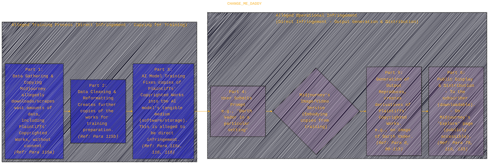

> ⚠️🏗️🚧🦺🧱🪵🪨🪚🛠️👷
> 
> This is a working draft in progress
> 
> 
> 
> gif image is provided by [Giphy](https://giphy.com)
> 
> ⚠️🏗️🚧🦺🧱🪵🪨🪚🛠️👷

----

<!--
https://media3.giphy.com/media/v1.Y2lkPTc5MGI3NjExZGhqcXdrdm5hcXFkbDU4MG44YWgxbjJuanY1dXRzcWViMHVjOTNzcCZlcD12MV9pbnRlcm5hbF9naWZfYnlfaWQmY3Q9Zw/iiiATPwmySN6on0cHR/giphy.gif
-->

# Disney et al. vs. Midjourney, Inc - Case No. 25-5275
> <ins>📢 **Disclaimer** 🚨</ins>
>
> This document contains my personal notes on the topic,
> compiled from publicly available documentation and various cited sources.
> The materials are intended for educational purposes, personal study, and reference.
> The content is dual-licensed:
> 1. **MIT License:** Applies to all code implementations (Swift, Mermaid, and other programming languages).
> 2. **Creative Commons Attribution-ShareAlike 4.0 International License (CC BY-SA 4.0):** Applies to all non-code content, including text, explanations, diagrams, and illustrations.
---

----

## 🏛️ Case Overview: Disney et al. vs. Midjourney, Inc

This lawsuit, Case No. 25-5275, pits major content creators against an AI technology company.

```mermaid
---
title: "Case Overview: Disney et al. vs. Midjourney, Inc"
author: "Cong Le"
version: "1.0"
license(s): "MIT, CC BY-SA 4.0"
copyright: "Copyright (c) 2025 Cong Le. All Rights Reserved."
config:
  layout: elk
  theme: base
  look: handDrawn
---
%%%%%%%% Mermaid version v11.4.1-b.14
%%%%%%%% Available curve styles include the following keywords:
%% basis, bumpX, bumpY, cardinal, catmullRom, linear, monotoneX, monotoneY, natural, step, stepAfter, stepBefore.
%%{
  init: {
    'flowchart': { 'htmlLabels': true, 'curve': 'basis' },
    'fontFamily': 'American Typewriter, monospace',
    'logLevel': 'fatal',
    'themeVariables': {
      'primaryColor': '#22BB',
      'primaryTextColor': '#F8B229',
      'lineColor': '#F8B229',
      'primaryBorderColor': '#27AE60',
      'secondaryColor': '#E2F1',
      'secondaryTextColor': '#6C3483',
      'secondaryBorderColor': '#A569BD',
      'fontSize': '20px'
    }
  }
}%%
flowchart TD
    A["<strong>Case 2:25-cv-05275</strong><br/>U.S. District Court, Central District of California"] --> B{Copyright Infringement Lawsuit};
    B --> C[Plaintiffs: <br/>Disney Enterprises, Inc.<br/>Marvel Characters, Inc.<br/>MVL Film Finance LLC<br/>Lucasfilm Ltd. LLC<br/>Twentieth Century Fox Film Corp.<br/>Universal City Studios Productions LLLP<br/>DreamWorks Animation L.L.C.];
    B --> D[Defendant: <br/>Midjourney, Inc.];
    C --> E{Claims};
    D --> E;
    E --> F[Direct Copyright Infringement];
    E --> G[Secondary Copyright Infringement];
    F --> H["Under Copyright Act<br/>(17 U.S.C. § 101 et seq.)"];
    G --> H;
    H --> I["Demand for Jury Trial"];

    style A fill:#f9f2,stroke:#333,stroke-width:2px;
    style C fill:#A226,stroke:#333,stroke-width:2px;
    style D fill:#A226,stroke:#333,stroke-width:2px;
    style E fill:#AD86,stroke:#333,stroke-width:2px;
```

**Key Legal Statutes Invoked:**
*   Copyright Act: $17 \text{ U.S.C. } \S 101 \text{ et seq.}$
*   Subject Matter Jurisdiction: $28 \text{ U.S.C. } \S\S 1331, 1338(a)$
*   Right to Sue for Infringement: $17 \text{ U.S.C. } \S 501(b)$
*   Venue: $28 \text{ U.S.C. } \S 1391(b), \S 1400(a)$

---

## 👥 The Parties Involved

### Plaintiffs: The Content Creators 🎬

The plaintiffs are a consortium of major film and entertainment studios, grouped as "Disney" and "Universal" for simplicity in the complaint.

### Defendant: The AI Service 💻

Midjourney, Inc. is the Delaware corporation accused of copyright infringement.

---

## 📜 Allegations Against Midjourney

The core argument is that Midjourney's AI services infringe on the plaintiffs' copyrighted works.

### How Midjourney's Service Allegedly Works and Infringes 🤖🖼️

The complaint outlines a process by which Midjourney's AI is supposedly trained on and then generates infringing content.

**Plaintiffs' Argument:** Midjourney's service acts as a "virtual vending machine" (Para 1) for unauthorized copies. They claim piracy is piracy, regardless of AI involvement (Para 2).

### Examples of Alleged Infringement 📸

The complaint is rich with visual examples (though not rendered here, they are described on pages 5, 7, and extensively from paragraph 81 onwards). These examples show Midjourney outputs that bear a strong resemblance to iconic characters like:
*   Darth Vader, Yoda, Stormtroopers, R2-D2, C-3PO, Chewbacca, The Mandalorian & Grogu (Baby Yoda) (Disney - Star Wars)
*   Bart Simpson, Homer Simpson (Disney - The Simpsons)
*   Iron Man, Deadpool, Spider-Man, The Incredible Hulk, Groot (Disney - Marvel)
*   Buzz Light year, Lightning McQueen, Wall-E, Sulley (Disney - Pixar)
*   Princess Elsa, Olaf, Aladdin & Jasmine, Simba, Ariel (Disney - Classic Animation)
*   Minions (Universal - Despicable Me)
*   Hiccup & Toothless, Shrek, The Boss Baby (Ted), Po (Universal - DreamWorks)

The complaint cites a research article by Gary Marcus and Reid Southen ("Generative AI Has A Visual Plagiarism Problem," IEEE Spectrum, Jan. 6, 2024 - *as cited in the document, though the year is prior to the fictional complaint filing*) which details Midjourney generating copyrighted works, sometimes even without explicit prompts for specific characters (Paras 123-131).

---

## ⚖️ Legal Claims

### 1. Direct Copyright Infringement (First Claim for Relief)

Plaintiffs allege Midjourney directly infringes their exclusive rights under $17 \text{ U.S.C. } \S 106$ by:
*   **Reproducing** copyrighted works (during training and output generation).
*   **Publicly Displaying** copyrighted works (e.g., on the "Explore" page).
*   **Distributing** copyrighted works (to subscribers).
*   **Creating Derivative Works** based on copyrighted works.
(Paras 201-211)

### 2. Secondary Copyright Infringement (Second Claim for Relief - Pled in Alternative)

If Midjourney argues its users are the direct infringers, Plaintiffs alternatively claim Midjourney is liable for secondary infringement.

(Paras 212-235)

----

## 😠 Willful Infringement & Failure to Act

Plaintiffs emphasize that Midjourney's actions are **willful** (Paras 3, 114, 189, 206, 230).
*   Midjourney allegedly ignored cease-and-desist letters sent in December 2024 (Exhibits C & D to the complaint).
*   Instead of implementing protective measures (like those used for nudity/violence or by competitor AI services), Midjourney allegedly "doubled down" by releasing newer versions (V7 in April 2025) and teasing a video service (Paras 3, 4, 10-11, 182-192).
*   Midjourney's CEO, David Holz, is quoted admitting to widespread data gathering for training without seeking consent and opining on the entertainment industry using AI to "cut costs" and "cut artists out" (Paras 115a, 31f, Footnotes 2, 5, 6).

-----

## ⏳ Timeline of Key Alleged Events

While the document is dense, a simplified timeline can be constructed based on the allegations:

*Disclaimer: The dates for revenue and user counts are cited in the document with specific sources like TechCrunch, DemandSage, and SEO.AI, but are presented here within the fictional timeline of the complaint.*

----

## 💔 Harm to Plaintiffs & Market

Plaintiffs claim Midjourney's actions cause **substantial and irreparable harm** (Paras 12, 14, 196-200, 211, 235) by:
*   Usurping control over their IP and licensing strategies.
*   Unfairly competing with legitimate licensees.
*   Undercutting existing and potential licensing markets.
*   Causing consumer confusion about authorization.
*   Threatening the American motion picture industry's jobs and economic contributions.

----

## 🙏 Prayer for Relief

Plaintiffs are seeking several remedies from the court:
1.  **Damages:**
	*   Plaintiffs' actual damages AND Midjourney's profits.
	*   Alternatively, maximum statutory damages: $17 \text{ U.S.C. } \S 504(c)$ (up to $150,000 per infringed work for willful infringement).
2.  **Accounting & Restitution:** For Midjourney's unlawful proceeds.
3.  **Injunctive Relief:** ($17 \text{ U.S.C. } \S 502$)
	*   To stop Midjourney from infringing (copying, displaying, distributing Plaintiffs' works).
	*   To prevent Midjourney from offering its Image and forthcoming Video services without appropriate copyright protection measures.
4.  **Prejudgment Interest.**
5.  **Attorneys' Fees and Costs:** ($17 \text{ U.S.C. } \S 505$).
6.  **Any other relief** the Court deems just.

(Paras 236-241 of the complaint in the image, actual listed as points 1-6 on page 108 of document)

---

## 🌐 Citations and References from the Document

*   **Statutes:**
	*   Copyright Act (17 U.S.C. § 101 et seq.)
	*   28 U.S.C. §§ 1331, 1338(a) (Subject Matter Jurisdiction)
	*   17 U.S.C. § 501(b) (Standing to sue for infringement)
	*   28 U.S.C. § 1391(b), § 1400(a) (Venue)
	*   17 U.S.C. § 106 (Exclusive Rights)
	*   17 U.S.C. § 504 (Damages and Profits)
	*   17 U.S.C. § 505 (Costs and Attorney's Fees)
	*   17 U.S.C. § 502 (Injunctive Relief)
*   **Articles & Online Sources (as cited by filename, with provided links):**
	*   Monge, Jim Clyde. "Midjourney Finally Releases V7 Image Model." Medium (Apr. 7, 2025). `https://generativeai.pub/midjourney-finally-releases-v7-image-model-e07455e60f57` (Footnote 1)
	*   Salkowitz, Rob. "Midjourney Founder David Holz on the Impact of AI on Art, Imagination and the Creative Economy." Forbes (Sept. 16, 2022). `https://www.forbes.com/sites/robsalkowitz/2022/09/16/midjourney-founder-david-holz-on-the-impact-of-ai-on-art-imagination-and-the-creative-economy/` (Footnotes 2, 6)
	*   Wiggers, Kyle. "Midjourney Says It's 'Getting Into Hardware'." TechCrunch (Aug. 28, 2024). `https://techcrunch.com/2024/08/28/midjourney-says-its-getting-into-hardware/` (Footnote 3)
	*   Kumar, Naveen. "Midjourney Statistics 2025: Users & Revenue Data." DemandSage (Dec. 31, 2024). `https://www.demandsage.com/midjourney-statistics/` (Footnote 3)
	*   Mortensen, Oskar. "How Many People Work at Midjourney? Statistics & Facts (2025)." SEO.AI (Dec. 2, 2024). (Footnote 3 - No direct link provided in complaint text for this one, but implied to be part of the set for statistic)
	*   Vincent, James. "'An Engine for the Imagination': The Rise of AI Image Generators, An Interview with Midjourney Founder David Holz." The Verge (Aug. 2, 2022). `https://www.theverge.com/2022/8/2/23287173/ai-image-generation-art-midjourney-multiverse-interview-david-holz` (Footnote 5)
	*   Marcus, Gary, and Reid Southen. "Generative AI Has A Visual Plagiarism Problem Experiments With Midjourney And DALL-E 3 Show A Copyright Minefield." IEEE Spectrum (Jan. 6, 2024). `https://spectrum.ieee.org/midjourney-copyright` (Footnote 7)
	*   InstantAI. "Recreating Classic Disney 1930s Style Animation with Midjourney AI." Medium (Oct. 14, 2024). `https://instantaiprompts.medium.com/recreating-classic-disney-1930s-style-animation-with-midjourney-ai-3c4735dfb226` (Footnote 8)
	*   Reddit Threads:
		*   CarterDire3, Battle-damaged Stormtrooper. `https://www.reddit.com/r/midjourney/comments/110krst/battledamaged_stormtrooper/` (Footnote 9)
		*   Sandwich01, Institutionalization of minions. `https://www.reddit.com/r/midjourney/comments/15lo724/institutionalization_of_minions/` (Footnote 10)
		*   gdspaz, Deadpool and Wolverine hanging out. `https://www.reddit.com/r/midjourney/comments/13h3fd0/deadpool_and_wolverine_hanging_out/` (Footnote 11)
		*   GremlinBobby, The Life of Shrek Beyond the Swamp. `https://www.reddit.com/r/midjourney/comments/180c179/the_life_of_shrek_beyond_the_swamp/` (Footnote 12)
		*   Eon_Flux_139, Deadpool. `https://www.reddit.com/r/midjourney/comments/1esdjzk/deadpool/` (Footnote 13)
		*   SmirkingDesigner, Frozen. `https://www.reddit.com/r/midjourney/comments/1fwkjhe/frozen/` (Footnote 14)
		*   RainMan915, Darth Vader. `https://www.reddit.com/r/midjourney/comments/198z4ad/darth_vader/` (Footnote 15)
		*   alanskimp, Yoda. `https://www.reddit.com/r/midjourney/comments/10xpm3j/yoda/` (Footnote 16)
		*   filoni, Some of my fave Marvel generations! [prompt in comment]. `https://www.reddit.com/r/midjourney/comments/xeqpi3/some_of_my_fave_marvel_generations_prompt_in/#lightbox` (Footnote 17)
	*   Midjourney Terms of Service. `https://docs.midjourney.com/hc/en-us/articles/32083055291277-Terms-of-Service` (Footnote 18)
	*   Midjourney Plans documentation. `https://docs.midjourney.com/docs/plans` (Footnote 4)

----

<!-- 

---
>**Licenses:**
>
>- **MIT License:**   - Full text in [LICENSE](LICENSE) file.
>- **Creative Commons Attribution-ShareAlike 4.0 International**: [CC BY-SA 4.0](https://creativecommons.org/licenses/by-sa/4.0/)  - Legal details in [LICENSE-CC-BY-SA-4.0](THE_PAST/LICENSE-CC-BY-SA-4.0) and at [Creative Commons official site](https://creativecommons.org/licenses/by-sa/4.0/).
>
---
