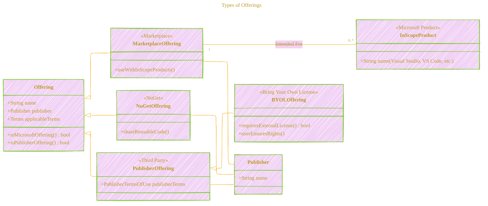

> ⚠️🏗️🚧🦺🧱🪵🪨🪚🛠️👷
> 
> This is a working draft in progress
> 
> 
>
> gif image is provided by [Giphy](https://giphy.com/gifs/spongebob-spongebob-squarepants-season-6-xT3i1dp3WjezioIadi)
> 
> ⚠️🏗️🚧🦺🧱🪵🪨🪚🛠️👷


----


# Microsoft Visual Studio Marketplace and NuGet.org Terms of Use
<details open>
<summary>Click to show/hide the full disclaimer.</summary>
   
> <ins>📢 **Disclaimer** 🚨</ins>
>
> This document contains my personal notes on the topic,
> compiled from publicly available documentation and various cited sources.
> The materials are intended for 👨‍🎓 <ins>educational purposes</ins> 👨‍🎓 (<ins>:trollface:sometimes, entertainment purposes:trollface:</ins>), 📖 <ins> personal study </ins> 📖, and 🔖 <ins> reference </ins> 🔖.
> The content is dual-licensed:
> 1. **MIT License:** Applies to all code implementations (Swift, Mermaid, and other programming languages).
> 2. **Creative Commons Attribution-ShareAlike 4.0 International License (CC BY-SA 4.0):** Applies to all non-code content, including text, explanations, diagrams, and illustrations.

</details>


----

## 🏛️ Overview of the Agreement and Platforms

The core of the agreement defines the relationship between **You** (the user/developer), **Microsoft** (the host), and **Publishers** (third-party providers) concerning the **Visual Studio Marketplace** and **NuGet.org**.

Here's a high-level view of the entities and their interactions:

```mermaid
---
title: "🏛️ Overview of the Agreement and Platforms"
author: "Cong Le"
version: "1.0"
license(s): "MIT, CC BY-SA 4.0"
copyright: "Copyright (c) 2025 Cong Le. All Rights Reserved."
config:
  layout: elk
  theme: base
  look: handDrawn
---
%%%%%%%% Mermaid version v11.4.1-b.14
%%%%%%%% Available curve styles include the following keywords:
%% basis, bumpX, bumpY, cardinal, catmullRom, linear, monotoneX, monotoneY, natural, step, stepAfter, stepBefore.
%%{
  init: {
    'flowchart': { 'htmlLabels': true, 'curve': 'basis' },
    'fontFamily': 'American Typewriter, monospace',
    'logLevel': 'fatal',
    'themeVariables': {
      'primaryColor': '#22BB',
      'primaryTextColor': '#F8B229',
      'lineColor': '#F8B229',
      'primaryBorderColor': '#27AE60',
      'secondaryColor': '#3483',
      'secondaryTextColor': '#6C3483',
      'secondaryBorderColor': '#A569BD',
      'fontSize': '20px'
    }
  }
}%%
flowchart TD
    subgraph Platforms["💻 Sites<br/>(Hosted by Microsoft)"]
    style Platforms fill:#F2F2,stroke:#333,stroke-width:1px, color: #FFFF
    direction LR
        MKT["Visual Studio Marketplace"]
        NUG["NuGet.org"]
    end

    MS["Microsoft Corp."] -- Hosts & Governs --> Platforms
    PUB["👥 Publisher<br/>(Third-Party)"] -- Publishes Offerings --> Platforms

    %% USER["👤 You<br/>(User/Developer)"] -- Accesses/Uses --> Platforms
    USER@{ img: "https://raw.githubusercontent.com/CongLeSolutionX/CongLeSolutionX/refs/heads/main/assets/images/My-meme-oranges.png", label: "✍️...🤔❓🤔...👨🏼‍💻", pos: "b", w: 200, h: 150, constraint: "on" }
    USER -- Accesses/Uses --> Platforms
    
    Platforms -- Provides Access To --> OFFERINGS
    subgraph OfferingsFamily["🎁 Offerings"]
    style OfferingsFamily fill:#22F2,stroke:#333,stroke-width:1px, color: #FFFF
        MKT_O["Marketplace Offerings"]
        NUG_O["NuGet Offerings"]
        PUB_O["Publisher Offerings<br/>(on MKT & NUG)"]
    end

    MKT -- Focuses On --> MKT_O
    NUG -- Focuses On --> NUG_O

    MKT_O --> EXTEND["Extend In-Scope Products"]
    NUG_O --> SHARE["Share/Consume .NET Components"]

    USER -- Agrees To --> ToU["📜 Terms of Use<br/>(This Agreement)"]
    PUB -- Bound By --> PA["Agreement with Microsoft<br/> (e.g., Publisher Agreement)"]
    USER -- May Be Bound By --> PTOU["📝 Publisher Terms of Use<br/>(for Publisher Offerings)"]

    style MS fill:#2874A6,stroke:#000,stroke-width:2px,color:#fff
    style USER fill:#1E8449,stroke:#000,stroke-width:2px,color:#fff
    style PUB fill:#B9770E,stroke:#000,stroke-width:2px,color:#fff
    style MKT fill:#884EA0,stroke:#000,stroke-width:2px,color:#fff
    style NUG fill:#D35400,stroke:#000,stroke-width:2px,color:#fff
    style ToU fill:#f9f2,stroke:#333,stroke-width:2px
    style PA fill:#f9f2,stroke:#333,stroke-width:2px
    style PTOU fill:#f9f2,stroke:#333,stroke-width:2px
```

**Key Takeaways from Introduction:**

*   **Parties:** You, Microsoft, Publishers.
*   **Sites:** Visual Studio Marketplace (for extensions for products like Visual Studio, VS Code, Azure DevOps) and NuGet.org (for .NET packages).
*   **Offerings:** Products, services, packages available on these sites.
*   **Binding Agreement:** By using the Sites, you agree to these Terms of Use.
*   **Publisher Offerings:** Governed by their own terms; Microsoft isn't responsible for third-party IP or information.
*   **Data Responsibility:** You are responsible for data you upload. Unlisted offerings are hidden from search.

---

## 📜 Section 1 & 2: Offerings and Use Rights

The document details different types of offerings and the specific rights and conditions associated with their use, particularly for the Marketplace.

### Types of Offerings

Let's visualize the hierarchy and types of offerings:



**Key Conditions for Marketplace Offerings (Section 2):**

*   **Publisher Terms of Use:** Your use of a `PublisherOffering` is governed by the Publisher's separate terms. Microsoft is not party to these.
*   **Marketplace Offering Use:** Governed by the acquisition agreement and applicable fees. Restricted to use with **In-Scope Products and Services** (e.g., Visual Studio, VS Code, Azure DevOps). You cannot reverse-engineer or use them outside these products.
*   **BYOL Offerings (Bring-Your-Own-License):** You must have externally obtained rights to use these. You are responsible for ensuring you have these rights.
*   **Publisher Policies:** Publishers must comply with applicable laws for customer data. Microsoft's policies do not apply to `PublisherOfferings` or data handled by Publishers.
*   **Marketplace APIs:** Use of APIs for purchasing or accessing offerings binds you to presented terms and authorizes fee payment.

---

## 🚫 Section 3: General Use Rights and Prohibitions for All Offerings

This section applies to both Marketplace and NuGet offerings and highlights restrictions on how you can use the Sites.

```dot
/*
 * title: Section 3 - General Use Rights and Prohibitions for All Offerings
 * author: Cong Le
 * version: 1.0
 * license(s): MIT, CC BY-SA 4.0
 * copyright: Copyright (c) 2025 Cong Le. All Rights Reserved.
 */
digraph ProhibitedUses {
    rankdir="LR";
    node [shape=box, style="filled,rounded", fillcolor="#FFCCCB"];
    edge [color="#FF4136", arrowhead="vee"];

    P_TITLE [label="🚫 Prohibited Uses of the Sites 🚫", shape=plaintext, fontsize=16];

    UNLAWFUL [label="Unlawful or Agreement-Prohibited Purposes"];
    DAMAGE_SERVER [label="Damage, Disable, Overburden, Impair Microsoft Servers/Networks"];
    INTERFERE [label="Interfere with Others' Use"];
    UNAUTH_ACCESS [label="Unauthorized Access\n(Hacking, Password Mining)"];
    NON_PUBLIC_MEANS [label="Obtain Info via Non-Publicly Supported Interfaces\n(Harvesting, Scraping, Spidering)"];
    IMPORT_OUTSIDE_SCOPE [label="Import/Install/Use MS/GitHub Offerings\nOutside In-Scope Products"];

    USER_ACTION [label="User Action", shape=ellipse, style=filled, fillcolor="#ADD8E6"];

    USER_ACTION -> UNLAWFUL;
    USER_ACTION -> DAMAGE_SERVER;
    USER_ACTION -> INTERFERE;
    USER_ACTION -> UNAUTH_ACCESS;
    USER_ACTION -> NON_PUBLIC_MEANS;
    USER_ACTION -> IMPORT_OUTSIDE_SCOPE;

    P_TITLE -> USER_ACTION [style=invis]; // For layout
}
```



Simply put: Don't misuse the Sites, harm Microsoft's infrastructure, interfere with other users, try to hack in, scrape data, or use Microsoft's own offerings incorrectly.

---

## 📜 Section 4: Code of Conduct

This is a comprehensive section detailing acceptable and unacceptable behavior. It's crucial for maintaining a healthy and lawful community.

```mermaid
---
title: "Section 4 - Code of Conduct"
author: "Cong Le"
version: "1.0"
license(s): "MIT, CC BY-SA 4.0"
copyright: "Copyright (c) 2025 Cong Le. All Rights Reserved."
config:
  theme: base
---
%%%%%%%% Mermaid version v11.4.1-b.14
%%{
  init: {
    'fontFamily': 'American Typewriter, monospace',
    'logLevel': 'fatal',
    'mindmap': {
	    'nodeAlign': 'center',
	    'padding': 20
    },
    'themeVariables': {
      'primaryColor': '#FC82',
      'primaryTextColor': '#F8B229',
      'primaryBorderColor': '#27AE60',
      'secondaryColor': '#EBF3',
      'secondaryTextColor': '#6C3483',
      'secondaryBorderColor': '#A569BD',
      'fontSize': '20px'
    }
  }
}%%
mindmap
  root)"📜 **Code of Conduct**"(
    ::icon(fas fa-gavel)
    Behavioral_Rules))"**Behavioral Rules**"((
      Respectful_Behavior{{"Respectful Behavior"}}
        :::icon(fas fa-comments)
        No_Disrespectful_Behavior{{"No Disrespectful Behavior"}}
          (Threats)
          (Harassment)
          (Abuse)
          (Slurs)
          (Profanity)
          (Attacks)
          (Sexual remarks)
        No_Impersonation{{"No Impersonation"}}
          (Microsoft employees)
          (Other users)
      Responsibility{{"Responsibility"}}
        Take Responsibility for Actions
          (Words, deeds, interactions)
      Integrity_and_Honesty{{"Integrity & Honesty"}}
        :::icon(fas fa-balance-scale)
        No False or Misleading Activity
          (False pretenses, manipulating stats, squatting names, undocumented behavior)
        No Plagiarism
          (Post own original/licensed work, no duplication of existing site content)
    Content_and_Activity))"**Content & Activity**"((
      Legal_and_Offensive_Content{{"Legal & Offensive Content"}}
        :::icon(fas fa-skull-crossbones)
        No Illegal or Offensive Activities
          (Defamatory, infringing, obscene, child pornography, drugs, piracy, discriminatory content)
      Discrimination_and_Harassment{{"Discrimination & Harassment"}}
        :::icon(fas fa-ban)
        No Discrimination or Harassment
          (Based on age, race, gender, religion, etc.)
        No Sexual Harassment
          (Unwelcome advances, sexual comments, explicit content)
      Protection_of_Minors{{"Protection of Minors"}}
        :::icon(fas fa-child)
        No Use by Under 13s
        No Activity Harming Children
      Privacy_and_Data{{"Privacy & Data"}}
        :::icon(fas fa-user-secret)
        No Violating Third-Party Privacy
          (Posting personal info without consent)
        No Spamming/Selling User Info
    Site_Specific_Rules))"**Site Specific Rules**"((
      Access_and_Usage{{"Access & Usage"}}
        :::icon(fas fa-network-wired)
        No Use if Previously Revoked
        No Circumventing Access Restrictions
        No Abusing Support Resources
        No "General Purpose" Hosting
          (Empty/duplicate packages/extensions)
      Community_and_Interaction{{"Community & Interaction"}}
        :::icon(fas fa-users)
        No Off-Topic Discussions in Forums
          (Stick to technical; no religion, sex, politics)
        No Self-Appointed Moderators
        No Spam in Discussions
        No Posting Harmful Data
          (Viruses, disruption tools)
    General_Principles))"**General Principles**"((
      Assistance{{"Assistance"}}
        Do Not Help Others Break Rules
      Hate_Speech{{"Hate Speech"}}
        :::icon(fas fa-comment-slash)
        No Hate Speech
          (Attacks based on protected traits)
```



**Key Themes of the Code of Conduct:**

*   **Respect & Professionalism:** Treat others with respect.
*   **Legality & Ethics:** No illegal activities, offensive content, or infringement.
*   **Honesty & Authenticity:** Don't mislead, impersonate, or plagiarize.
*   **Safety & Privacy:** Protect children and respect user privacy.
*   **Constructive Community:** Use forums appropriately and avoid spam.

---

## ⚖️ Section 5: Termination and Suspension

Microsoft reserves the right to terminate or suspend your access if you violate the agreement.


**Grounds for Termination/Suspension include:**

*   Violation of law.
*   Harm to Microsoft's or others' interests (including IP).
*   Need to prevent unauthorized data access.
*   Violation of the Terms of Use (including the Code of Conduct).
*   Any reason at Microsoft's sole discretion.

---

## 🔄 Section 6: Updates and Changes to Terms

Microsoft can update the Agreement.

*   You'll be notified of changes upon accessing the Sites.
*   The "Last Updated" date at the top of the Agreement will change.
*   **Continued use after updates signifies acceptance of the new terms.**

---

## 🔒 Section 7: Privacy and Security Terms

This section addresses how your information is handled.

*   **Privacy:**
	*   The **Microsoft Privacy Statement** applies to information collected *through the Sites themselves*, not through third-party Offerings.
	*   **Organizational Control:** If using an organizational email (employer, school), the organization might control your account and access your data. Your use might be subject to your organization's policies. Direct privacy inquiries for such accounts to your administrator.
*   **Security:**
	*   Microsoft implements technical and organizational measures to protect customer data against accidental/unauthorized access, disclosure, alteration, loss, or destruction.

---

## ⚠️ Section 8: No Warranty

This is a standard disclaimer limiting Microsoft's responsibility for the performance and reliability of the Sites.

```mermaid
---
title: "⚠️ Section 8: No Warranty"
author: "Cong Le"
version: "1.0"
license(s): "MIT, CC BY-SA 4.0"
copyright: "Copyright (c) 2025 Cong Le. All Rights Reserved."
config:
  layout: elk
  theme: base
  look: handDrawn
---
%%%%%%%% Mermaid version v11.4.1-b.14
%%%%%%%% Available curve styles include the following keywords:
%% basis, bumpX, bumpY, cardinal, catmullRom, linear, monotoneX, monotoneY, natural, step, stepAfter, stepBefore.
%%{
  init: {
    'flowchart': { 'htmlLabels': true, 'curve': 'basis' },
    'fontFamily': 'American Typewriter, monospace',
    'logLevel': 'fatal',
    'themeVariables': {
      'primaryColor': '#22BB',
      'primaryTextColor': '#F8B229',
      'lineColor': '#F8B229',
      'primaryBorderColor': '#27AE60',
      'secondaryColor': '#E2F1',
      'secondaryTextColor': '#6C3483',
      'secondaryBorderColor': '#A569BD',
      'fontSize': '20px'
    }
  }
}%%
flowchart LR
    A["🛡️ Microsoft & Affiliates Provide Sites:"] --- B["AS IS"]
    A --- C["WITH ALL FAULTS"]
    A --- D["AS AVAILABLE"]

    B --> E["🚫 NO GUARANTEES 🚫"]
    C --> E
    D --> E

    E --> F["Accuracy or Timeliness of Info"]
    E --> G["Uninterrupted, Timely, Secure, Error-Free Access"]
    E --> H["No Data Loss"]

    I["EXCLUSION OF IMPLIED WARRANTIES"] --> J["Merchantability"]
    I --> K["Satisfactory Quality"]
    I --> L["Fitness for a Particular Purpose"]
    I --> M["Workmanlike Effort"]
    I --> N["Non-Infringement"]

    O["Your Local Law"] -- May Grant --> P["Certain Rights (Unaffected if Applicable)"]

    style A fill:#f9f2,stroke:#333,stroke-width:2px
    style E fill:#f299,stroke:#cc0000,stroke-width:2px
    style I fill:#f9f2,stroke:#333,stroke-width:2px
```



**In essence: Use the Sites at your own risk.** Microsoft doesn't guarantee they will always work perfectly or that information will always be accurate.

---

## 💰 Section 9: Limitation of Liability

This section significantly limits the damages you can recover from Microsoft.

**Key Limitation:**
If Microsoft breaches the agreement, or if you have any basis for recovering damages:
Your exclusive remedy is to recover direct damages up to:
$$
\text{USD\$5.00}
$$

**Damages You CANNOT Recover (to the extent permitted by law):**

*   Consequential damages
*   Lost profits
*   Special, indirect, incidental, or punitive damages

**This limitation applies regardless of:**

*   If the $5.00 remedy doesn't fully compensate for losses.
*   If Microsoft knew or should have known about the possibility of damages.

**Applies to anything related to the Agreement, such as:**

*   Loss of customer data.
*   Viruses from using the Sites.
*   Delays/failures in transmissions or transactions.
*   Claims for breach of contract, warranty, etc.
*   Strict liability, negligence, torts.
*   Violation of statute or regulation.
*   Unjust enrichment.

*Local laws might affect these limitations.*

---

## 📑 Section 10: Miscellaneous

This section covers various important legal and operational details.

```dot
/*
 * title: Section 10 - Miscellaneous
 * author: Cong Le
 * version: 1.0
 * license(s): MIT, CC BY-SA 4.0
 * copyright: Copyright (c) 2025 Cong Le. All Rights Reserved.
 */
digraph Miscellaneous {
    node [style="filled,rounded", fillcolor="#E3F2FD"];

    subgraph cluster_Authority {
        label="🤝 Contracting Authority";
        ca_individual [label="Individual accepting for an entity\nrepresents legal authority."];
        ca_entity [label="Entity specified or using entity email\nis treated as account owner."];
    }

    subgraph cluster_IP {
        label="©️ Intellectual Property Rights";
        ip_ms [label="Microsoft/suppliers retain all rights, titles, interests\nin Sites & MS-published Offerings."];
        ip_reserved [label="Microsoft reserves all rights not expressly granted."];
        ip_brand [label="Review Microsoft Trademark & Brand Guidelines.\nLogos, icons require express license.\nDiscouraged: MS/GitHub wordmarks in package names."];
        ip_no_grant [label="Agreement doesn't grant/imply rights to MS/supplier trademarks."];
    }

    subgraph cluster_Infringement {
        label="📢 IP Infringement Claims";
        inf_notice [label="DMCA: Send notifications to Designated Agent."];
        inf_report [label="Use 'Report Abuse'/'Report Package' links."];
        inf_share [label="Notice (incl. email) may be shared with alleged infringer."];
        inf_repeat [label="Repeat infringers' accounts may be closed."];
    }

    subgraph cluster_Legal {
        label="🧑‍⚖️ Jurisdiction & Governing Law";
        law_state [label="Governed by Laws of Washington State, USA\n(excluding conflicts of laws)."];
        law_courts [label="Exclusive jurisdiction: Federal courts in King County, WA.\n(If no federal jurisdiction, then WA State courts in King County, WA)."];
        law_un [label="UN Convention on Contracts for the International Sale of Goods: DOES NOT APPLY."];
    }

    subgraph cluster_Agreement {
        label="📜 Entire Agreement";
        ea_full [label="This Agreement is the entire agreement,\nsupersedes all prior communications."];
    }
}
```



**Key Points from Miscellaneous:**

*   **Contracting Authority:** Clarifies who is bound if an individual accepts on behalf of an entity.
*   **Intellectual Property Rights:** Microsoft retains its IP. Review brand guidelines for using Microsoft trademarks.
*   **IP Infringement Claims:** Procedures for reporting copyright and other IP infringement (DMCA process).
*   **Jurisdiction and Governing Law:** Disputes will be handled under Washington State law in King County, WA courts.
*   **Entire Agreement:** This document is the complete agreement between you and Microsoft regarding the Sites.

---

This breakdown should provide a clearer understanding of the Microsoft Visual Studio Marketplace and NuGet.org Terms of Use. Remember, this is a summary, and the full document should always be consulted for precise legal details.

**Primary Reference:** The provided "Microsoft Visual Studio Marketplace and NuGet.org Terms of Use" document, Last Updated January 2025.

For official Microsoft legal documents, you would typically refer to:
*   Microsoft Legal: [https://www.microsoft.com/en-us/legal](https://www.microsoft.com/en-us/legal)
*   Microsoft Trademark and Brand Guidelines: [https://www.microsoft.com/en-us/legal/intellectualproperty/trademarks/usage/general.aspx](https://www.microsoft.com/en-us/legal/intellectualproperty/trademarks/usage/general.aspx) (Note: The link in the document was generic, this is a common specific one.)
*   GitHub Brand Toolkit (if applicable, through GitHub's site).

-----

<!-- 


---
>**Licenses:**
>
>- **MIT License:**  [](LICENSE) - Full text in [LICENSE](LICENSE) file.
>- **Creative Commons Attribution-ShareAlike 4.0 International**: [CC BY-SA 4.0](https://creativecommons.org/licenses/by-sa/4.0/) [](https://creativecommons.org/licenses/by-sa/4.0/) - Legal details in [LICENSE-CC-BY-SA-4.0](THE_PAST/LICENSE-CC-BY-SA-4.0) and at [Creative Commons official site](https://creativecommons.org/licenses/by-sa/4.0/).
>
---
