> ⚠️🏗️🚧🦺🧱🪵🪨🪚🛠️👷
> 
> This is a working draft in progress
> 
> 
>
> gif image is provided by [Giphy](https://giphy.com/gifs/spongebob-spongebob-squarepants-season-6-xT3i1dp3WjezioIadi)
> 
> ⚠️🏗️🚧🦺🧱🪵🪨🪚🛠️👷


----


## 📜 MICROSOFT SOFTWARE LICENSE TERMS - VISUAL STUDIO CODE 📜
<details open>
<summary>Click to show/hide the full disclaimer.</summary>
   
> <ins>📢 **Disclaimer** 🚨</ins>
>
> This document contains my personal notes on the topic,
> compiled from publicly available documentation and various cited sources.
> The materials are intended for educational purposes (<ins>sometimes, entertainment purposes</ins>), personal study, and reference.
> The content is dual-licensed:
> 1. **MIT License:** Applies to all code implementations (Swift, Mermaid, and other programming languages).
> 2. **Creative Commons Attribution-ShareAlike 4.0 International License (CC BY-SA 4.0):** Applies to all non-code content, including text, explanations, diagrams, and illustrations.

</details>

---

This is an agreement between **you** and **Microsoft Corporation** (or an affiliate based on your location) for the **Visual Studio Code software**. It also covers Microsoft services or updates for the software, unless they have different terms.

**Key Point:** If you comply, you get the rights detailed below. ✅

---

### 🏛️ Overall Structure of the License Agreement

Let's start with a high-level overview of the license terms using a mind map.


---

### 1. 💻 INSTALLATION AND USE RIGHTS

This section outlines what you're permitted to do with the software.

#### Flow of Permitted Uses

```mermaid
---
title: "💻 INSTALLATION AND USE RIGHTS"
author: "Cong Le"
version: "1.0"
license(s): "MIT, CC BY-SA 4.0"
copyright: "Copyright (c) 2025 Cong Le. All Rights Reserved."
config:
  layout: elk
  theme: base
  look: handDrawn
---
%%%%%%%% Mermaid version v11.4.1-b.14
%%%%%%%% Available curve styles include the following keywords:
%% basis, bumpX, bumpY, cardinal, catmullRom, linear, monotoneX, monotoneY, natural, step, stepAfter, stepBefore.
%%{
  init: {
    'flowchart': { 'htmlLabels': true, 'curve': 'linear'},
    'fontFamily': 'Monaco',
    'themeVariables': {
      'primaryColor': '#22BB',
      'primaryTextColor': '#F8B229',
      'lineColor': '#F8B229',
      'primaryBorderColor': '#27AE60',
      'secondaryColor': '#6C3483',
      'secondaryTextColor': '#6C3483',
      'secondaryBorderColor': '#A569BD',
      'fontSize': '15px'
    }
  }
}%%
flowchart TD
	My_Meme@{ img: "https://raw.githubusercontent.com/CongLeSolutionX/CongLeSolutionX/refs/heads/main/assets/images/My-meme-original.png", label: "You", pos: "b", w: 200, h: 150, constraint: "on" }
	My_Meme --> B("Install & Use VS Code")
    B --> C{"What for?"}
    C --> D["Develop Your Applications 👨‍💻"]
    C --> E["Test Your Applications 🧪"]
    D --> F["Deploy within Internal Corporate Network 🏢"]
    E --> F
    C --> G["Demonstrate Your Applications<br/>(Demo Use) 🎤"]

    B --> H("Consider Third Party Components")
    H --> I["May have separate legal notices/agreements<br/> (see ThirdPartyNotices file) 📄"]

    B --> J("Option:<br/>Download Extensions 🧩")
    J --> K["From Extension Marketplace / Package Managers"]
    K --> L["Extensions have THEIR OWN LICENSES<br/>(Not this agreement) ❗"]
    L --> M["Microsoft does not distribute, license, or warrant third-party packages"]
    M --> N["Using Marketplace?<br/>Agree to Marketplace ToU: <a href='https://aka.ms/vsmarketplace-ToU'>aka.ms/vsmarketplace-ToU</a>"]
```

**Key Points:**
*   **General Use:** Use any number of copies for development and testing, including internal corporate deployment.
*   **Demo Use:** Permitted.
*   **Third-Party Components:** Check `ThirdPartyNotices` file for separate terms.
*   **Extensions:** Governed by their own licenses, not this one. Using the marketplace means you agree to its terms.

---

### 2. 📊 DATA

This section deals with data collection and processing.

#### Data Collection & Usage Flow


**Key Points:**
*   **Data Collection by Microsoft:** Software collects data about you and your usage.
	*   **Purpose:** Provide services, improve products.
	*   **Opt-out:** Possible for many, but not all scenarios. Refer to product documentation.
*   **Data Collection by You (via Software Features):** If you use features to collect data from users of *your* applications:
	*   You must comply with applicable law.
	*   Provide appropriate notices to users.
	*   Include Microsoft's privacy statement.
*   **Processing of Personal Data:** Microsoft adheres to GDPR terms as per Online Services Terms if it acts as a processor/subprocessor.
*   **Consent:** Using the software implies consent to these data practices.

---

### 3. 🔄 UPDATES

How software updates are handled.


**Key Points:**
*   Software periodically checks for, downloads, and installs updates.
*   Updates only from Microsoft or authorized sources.
*   Microsoft might need to update your system.
*   You agree to automatic updates without extra notice.
*   Updates might not support all existing features.
*   You can turn off automatic updates (see documentation).

---

### 4. 💡 FEEDBACK

What happens if you provide feedback to Microsoft.

```mermaid
---
title: "💡 FEEDBACK"
author: "Cong Le"
version: "1.0"
license(s): "MIT, CC BY-SA 4.0"
copyright: "Copyright (c) 2025 Cong Le. All Rights Reserved."
config:
  layout: elk
  theme: base
  look: handDrawn
---
%%%%%%%% Mermaid version v11.4.1-b.14
%%%%%%%% Available curve styles include the following keywords:
%% basis, bumpX, bumpY, cardinal, catmullRom, linear, monotoneX, monotoneY, natural, step, stepAfter, stepBefore.
%%{
  init: {
    'flowchart': { 'htmlLabels': true, 'curve': 'linear'},
    'fontFamily': 'Monaco',
    'themeVariables': {
      'primaryColor': '#22BB',
      'primaryTextColor': '#F8B229',
      'lineColor': '#F8B229',
      'primaryBorderColor': '#27AE60',
      'secondaryColor': '#6C3483',
      'secondaryTextColor': '#6C3483',
      'secondaryBorderColor': '#A569BD',
      'fontSize': '15px'
    }
  }
}%%
flowchart LR
	My_Meme@{ img: "https://raw.githubusercontent.com/CongLeSolutionX/CongLeSolutionX/refs/heads/main/assets/images/My-meme-original.png", label: "You", pos: "b", w: 200, h: 150, constraint: "on" }
	My_Meme -- Gives Feedback --> B["Microsoft"]
    B -- Receives --> C{"Feedback Rights Given to Microsoft"}
    C --> D["Use Feedback ✅"]
    C --> E["Share Feedback ✅"]
    C --> F["Commercialize Feedback ✅"]
    D & E & F --> G["In any way, for any purpose, without charge 💸"]

    My_Meme -- Must Not Give --> H{"Feedback Subject to Restrictive Licenses"}
    H --> I["Licenses requiring Microsoft to license its software/docs to third parties because your feedback is included 🚫"]

    subgraph Survival["Survival"]
    style Survival fill:#F2F2,stroke:#333,stroke-width:1px, color: #FFFF
        J["These rights survive this agreement<br/>(even if it ends) ⏳"]
    end
    C --> J
```

**Key Points:**
*   If you give feedback, Microsoft gets rights to use, share, and commercialize it free of charge.
*   Don't provide feedback that's subject to a license requiring Microsoft to license *its* software/docs to third parties.
*   These rights persist even if the agreement ends.

---

### 5. 🗺️ SCOPE OF LICENSE

This defines what the license covers and your limitations.

**License Coverage & Source Code Distinction:**

```mermaid
---
title: "🗺️ SCOPE OF LICENSE"
author: "Cong Le"
version: "1.0"
license(s): "MIT, CC BY-SA 4.0"
copyright: "Copyright (c) 2025 Cong Le. All Rights Reserved."
config:
  layout: elk
  theme: base
  look: handDrawn
---
%%%%%%%% Mermaid version v11.4.1-b.14
%%%%%%%% Available curve styles include the following keywords:
%% basis, bumpX, bumpY, cardinal, catmullRom, linear, monotoneX, monotoneY, natural, step, stepAfter, stepBefore.
%%{
  init: {
    'flowchart': { 'htmlLabels': true, 'curve': 'linear'},
    'fontFamily': 'Monaco',
    'themeVariables': {
      'primaryColor': '#22BB',
      'primaryTextColor': '#F8B229',
      'lineColor': '#F8B229',
      'primaryBorderColor': '#27AE60',
      'secondaryColor': '#EEF2',
      'secondaryTextColor': '#6C3483',
      'secondaryBorderColor': '#A569BD',
      'fontSize': '15px'
    }
  }
}%%
flowchart TD
    subgraph Visual_Studio_Code_Ecosystem["Visual Studio Code Ecosystem"]
    style Visual_Studio_Code_Ecosystem fill:#F2F2,stroke:#333,stroke-width:1px, color: #FFFF
        A("VS Code <strong>Product</strong>") ==> B["Governed by <strong>THIS License Agreement</strong>"]
        C("VS Code <strong>Source Code</strong>") ==> D["Available at <a href='https://github.com/Microsoft/vscode'>github.com/Microsoft/vscode</a><br/>Governed by <strong>MIT License</strong>"]
        E("Extensions") ==> F["Governed by <strong>THEIR OWN Licenses</strong><br/>(Not this agreement)"]
    end

    X["Software is <strong>LICENSED, NOT SOLD</strong> 📜"] --> Y["Agreement gives <strong>SOME Rights</strong>"]
    Y --> Z["Microsoft reserves <strong>ALL OTHER Rights</strong> 🔒"]
```



**Your Obligations & Restrictions (Do's and Don'ts):**


*Note on "Reverse engineer…*": Except and solely to the extent required by third-party licensing terms governing use of certain open source components that may be included in the software.

**Key Points:**
*   Applies to the VS Code **product**. Source code is under MIT.
*   Software is **licensed, not sold**.
*   Microsoft reserves all other rights.
*   Use only as expressly permitted and comply with technical limitations.
*   **Restrictions:** No reverse engineering (with exceptions), no removing notices, no illegal use, no sharing/publishing/renting/leasing or offering as a standalone service.

---

### 6. 🛠️ SUPPORT SERVICES

*   Software is provided **"as is."**
*   Microsoft **may not** provide support services for it. 🤷‍♂️

---

### 7. 🤝 ENTIRE AGREEMENT

*   This agreement + terms for supplements, updates, internet-based services, and support services you use = **Entire agreement**.

---

### 8. 🌍 EXPORT RESTRICTIONS

*   You must comply with all domestic and international **export laws and regulations**.
*   Includes restrictions on destinations, end-users, and end use.
*   More info: [www.microsoft.com/exporting](https://www.microsoft.com/exporting) 🚢✈️

---

### 9. ⚖️ APPLICABLE LAW

The governing law depends on where you acquired the software.


---

### 10. 🛍️ CONSUMER RIGHTS; REGIONAL VARIATIONS

This agreement describes certain legal rights. You might have other rights (e.g., consumer rights) under your local laws. This agreement doesn't change those if local law prohibits it.

```plantuml
/'
title: CONSUMER RIGHTS; REGIONAL VARIATIONS
author: Cong Le
version: 1.0
license(s): MIT, CC BY-SA 4.0
copyright: Copyright (c) 2025 Cong Le. All Rights Reserved.
'/
@startuml
title Regional Variations for Consumer Rights

map "Consumer Rights Processing" {
    "Default" => "Standard License Terms Apply"
    "Australia 🇦🇺" => "Statutory guarantees under Australian Consumer Law apply.\nNothing in this agreement affects those rights."
    "Canada 🇨🇦" => "Can stop updates by:\n- Turning off automatic update feature\n- Disconnecting from Internet\n- Uninstalling software.\nProduct docs may specify more."
    "Germany & Austria 🇩🇪🇦🇹" => "Specific Warranty & Liability Terms"
}

note onlink "Germany & Austria 🇩🇪🇦🇹" to "Specific Warranty & Liability Terms"
  <b>Warranty:</b>
  - Properly licensed software performs as described in MS materials.
  - No other contractual guarantee.
  <b>Limitation of Liability:</b>
  - MS liable per statutory law for: intentional conduct, gross negligence, Product Liability Act claims, death/personal/physical injury.
  - For slight negligence, MS liable ONLY if breaching material contractual obligations ("cardinal obligations").
  - Otherwise, MS NOT liable for slight negligence.
end note
@enduml
```

---

### 11. ⚠️ DISCLAIMER OF WARRANTY

This is a very important section regarding what Microsoft does *not* promise.

```mermaid
---
title: "⚠️ DISCLAIMER OF WARRANTY"
author: "Cong Le"
version: "1.0"
license(s): "MIT, CC BY-SA 4.0"
copyright: "Copyright (c) 2025 Cong Le. All Rights Reserved."
config:
  layout: elk
  theme: base
  look: handDrawn
---
%%%%%%%% Mermaid version v11.4.1-b.14
%%%%%%%% Available curve styles include the following keywords:
%% basis, bumpX, bumpY, cardinal, catmullRom, linear, monotoneX, monotoneY, natural, step, stepAfter, stepBefore.
%%{
  init: {
    'flowchart': { 'htmlLabels': true, 'curve': 'linear'},
    'fontFamily': 'Monaco',
    'themeVariables': {
      'primaryColor': '#22BB',
      'primaryTextColor': '#F8B229',
      'lineColor': '#F8B229',
      'primaryBorderColor': '#27AE60',
      'secondaryColor': '#6C3483',
      'secondaryTextColor': '#6C3483',
      'secondaryBorderColor': '#A569BD',
      'fontSize': '15px'
    }
  }
}%%
flowchart LR
  subgraph Disclaimer_of_Warranty["Disclaimer of Warranty"]
  style Disclaimer_of_Warranty fill:#F2F2,stroke:#333,stroke-width:1px, color: #FFFF
      A["Software is licensed <strong>“AS-IS”</strong> ❗"] --> B["You bear the <strong>RISK</strong> of using it 🎲"]
      B --> C["Microsoft gives <strong>NO</strong> express warranties, guarantees, or conditions 🚫📜"]
      C --> D{"Implied Warranties?"}
      D -- "To the extent permitted by local laws" --> E["Microsoft <strong>EXCLUDES</strong> implied warranties of:"]
      E --> F["Merchantability"]
      E --> G["Fitness for a particular purpose"]
      E --> H["Non-infringement"]
  end
```



**In essence: The software is provided without any explicit or (where legally possible) implicit guarantees.**

---

### 12. 💸 LIMITATION ON AND EXCLUSION OF DAMAGES

This section limits Microsoft's financial liability.

**Recovery Limits:**
*   You can recover from Microsoft and its suppliers only **direct damages up to U.S. $5.00**. 💰
	*   Yes, you read that right: $L_{\text{max}} = \$5.00$
	  (Using MathJax notation for illustrative purposes: $L_{\text{max}}$ represents maximum liability)

*   You **CANNOT** recover any other damages, including:
	*   Consequential damages
	*   Lost profits 📉
	*   Special damages
	*   Indirect damages
	*   Incidental damages

**This limitation applies to:**
1.  Anything related to the software, services, content (including code) on third-party Internet sites, or third-party applications.
2.  Claims for:
	*   Breach of contract
	*   Breach of warranty, guarantee, or condition
	*   Strict liability
	*   Negligence
	*   Other tort (to the extent permitted by applicable law).

**Important Note:** This applies even if Microsoft knew or should have known about the possibility of such damages. The limitation or exclusion may not apply if your state or country doesn't allow it for incidental, consequential, or other damages.

#### Visualizing the Damage Limitation Cap


---

This breakdown should provide a clearer understanding of the Microsoft Visual Studio Code license terms. Remember, for legal interpretation, always refer to the original document and consult with a legal professional if necessary. 👍

---

<!-- 


---
>**Licenses:**
>
>- **MIT License:**  [](LICENSE) - Full text in [LICENSE](LICENSE) file.
>- **Creative Commons Attribution-ShareAlike 4.0 International**: [CC BY-SA 4.0](https://creativecommons.org/licenses/by-sa/4.0/) [](https://creativecommons.org/licenses/by-sa/4.0/) - Legal details in [LICENSE-CC-BY-SA-4.0](THE_PAST/LICENSE-CC-BY-SA-4.0) and at [Creative Commons official site](https://creativecommons.org/licenses/by-sa/4.0/).
>
---

### References & Citations

*   Visual Studio Code Source Code: [https://github.com/Microsoft/vscode](https://github.com/Microsoft/vscode)
*   MIT License for VS Code Source: [https://github.com/microsoft/vscode/blob/main/LICENSE.txt](https://github.com/microsoft/vscode/blob/main/LICENSE.txt)
*   VS Code FAQ: [https://code.visualstudio.com/docs/supporting/faq](https://code.visualstudio.com/docs/supporting/faq)
*   Extension Marketplace Terms of Use: [https://aka.ms/vsmarketplace-ToU](https://aka.ms/vsmarketplace-ToU)
*   How to Disable Telemetry Reporting (FAQ): [https://code.visualstudio.com/docs/supporting/faq#\_how-to-disable-telemetry-reporting](https://code.visualstudio.com/docs/supporting/faq#_how-to-disable-telemetry-reporting)
*   Microsoft Privacy Statement: [https://go.microsoft.com/fwlink/?LinkID=824704](https://go.microsoft.com/fwlink/?LinkID=824704)
*   GDPR Terms: [https://docs.microsoft.com/legal/gdpr](https://docs.microsoft.com/legal/gdpr)
*   Turning Off Automatic Updates: [https://go.microsoft.com/fwlink/?LinkID=616397](https://go.microsoft.com/fwlink/?LinkID=616397)
*   Export Restrictions Information: [https://www.microsoft.com/exporting](https://www.microsoft.com/exporting)

----
