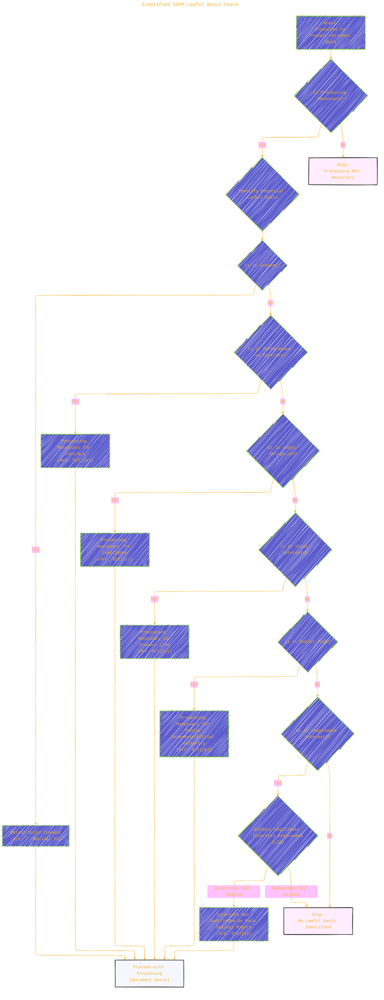

# **LegalLens**: <br/>*Visualizing the Landscape of Technology Law & Policy*

[](LICENSE) [](LICENSE-CC-BY) [](https://github.com/CongLeSolutionX/LegalLens/)

Copyright (c) 2025 Cong Le. All Rights Reserved.

----


> ⚠️🏗️🚧🦺🧱🪵🪨🪚🛠️👷
> 
> This is a working draft in progress
> 

<div align="center">
  <table style="border: none">
    <tr>
      <td align="center", style="border: none">
        
        <br/>
        <em>gif image is provided by <a href="https://giphy.com">Giphy</a></em>
      </td>
      <td align="center", border="none">
        <blockquote>
          "If you understood all the world's rules,<br/>
          would you break them<br/>
          or<br/>
          write new ones....?"
        </blockquote>
      </td>
    </tr>
  </table>
</div>

```mermaid
---
title: "✍️...🤔❓🤔...👨🏼‍💻"
author: "Cong Le"
version: "1.0"
license(s): "MIT, CC BY-SA 4.0"
copyright: "Copyright (c) 2025 Cong Le. All Rights Reserved."
config:
  theme: base
---
%%%%%%%% Mermaid version v11.4.1-b.14
%%{
  init: {
    'flowchart': { 'htmlLabels': false },
    'fontFamily': 'Bradley Hand',
    'themeVariables': {
      'primaryColor': '#fc82',
      'primaryTextColor': '#F8B229',
      'primaryBorderColor': '#27AE60',
      'secondaryColor': '#8784',
      'secondaryTextColor': '#6C3483',
      'lineColor': '#F8B229',
      'fontSize': '20px'
    }
  }
}%%
flowchart LR
    My_Meme@{ img: "https://raw.githubusercontent.com/CongLeSolutionX/CongLeSolutionX/refs/heads/main/assets/images/My-meme-questions-magnifying-glass-tangled-lines-bubble-thought.png", label: "....?", pos: "b", w: 200, h: 150, constraint: "on" }
    Link_to_my_profile{{"<a href='https://github.com/CongLeSolutionX' target='_blank'>Click here if you care about my profile</a>"}}

    My_Meme animatingEdge@--> Link_to_my_profile
    animatingEdge@{ animate: true }

```

<!--
https://media2.giphy.com/media/v1.Y2lkPTc5MGI3NjExa3BlNDJqYWVxOTdqYjRkeWVyNGdwMmwxcXQwd3MxZ2tjNGo5Y3h0MyZlcD12MV9pbnRlcm5hbF9naWZfYnlfaWQmY3Q9Zw/udhR8Hh1YVM6Q/giphy.gif
-->

-----

**Welcome to LegalLens!**

Navigating the intricate world of technology-related legal documents and policies can be daunting. **LegalLens** is an open-source initiative dedicated to demystifying this complexity by translating dense legal text into clear, concise, and interactive visual diagrams.

Utilizing `Mermaid.js`, we create flowcharts, mind maps, sequence diagrams, and other visualizations to illustrate key concepts, processes, obligations, and relationships found within:

*   Privacy Policies (GDPR, CCPA/CPRA, etc.)
*   Terms of Service (ToS/ToU)
*   Software & Content Licenses (Open Source & Proprietary)
*   Data Processing Agreements (DPAs)
*   Intellectual Property Frameworks
*   Other essential legal instruments shaping the digital landscape.

Whether you are a developer ensuring compliance, a user seeking to understand your rights, a legal professional looking for quick references, a student learning tech law, or a policymaker analyzing regulatory impact, `LegalLens` provides an accessible visual pathway.

**`LegalLens` is a sibling project to [AlgoVerse](https://github.com/CongLeSolutionX/AlgoVerse) (algorithms), [Synthetic Zooniverse](https://github.com/CongLeSolutionX/Synthetic-Zooniverse) (AI models), and [ArchExplorer](https://github.com/CongLeSolutionX/ArchExplorer) (software architectures). Together, these projects strive to enhance understanding of complex technical and regulatory domains through visualization.**

## Table of Contents

- [**LegalLens**: *Visualizing the Landscape of Technology Law \& Policy*](#legallens-visualizing-the-landscape-of-technology-law--policy)
  - [Table of Contents](#table-of-contents)
  - [The Challenge \& Our Approach](#the-challenge--our-approach)
  - [Legal \& Regulatory Focus Areas](#legal--regulatory-focus-areas)
  - [Repository Structure](#repository-structure)
  - [Example Visualization: GDPR Lawful Basis Check](#example-visualization-gdpr-lawful-basis-check)
  - [Getting Started](#getting-started)
    - [Prerequisites](#prerequisites)
    - [Cloning the Repository (Optional)](#cloning-the-repository-optional)
  - [How to Use LegalLens](#how-to-use-legallens)
  - [Contributing](#contributing)
  - [License](#license)
  - [**Important Disclaimer**](#important-disclaimer)
  - [Markdown and Visualization Resources](#markdown-and-visualization-resources)

---

## The Challenge & Our Approach

<div align="center">
	
	<br/>
	<em>gif image is provided by <a href="https://giphy.com">Giphy</a></em>
 
</div>

Traditional legal documents, while precise, are often characterized by dense text, specialized jargon, and complex sentence structures, making them challenging to parse quickly and accurately. `LegalLens` addresses this by offering a visual interpretation layer, designed to help you:

*   **Accelerate Understanding:** Quickly grasp the core principles, requirements, and workflows outlined in legal texts.
*   **Visualize Processes:** Clearly see data flows, consent mechanisms, dispute resolution paths, compliance steps, and more.
*   **Identify Rights & Obligations:** Distill the key rights afforded to individuals (e.g., data subjects) and the corresponding obligations of organizations (e.g., data controllers/processors).
*   **Map Relationships:** Understand the interactions and responsibilities between different parties (users, companies, regulators, third-party vendors).
*   **Learn Through Examples:** Study visual breakdowns of common legal frameworks and clauses to build a stronger foundational understanding.
*   **Facilitate Communication:** Use the diagrams as aids for explaining complex legal concepts to diverse audiences, including non-legal teams.
*   **Support Compliance Efforts:** Provide visual checklists and process flows related to regulatory requirements.

### Our Method

<div align="center">
	
	<br/>
	<em>gif image is provided by <a href="https://giphy.com">Giphy</a></em>
</div>

1.  **Analyze Source Documents:** We review relevant legal statutes, regulations, standard contract terms, and policy documents.
2.  **Create Mermaid Diagrams:** We select appropriate diagram types (flowcharts, mind maps, etc.) to best represent the specific legal concept or process.
3.  **Provide Contextual Explanations:** Each diagram is accompanied by clear, concise text explaining the visualized elements, their significance, and the relationships depicted.
4.  **Link to Authoritative Sources:** Whenever possible, we link to the original legal documents, official guidance, or reputable resources for deeper dives and verification.
5.  **Prioritize Clarity & Accuracy:** We aim for simplified, accurate representations, focusing on the essential elements for comprehension. *Note: These are interpretations, not replacements for the original text.*
6.  **Foster Community Collaboration:** We actively encourage contributions to expand the scope and depth of visualized legal concepts.

**This project applies the visual learning principles established in AlgoVerse, Synthetic Zooniverse, and ArchExplorer to the critical domain of technology law and policy.**

---

## Legal & Regulatory Focus Areas

`LegalLens` aims to cover a broad spectrum of legal and regulatory topics pertinent to the technology sector. The mind map below provides an overview of the areas currently included or planned for visualization:

```mermaid
---
title: "LegalLens: Visualizing Tech Law & Policy Domains"
author: "Cong Le"
version: "1.0"
license(s): "MIT, CC BY 4.0"
copyright: "Copyright (c) 2025 Cong Le. All Rights Reserved."
config:
  theme: base
---
%%%%%%%% Mermaid version v11.4.1-b.14
%%{
  init: {
    'fontFamily': 'Luminari, American Typewriter, monospace',
    'logLevel': 'fatal',
    'mindmap': {
	    'nodeAlign': 'center',
	    'padding': 25
    },
    'themeVariables': {
      'primaryColor': '#FC82',
      'primaryTextColor': '#F8B229',
      'primaryBorderColor': '#27AE60',
      'secondaryColor': '#EBF3',
      'secondaryTextColor': '#6C3483',
      'secondaryBorderColor': '#A569BD',
      'fontSize': '25px'
    }
  }
}%%
mindmap
    root)"Legal & Regulatory Issues in Tech"(
        Data_Privacy_and_Protection))"Data Privacy and Protection"((
            Core_Regulations{{"Core Regulations"}}
                GDPR_(EU/EEA)
                    Data_Subject_Rights(Access, Rectification, Erasure, Restriction, Portability, Object, Automated Decision-Making)
                    Lawful_Basis_for_Processing(Consent, Contract, Legal Obligation, Vital Interests, Public Task, Legitimate Interests)
                    Controller_vs_Processor(Roles, Responsibilities, DPA Requirements)
                    Data_Breach_Management(Notification Rules, Risk Assessment, Mitigation Strategy)
                    International_Data_Transfers(Mechanisms: Adequacy, SCCs, BCRs)
                    Consent_Requirements(Validity, Withdrawal, Granularity, Record-Keeping)
                    DPIAs(Triggers, Process, Content Requirements)
                    Visualizations(Data Flow Maps, Rights Request Workflow, Consent Models, Breach Notification Flowchart, Controller-Processor Interaction)
                CCPA_CPRA_(California)
                    Consumer_Rights("Know, Delete, Opt-Out [Sale/Sharing], Correct, Limit Use of Sensitive PI")
                    Business_Obligations(Notices, Responding to Requests, Data Minimization, Security)
                    Key_Definitions(Personal Information, Sensitive PI, Sale, Sharing, Consent)
                    Enforcement(CPPA Role, Penalties)
                    Visualizations(Data Collection Mapping, Opt-Out Process, Request Handling Workflow, Comparison CCPA vs. CPRA)
                Other_Key_Jurisdictions
                    LGPD_(Brazil)
                    PIPEDA_(Canada)
                    APPI_(Japan)
                    POPIA_(South_Africa)
                    UK_GDPR
                    Emerging_Laws_("Emerging_Laws:<br/>e.g., India DPDPA")
                    Visualizations(Comparative Analysis Charts, Jurisdictional Scope Diagrams)
            Fundamental_Concepts{{"Fundamental Concepts"}}
                Personal_Data_vs_PII(Definitions, Scope, Examples, Sensitive Categories)
                Data_Lifecycle_Management(Collection, Use, Storage, Deletion)
                Data_Minimization_&_Purpose_Limitation(Principles, Implementation Techniques)
                Data_Security_Measures(Technical, Physical, Organizational Safeguards, Risk-Based Approach)
                Consent_Management_Platforms(Functionality, Compliance Aspects)
                Data_Subject_Access_Requests_DSARs(Intake, Verification, Fulfillment Workflow)
                Cross_Border_Transfer_Mechanisms(Detailed Look at SCCs, BCRs, Adequacy)
                Anonymization_vs_Pseudonymization(Techniques, Legal Status, Re-identification Risk)
                Privacy_by_Design_&_Default(Integrating Privacy into Development Lifecycles)
            Technology_Specific_Issues{{"Technology-Specific Issues"}}
                Cookies_&_Online_Tracking
                    Cookie_Types(First/Third-Party, Session/Persistent, Essential/Non-Essential)
                    Consent_Banners_&_Mechanisms(CMP Design, Opt-In vs. Opt-Out Rules)
                    ePrivacy_Directive_Regulation(Relationship with GDPR)
                    Visualizations(Cookie Consent Flow, Tracking Technologies Map)
                Artificial_Intelligence_&_Machine_Learning
                    AI_Act_EU_Proposal("AI Act - EU Proposal:<br/>Risk Categories, Requirements, Prohibited Practices")
                    Bias_Fairness_&_Non-Discrimination("Bias Fairness & Non-Discrimination: Detection, Mitigation, Auditing")
                    Transparency_&_Explainability_XAI(Methods, Legal Implications)
                    Data_Governance_for_AI(Training Data Quality, Provenance)
                    Ethical_Frameworks_&_Governance_Models
                Big_Data_Analytics(Privacy Challenges, Aggregation Issues, Algorithmic Impact)
                Internet_of_Things_IoT(Data Collection Practices, Security Vulnerabilities, Device Lifecycles)
                Cloud_Computing_Agreements("Data Residency & Sovereignty, Security Responsibility Models<br/>[Shared Responsibility]")
                Biometric_Data_Processing("Specific Regulations [e.g., BIPA], Consent, Security Standards")

        ToS_ToU))"Terms of Service & User Agreements"((
            Essential_Clauses{{"Essential Clauses"}}
                Service_Description_&_Scope(Permitted Use, Functionality, Limitations)
                User_Accounts_&_Responsibilities(Registration, Security, Conduct Rules)
                IP["Intellectual Property - Ownership: Platform IP, User-Generated Content Licenses)"]
                Disclaimers_&_Limitation_of_Liability(Warranty Disclaimers, Cap on Damages)
                Termination_&_Suspension_Clauses(Grounds, Notice, Data Retrieval)
                Dispute_Resolution_Mechanisms(Arbitration Clauses, Class Action Waivers, Governing Law & Venue)
                Modification_of_Terms(Notice Procedures, Acceptance Methods)
                Acceptable_Use_Policy_AUP("Acceptable Use Policy - AUP: Specific Prohibitions, Enforcement Actions")
                Payment_Terms_&_Subscriptions("Payment_Terms_&_Subscriptions: Fees, Billing Cycles, Refunds, Auto-Renewal")
            Agreement_Types{{"Agreement Types"}}
                General_Website/App_ToS
                End-User_License_Agreements_EULAs("End-User_License_Agreements_EULAs For Software")
                Service_Level_Agreements_SLAs("Service_Level_Agreements_SLAs For B2B Services")
            Key_Legal_Considerations{{"Key Legal Considerations"}}
                Contract_Formation_&_Enforceability(Clickwrap, Browsewrap validity)
                Clarity_&_Readability(Plain Language Requirements, Avoiding Ambiguity)
                Unfair_Contract_Terms_Legislation(Consumer Protection Laws)

        Software_and_Content_Licensing))"Software & Content Licensing"((
            Open_Source_Software_OSS_Licenses{{"Open-Source Software OSS Licenses"}}
                Permissive_Licenses(MIT, Apache 2.0, BSD family)
                    Key_Permissions_&_Conditions(Attribution, Warranty Disclaimer)
                Copyleft_Licenses("GNU GPL family [v2, v3, LGPL, AGPL]")
                    Reciprocity/Share-Alike_Obligations, Source Code Disclosure
                Creative_Commons_CC_Licenses(For Content: BY, SA, NC, ND combinations)
                Other_OSS_Licenses(MPL, EPL, etc.)
            Proprietary_and_Commercial_Licenses{{"Proprietary and Commercial Licenses"}}
                Common_Models(Perpetual, Subscription, Per-User, Site License)
                EULAs(Restrictions on Use, Reverse Engineering, Transferability)
            Core_Licensing_Concepts{{"Core Licensing Concepts"}}
                Copyright_Basics(Exclusive Rights, Fair Use/Dealing)
                Patent_Grants_in_Licenses(Express vs. Implied Grants, Defensive Termination)
                License_Compatibility_&_Interaction(Combining Code Under Different Licenses)
                Compliance_&_Audits(Tracking Dependencies, Obligations Management)
                Contributor_License_Agreements_CLAs
            Common_Issues{{"Common Issues"}}
                License_Violation_Consequences(Copyright Infringement, Contract Breach)
                OSS_Security_Management(Vulnerability Patching, SBOMs)

        Intellectual_Property))"Intellectual Property<br/>(IP)"((
            Major_IP_Types{{"Major IP Types"}}
                Copyright(Protecting Original Works: Code, UI, Content)
                Patents(Protecting Inventions: Algorithms, Processes, Systems)
                Trademarks(Protecting Brands: Names, Logos, Slogans)
                Trade_Secrets("Protecting Confidential Information: Formulas, Source Code<br>[if kept secret]")
            Tech_Specific_IP_Challenges{{"Tech-Specific IP Challenges"}}
                Software_Patentability_Debates
                IP_Issues_in_OSS(Ownership, Contributions, Enforcement)
                Digital_Millennium_Copyright_Act_DMCA("Digital_Millennium_Copyright_Act_DMCA: Takedown Notices, Safe Harbors")
                Trademark_Issues_Online(Domain Names, Keywords, App Stores)
                Trade_Secret_Protection_in_Collaborative_Environments
                Digital_Rights_Management_(DRM)

        E_commerce_and_Online_Platforms))"E-commerce & Online Platforms"((
            Consumer_Protection_Laws(Disclosure Requirements, Cooling-Off Periods)
            Payment_Card_Industry_Data_Security_Standard_(PCI_DSS)
            Tax_Obligations_for_Online_Sales(Nexus, Marketplace Facilitator Laws)
            Platform_Liability_(e.g., Section_230_CDA_US,_Digital_Services_Act_EU)

        Cybersecurity_Law_and_Standards))"Cybersecurity_Law_and_Standards"((
            Key_Frameworks(NIST Cybersecurity Framework, ISO 27001/27002, SOC 2)
            Incident_Response_&_Reporting_Obligations(Legal Requirements for Breach Notification)
            Vulnerability_Disclosure_Programs_(VDPs)
            Data_Encryption_Standards_&_Best_Practices

        Accessibility_A11y))"Accessibility_A11y"((
            WCAG("Web Content Accessibility Guidelines: Global Standard")
            ADA(Americans with Disabilities Act - US: Application to Websites/Apps")
            Section_508_("Section 508: US_Federal")
            EAA("European Accessibility Act")

        Emerging_Legal_Areas))"Emerging_Legal_Areas"((
            AI_Ethics_&_Regulation(Ongoing Developments Worldwide)
            Antitrust_&_Competition_in_Tech_Markets
            Online_Safety_&_Content_Moderation_Laws
                 
```




*This mind map serves as a guide to the topics covered. The repository structure reflects these categories.*

---

## Repository Structure

The repository is logically organized by major legal domains, then further subdivided by specific regulations, document types, or concepts:

```plaintext
LegalLens/
├── LICENSE                 # MIT License (for code/diagram source)
├── LICENSE-CC-BY           # CC BY 4.0 License (for documentation/text)
├── README.md               # This overview file
│
├── DataPrivacy/
│   ├── GDPR/
│   │   ├── README.md       # GDPR overview, diagrams, explanations
│   │   └── diagrams/       # Mermaid source files (.mmd) for GDPR
│   │       ├── lawful_basis_check.mmd
│   │       ├── data_subject_rights_overview.mmd
│   │       └── ...
│   ├── CCPA-CPRA/
│   │   ├── README.md
│   │   └── diagrams/
│   │       └── ...
│   └── _Concepts/          # General privacy concepts (e.g., Consent, DPIA)
│       ├── ConsentModels/
│       └── ...
│
├── TermsOfService/
│   ├── StandardClauses/
│   │   ├── README.md       # Explanations of common ToS clauses
│   │   └── diagrams/
│   │       ├── limitation_of_liability.mmd
│   │       └── ...
│   └── _Concepts/
│       ├── ClickwrapVsBrowsewrap/
│       └── ...
│
├── SoftwareLicensing/
│   ├── OpenSource/
│   │   ├── MIT/
│   │   │   ├── README.md
│   │   │   └── diagrams/
│   │   ├── GPLv3/
│   │   └── ...
│   ├── Proprietary/
│   │   └── ...
│   └── _Concepts/
│       ├── LicenseCompatibility/
│       └── ...
│
├── IntellectualProperty/
│   ├── Copyright/
│   └── ...
│
└── ... (Other top-level legal areas like Cybersecurity, ECommerce, Accessibility)
```

Within each specific topic folder (e.g., `GDPR/`):

*   **`README.md`:** Contains a detailed explanation of the legal concept, including its purpose, key provisions, relevant definitions, and the Mermaid diagrams with corresponding textual breakdowns. Links to authoritative sources are provided for further reading.
*   **`diagrams/`:** Holds the raw `Mermaid.js` source code (`.mmd` files) for the visualizations presented in the README.

We strive for consistency in structure and naming conventions across the repository.

---

## Example Visualization: GDPR Lawful Basis Check

This simplified flowchart illustrates the critical step of determining a lawful basis before processing personal data under GDPR.




**Diagram Explanation:**

1.  **Intention to Process:** The process begins when an organization plans to collect or use personal data.
2.  **Necessity Check:** Is the intended processing actually required for a specific purpose?
3.  **Identify Potential Basis:** GDPR Article 6(1) lists six potential lawful bases. Organizations must identify *at least one* that applies.
4.  **Specific Basis Checks:** The flowchart checks each basis sequentially (the order here is illustrative).
    *   **Consent:** Requires meeting strict validity requirements.
    *   **Contract:** Processing must be necessary to fulfill a contract with the data subject or take pre-contractual steps.
    *   **Legal Obligation:** Processing required by EU or Member State law.
    *   **Vital Interests:** Necessary to protect someone's life.
    *   **Public Task:** Necessary for tasks in the public interest or exercising official authority.
    *   **Legitimate Interests:** Requires a balancing test (LIA) to ensure the organization's interests don't unfairly override the individual's rights and freedoms.
5.  **Outcome:**
    *   If a valid basis is identified and documented, processing can proceed.
    *   If no lawful basis applies, the processing cannot legally occur under GDPR.

*This is a high-level illustration. Each lawful basis has specific nuances and requirements.*

---

## Getting Started

<div align="center">
	
	<br/>
	<em>gif image is provided by <a href="https://giphy.com">Giphy</a></em>
</div>


### Prerequisites

*   **Web Browser:** Any modern web browser capable of rendering GitHub pages (which includes Mermaid.js support).
*   **(Optional) Git:** To clone the repository locally for offline viewing or contribution.
*   **(Optional) Markdown Editor:** A text editor or IDE with Markdown preview capabilities (like VS Code with extensions) is helpful for viewing/editing `.md` and `.mmd` files locally.

### Cloning the Repository (Optional)

```bash
git clone https://github.com/CongLeSolutionX/LegalLens.git
cd LegalLens
```

---

## How to Use LegalLens

<div align="center">
	
	<br/>
	<em>gif image is provided by <a href="https://giphy.com">Giphy</a></em>
</div>


1.  **Browse the Repository:** Navigate the folders based on the legal domain or specific topic you are interested in (e.g., `DataPrivacy/GDPR/`, `SoftwareLicensing/OpenSource/MIT/`).
2.  **Read the `README.md`:** Each topic's `README.md` file is the primary entry point. It provides the overview, explanations, and embedded visualizations.
3.  **Analyze the Diagrams:** Study the Mermaid diagrams within the READMEs. Consider the flow, relationships, and key decision points they illustrate.
4.  **Review Explanations:** Read the accompanying text carefully to understand the context and meaning of the diagram elements.
5.  **Consult Source Links:** Use the provided links to access original legal texts, official guidelines, or authoritative articles for definitive information and deeper understanding.
6.  **(Locally) View `.mmd` Files:** If cloned, you can open the `.mmd` files in the `diagrams/` subdirectories using a compatible editor or the Mermaid Live Editor.

---

## Contributing

<div align="center">
	
	<br/>
	<em>gif image is provided by <a href="https://giphy.com">Giphy</a></em>
</div>


Contributions are essential to making `LegalLens` a comprehensive and valuable resource! We welcome additions, corrections, and improvements.
We are working on the setup for this section. TBD.

<!-- 
**How to Contribute:**

1.  **Fork the Repository:** Create your own copy of the `LegalLens` repository.
2.  **Create a Branch:** Make a new branch in your fork for your specific contribution (e.g., `feature/visualize-ccpa-right-to-know`, `fix/update-gdpr-consent-diagram`).
3.  **Develop Your Contribution:**
    *   Identify a legal concept, process, or clause to visualize or improve.
    *   Create clear, accurate `Mermaid.js` diagrams (`.mmd` files in the appropriate `diagrams/` folder).
    *   Write concise, informative explanations in the corresponding `README.md`.
    *   Ensure accuracy and cite authoritative sources where possible.
    *   Follow the existing repository structure and naming conventions.
4.  **Test:** Ensure your Markdown renders correctly and diagrams are displayed properly on GitHub.
5.  **Submit a Pull Request (PR):** Create a PR from your branch back to the main `LegalLens` repository. Provide a clear description of your changes.
6.  **Engage:** Be prepared to discuss your PR and make adjustments based on feedback.

*Please adhere to the project's Code of Conduct (to be added).* A more detailed `CONTRIBUTING.md` file with style guides and specific requirements is planned. -->


---

## 🚀 Project Current Activities


<div align="center">
	
	<br/>
	<em>gif image is provided by <a href="https://giphy.com">Giphy</a></em>
</div>


<div align="left"><a name="project-current-activities"></a>

<details open>
<summary>Click to show/hide more on recent activities of this project </summary>

> powered by [OSS Insight](https://ossinsight.io)
<!-- All the diagrams below are made with [OSS Insight](https://ossinsight.io/) -->

| :bar_chart: Widget & Description | :art: Snapshot (Light Mode) |
|---|---|
| Active Contributors :technologist: of CongLeSolutionX/LegalLens - Last 28 days |  <br/> :link: [View Full Report :mag:](https://next.ossinsight.io/widgets/official/compose-recent-active-contributors?repo_id=946382201&limit=30) |
| Pushes :arrow_up: and Commits :writing_hand: of CongLeSolutionX/LegalLens |  <br/> :link: [View Full Report :mag:](https://next.ossinsight.io/widgets/official/analyze-repo-pushes-and-commits-per-month?repo_id=946382201) |
| Pull Request Size :straight_ruler: of CongLeSolutionX/LegalLens |  <br/> :link: [View Full Report :mag:](https://next.ossinsight.io/widgets/official/analyze-repo-pull-requests-size-per-month?repo_id=946382201) |
| Pull Request Lifecycle :arrows_counterclockwise: of CongLeSolutionX/LegalLens |  <br/> :link: [View Full Report :mag:](https://next.ossinsight.io/widgets/official/analyze-repo-pull-request-open-to-merged?repo_id=946382201) |
| Lines of Code Changes :computer::scroll: of CongLeSolutionX/LegalLens |  <br/> :link: [View Full Report :mag:](https://next.ossinsight.io/widgets/official/analyze-repo-loc-per-month?repo_id=946382201) |
| Commits Time Distribution :alarm_clock::date: of CongLeSolutionX/LegalLens |  <br/> :link: [View Full Report :mag:](https://next.ossinsight.io/widgets/official/analyze-repo-commits-time-distribution?repo_id=946382201&period=last_1_year&zone=0) | 

</details>

</div>

---

## License

This project utilizes a dual-licensing approach:

*   **Code & Diagram Sources:** All `Mermaid.js` source files (`.mmd`) and any other code files are licensed under the [**MIT License**](LICENSE). This allows for broad reuse and modification of the visualization code itself.
*   **Documentation & Explanatory Text:** All textual content, including `README.md` files and explanations accompanying the diagrams, is licensed under the [**Creative Commons Attribution 4.0 International License (CC BY 4.0)**](LICENSE-CC-BY). This requires attribution if you reuse or adapt the textual content.

---

## **Important Disclaimer**

**The information, diagrams, and explanations provided in the `LegalLens` repository are intended for educational and informational purposes ONLY. They DO NOT constitute legal advice.**

*   Laws and regulations are complex, vary significantly by jurisdiction, and are subject to change.
*   The visualizations are simplified interpretations and may not capture every nuance or exception of the underlying legal text.
*   Always consult with a qualified legal professional licensed in your jurisdiction for advice regarding specific legal situations, compliance requirements, or contract interpretation.

**Do not rely solely on the content of this repository for making legal decisions or determining compliance obligations.** The maintainers and contributors assume no liability for any actions taken or not taken based on the information presented here.

---

## Markdown and Visualization Resources

*   **GitHub Markdown Guide:** [https://docs.github.com/en/get-started/writing-on-github/getting-started-with-writing-and-formatting-on-github/basic-writing-and-formatting-syntax](https://docs.github.com/en/get-started/writing-on-github/getting-started-with-writing-and-formatting-on-github/basic-writing-and-formatting-syntax)
*   **Mermaid.js Official Documentation:** [https://mermaid.js.org/](https://mermaid.js.org/)
*   **Mermaid Live Editor (for testing diagrams):** [https://mermaid.live/](https://mermaid.live/)

----


<div align="center">
	
	<br/>
	<em>gif image is provided by <a href="https://giphy.com">Giphy</a></em>
 
</div>

----


```mermaid
---
title: "❓...CongLeSolutionX....❓"
author: "Cong Le"
version: "1.0"
license(s): "MIT, CC BY-SA 4.0"
copyright: "Copyright (c) 2025 Cong Le. All Rights Reserved."
config:
  theme: base
---
%%%%%%%% Mermaid version v11.4.1-b.14
%%{
  init: {
    'flowchart': { 'htmlLabels': false },
    'fontFamily': 'Bradley Hand',
    'themeVariables': {
      'primaryColor': '#fc82',
      'primaryTextColor': '#F8B229',
      'primaryBorderColor': '#27AE60',
      'secondaryColor': '#8784',
      'secondaryTextColor': '#6C3483',
      'lineColor': '#F8B229',
      'fontSize': '20px'
    }
  }
}%%
flowchart LR
    My_Meme@{ img: "https://raw.githubusercontent.com/CongLeSolutionX/CongLeSolutionX/refs/heads/main/assets/images/My-meme-questions-magnifying-glass-tangled-lines-bubble-thought.png", label: "✍️...🤔❓🤔...👨🏼‍💻", pos: "b", w: 200, h: 150, constraint: "on" }
    Link_to_my_profile{{"<a href='https://github.com/CongLeSolutionX' target='_blank'>Click here if you care about my profile</a>"}}

  Closing_quote@{ shape: braces, label: "If you understood all the world's rules,<br/>would you break them<br/>or<br/>write new ones....?"}
    
   Closing_quote ~~~ My_Meme
    
  Link_to_my_profile{{"<a href='https://github.com/CongLeSolutionX' target='_blank'>Click here if you care about my profile</a>"}}

  Closing_quote ~~~ My_Meme
  My_Meme animatingEdge@--> Link_to_my_profile
  
  animatingEdge@{ animate: true }


```


-----
