> ⚠️🏗️🚧🦺🧱🪵🪨🪚🛠️👷
> 
> This is a working draft in progress
> 
> 
>
> gif image is provided by [Giphy](https://giphy.com/gifs/spongebob-spongebob-squarepants-season-6-xT3i1dp3WjezioIadi)
> 
> ⚠️🏗️🚧🦺🧱🪵🪨🪚🛠️👷


----


# Starbucks Privacy Notice - Starbucks Coffee Company
<details open>
<summary>Click to show/hide the full disclaimer.</summary>
   
> <ins>📢 **Disclaimer** 🚨</ins>
>
> This document contains my personal notes on the topic,
> compiled from publicly available documentation and various cited sources.
> The materials are intended for educational purposes (<ins>sometimes, entertainment purposes</ins>), personal study, and reference.
> The content is dual-licensed:
> 1. **MIT License:** Applies to all code implementations (Swift, Mermaid, and other programming languages).
> 2. **Creative Commons Attribution-ShareAlike 4.0 International License (CC BY-SA 4.0):** Applies to all non-code content, including text, explanations, diagrams, and illustrations.

</details>


----

## 🏛️ Starbucks' Core Approach to Data & Privacy

Starbucks emphasizes a "people first" philosophy for data and privacy, guided by recognized data governance principles.

```mermaid
---
title: "CHANGE_ME_DADDY"
author: "Cong Le"
version: "1.0"
license(s): "MIT, CC BY-SA 4.0"
copyright: "Copyright (c) 2025 Cong Le. All Rights Reserved."
config:
  layout: elk
  theme: base
  look: handDrawn
---
%%%%%%%% Mermaid version v11.4.1-b.14
%%%%%%%% Available curve styles include the following keywords:
%% basis, bumpX, bumpY, cardinal, catmullRom, linear, monotoneX, monotoneY, natural, step, stepAfter, stepBefore.
%%{
  init: {
    'flowchart': { 'htmlLabels': true, 'curve': 'basis' },
    'fontFamily': 'American Typewriter, monospace',
    'logLevel': 'fatal',
    'themeVariables': {
      'primaryColor': '#22BB',
      'primaryTextColor': '#F8B229',
      'lineColor': '#F8B229',
      'primaryBorderColor': '#27AE60',
      'secondaryColor': '#E2F1',
      'secondaryTextColor': '#6C3483',
      'secondaryBorderColor': '#A569BD',
      'fontSize': '20px'
    }
  }
}%%
flowchart LR
    A["Starbucks' Data Philosophy 🧑‍🤝‍🧑"] -- "Leads to" --> B("People First Approach")
    B --> C{Core Guiding Principles}
    C --> C1[Data Minimization ✨]
    C --> C2[Limited Collection 🤏]
    C --> C3[Limited Use 🎯]
    
    style A fill:#00704A,color:#fff
    style B fill:#00704A,color:#fff
    style C fill:#D4E9E2,color:#000
    style C1 fill:#f2f2f2,color:#000
    style C2 fill:#f2f2f2,color:#000
    style C3 fill:#f2f2f2,color:#000

```



---

## 📜 Starbucks Privacy Notice: Table of Contents

Here's a bird's-eye view of what the full privacy notice covers:

```mermaid
mindmap
  root((Starbucks Privacy Notice 📄))
    1. Applicability and Scope
    2. Updates to this Privacy Notice
    3. Information We Collect
    4. Sources of Information
    5. How We Use Your Information
    6. How We Disclose Your Information
    7. Cookies, Web Beacons, and Similar Technologies
    8. How We Protect Your Information
    9. Retention
    10. Children’s Privacy
    11. Starbucks WiFi
    12. Your Privacy Choices & Rights
    13. Notice of Financial Incentive & Starbucks® Rewards
    14. Additional Disclosures for Data Subjects in the EEA, the U.K. and Switzerland
    15. Participation in the Data Privacy Framework
    16. Contact Us
```



---

### 1. Applicability and Scope 🌐

This diagram shows which services this Privacy Notice applies to and clarifies responsibility for third-party links.

```mermaid
---
title: "CHANGE_ME_DADDY"
author: "Cong Le"
version: "1.0"
license(s): "MIT, CC BY-SA 4.0"
copyright: "Copyright (c) 2025 Cong Le. All Rights Reserved."
config:
  layout: elk
  theme: base
  look: handDrawn
---
%%%%%%%% Mermaid version v11.4.1-b.14
%%%%%%%% Available curve styles include the following keywords:
%% basis, bumpX, bumpY, cardinal, catmullRom, linear, monotoneX, monotoneY, natural, step, stepAfter, stepBefore.
%%{
  init: {
    'flowchart': { 'htmlLabels': true, 'curve': 'basis' },
    'fontFamily': 'American Typewriter, monospace',
    'logLevel': 'fatal',
    'themeVariables': {
      'primaryColor': '#22BB',
      'primaryTextColor': '#F8B229',
      'lineColor': '#F8B229',
      'primaryBorderColor': '#27AE60',
      'secondaryColor': '#E2F1',
      'secondaryTextColor': '#6C3483',
      'secondaryBorderColor': '#A569BD',
      'fontSize': '20px'
    }
  }
}%%
flowchart TD
    A[User Interacts ☕] --> B{Interaction Channel?}
    B -- "Starbucks.com" --> C[Starbucks Services]
    B -- "Starbucksreserve.com" --> C
    B -- "Starbucks.ca" --> C
    B -- "Starbucks App 📱" --> C
    B -- "Starbucks Stores 🏬" --> C
    B -- "Other Starbucks Owned/Operated Sites/Apps" --> C
    C --> D[This Privacy Notice APPLIES ✅]
    B -- "Third-Party Links 🔗" --> E[External Site/App]
    E --> F[Starbucks Notice DOES NOT Apply ❌]
    F --> G[Refer to Third-Party's Privacy Notice & Policies]
    
    style A fill:#f9f9f9,stroke:#333,stroke-width:2px
    style C fill:#D4E9E2,stroke:#00704A,stroke-width:2px
    style E fill:#fef6f6,stroke:#cc0000,stroke-width:2px

```



---

### 3. Information We Collect 📥

Starbucks collects various categories of personal information. This mind map details them:

```mermaid
mindmap
  root((Information We Collect 📂))
    Identifiers
      ::icon(fa fa-user)
      First & Last Name
      Phone Number
      Address Book
      Username & Password
      Email Address
      Postal Address
      IP Address
      Birthday["Birthday (Day & Month) 🎂"]
      Demographic Info (e.g., Gender)
    Financial Information
      ::icon(fa fa-credit-card)
      Credit/Debit Card Info
      Associated Phone Number
      Associated Name
    Commercial Information
      ::icon(fa fa-shopping-cart)
      Transaction History (in-store, online, app)
      Products Purchased
      Purchase Frequency
      Rewards/Promotions with Purchase
      "Wishlist" / "My Bag" items
    Electronic Network Activity Information
      ::icon(fa fa-wifi)
      Browsing History
      How you use Starbucks Services
      Device Information (OS, type)
      "Live help" chat feature info
    Geolocation Information
      ::icon(fa fa-map-marker-alt)
      Device Location (derived from IP, etc.)
      In-Store Device Presence (Bluetooth, if settings allow)
    Audio and Visual Information
      ::icon(fa fa-video)
      CCTV_in_retail_locations["CCTV in retail locations (Security, Safety) 🕵️"]
      Audio_for_Voice_Ordering["Audio for Voice Ordering (if you choose to use it) 🎤"]
    Inferences
      ::icon(fa fa-lightbulb)
      Drawn from other collected information (e.g., preferences)
    Other
      ::icon(fa fa-comment-dots)
      Information you voluntarily provide (e.g., survey responses)
    Sensitive Personal Information
      Precise Geolocation Information
        ::icon(fa fa-location-arrow)
        GPS Latitude and Longitude
        In-Store Precise Location (via GPS, WiFi, Bluetooth, if settings allow)
        Purposes: Find nearby stores, enable remote order/pay, facilitate third-party delivery
```



*Note: Aggregated or de-identified data that Starbucks does not attempt to re-identify is not subject to this Notice.*

---

### 4. Sources of Information 🧐

Starbucks gathers information from various places:

```dot
// To render this DOT diagram, you can use Graphviz (e.g., online viewers like viz-js.com or local installations)
digraph SourcesOfInformation {
    rankdir=LR;
    bgcolor="transparent";
    node [shape=box, style="rounded,filled", fillcolor="#FDFDFD", fontname="Arial", color="#00704A"];
    edge [fontname="Arial", fontsize=10, color="#333333"];

    You [label="You (The User) 🧑‍💻", fillcolor="#D4E9E2"];
    OtherUsers [label="Other Users\n(e.g., purchasing a gift for you) 🎁"];
    StarbucksServices [label="Starbucks Services\n(your usage data) 📱"];
    AdvertisingPartners [label="Advertising Partners 📢"];
    CoSponsors [label="Co-Sponsors 🤝"];
    ISPs [label="Internet Service Providers"];
    DataAnalytics [label="Data Analytics Providers 📈"];
    OSPlatforms [label="Operating Systems\n& Platforms (e.g., iOS, Android)"];
    SocialNetworks [label="Social Networks\n(if you log in or share via Starbucks Services)"];
    PublicSources [label="Publicly Available Sources 📰"];
    
    Starbucks [label="Starbucks", shape=ellipse, style=filled, fillcolor="#00704A", fontcolor="#FFFFFF", fontsize=14];
    
    You -> Starbucks [label="Directly Provided"];
    OtherUsers -> Starbucks;
    StarbucksServices -> Starbucks [label="Generated by Use"];
    AdvertisingPartners -> Starbucks;
    CoSponsors -> Starbucks;
    ISPs -> Starbucks;
    DataAnalytics -> Starbucks;
    OSPlatforms -> Starbucks;
    SocialNetworks -> Starbucks;
    PublicSources -> Starbucks;
}
```



---

### 5. How We Use Your Information 🛠️

Here's a breakdown of the business purposes for which Starbucks uses your information:

```mermaid
mindmap
  root((How We Use Your Information ⚙️))
    (a) To Provide Our Services
      ::icon(fa fa-concierge-bell)
      Process or fulfill orders and transactions
      Maintain and service accounts
      Support and improve our loyalty programs (e.g., Starbucks® Rewards)
      Deliver gift cards or e-gifts (and personalized messages)
      Debug to identify and repair errors
      Facilitate the functionality of our websites and mobile applications
      Process payments
      Customize experiences (e.g., in/around stores with location permission)
    (b) To Communicate With You
      ::icon(fa fa-comments)
      Provide customer service (incl. website's "live help" chat)
      Address requests for information
      Communicate about orders, purchases, returns, services, accounts, programs, contests, sweepstakes
      Send personalized promotions, content, and special offers
      Communicate about our brands, products, events, or other promotional purposes
      Implement your communications preferences (e.g., sharing with partners for their emails)
      Provide important product safety information and notice of product recalls ⚠️
    (c) For Research, Development, and Improvement of Our Services
      ::icon(fa fa-flask)
      Maintain, improve, and analyze our websites, mobile apps, ads, products, and services
      Help to ensure security and integrity (detect, prevent, or investigate suspicious activity or fraud)
    (d) To Enforce our Terms, Agreements, or Policies
      ::icon(fa fa-file-signature)
      Maintain a safe, secure, and trusted environment
      Ensure our terms, policies, and agreements are enforced
    (e) To Comply with Applicable Laws
      ::icon(fa fa-balance-scale)
      Process information under laws and regulations (e.g., tax laws)
      Maintain appropriate records for internal administrative purposes
      Comply with applicable legal and regulatory obligations, and respond to lawful governmental requests
    (f) Targeted Advertising
      ::icon(fa fa-bullseye)
      Provide targeted advertising (cross-contextual/online behavioral ads)
      Show offers and promotions that may interest you
    (g) With Your Consent
      ::icon(fa fa-check-circle)
      Fulfill any other business or commercial purposes at your direction or with your consent
```

---

### 6. How We Disclose Your Information ↔️

Starbucks may share your information with various parties for specific purposes:


---

### 7. Cookies, Web Beacons, and Similar Technologies 🍪📡

Starbucks uses these technologies Online. Here's a summary:

```mermaid
mindmap
  root((Cookies & Similar Technologies _💻_))
    Technologies Used
      Cookies (incl. Flash LSOs)
        ::icon(fa fa-cookie-bite)
        _Persistent and session cookies for various functions. Flash LSO settings [here](http://www.macromedia.com/support/documentation/en/flashplayer/help/settings_manager07.html) (Note: Flash is largely deprecated)_
      Web Beacons (Clear GIFs, Pixels, Page Tags, Web Bugs)
        ::icon(fa fa-eye-slash)
        _Transparent images to track page visits, marketing effectiveness, email opens_
      JavaScript
        ::icon(fab fa-js-square)
        _Code snippets to accelerate refresh speeds, monitor component usage_
      Entity Tags (ETags)
        ::icon(fa fa-tags)
        _HTTP mechanism to cache website parts, validate caches, speed up performance_
      HTML5 Local Storage
        ::icon(fa fa-database)
        _Caches website data in your browser for faster revisits_
    Purposes of These Technologies
      Services and Functionality
        ::icon(fa fa-cogs)
        _Essential for you to access and use websites/apps correctly_
      Performance Monitoring
        ::icon(fa fa-chart-line)
        _Analyze traffic, usage volume, user interaction, error detection (no PII collected directly for this purpose)_
      User Convenience
        ::icon(fa fa-handshake)
        _Enhance ease of use, speed up load/refresh times, remember prior information_
      Marketing
        ::icon(fa fa-bullhorn)
        _Tailor your experience, control promotions/ads on Starbucks and other digital properties_
```

---

### 8. How We Protect Your Information 🛡️

Starbucks takes security seriously, but it's a shared responsibility:

```mermaid
---
title: "CHANGE_ME_DADDY"
author: "Cong Le"
version: "1.0"
license(s): "MIT, CC BY-SA 4.0"
copyright: "Copyright (c) 2025 Cong Le. All Rights Reserved."
config:
  layout: elk
  theme: base
  look: handDrawn
---
%%%%%%%% Mermaid version v11.4.1-b.14
%%%%%%%% Available curve styles include the following keywords:
%% basis, bumpX, bumpY, cardinal, catmullRom, linear, monotoneX, monotoneY, natural, step, stepAfter, stepBefore.
%%{
  init: {
    'flowchart': { 'htmlLabels': true, 'curve': 'basis' },
    'fontFamily': 'American Typewriter, monospace',
    'logLevel': 'fatal',
    'themeVariables': {
      'primaryColor': '#22BB',
      'primaryTextColor': '#F8B229',
      'lineColor': '#F8B229',
      'primaryBorderColor': '#27AE60',
      'secondaryColor': '#E2F1',
      'secondaryTextColor': '#6C3483',
      'secondaryBorderColor': '#A569BD',
      'fontSize': '20px'
    }
  }
}%%
flowchart TD
    subgraph "Protecting Your Information"
        direction LR
        A["Starbucks Uses Reasonable Security Measures"] --"Technical, Physical, Administrative"--> B["To Reduce Risk Of:"];
        B --> BA[Loss];
        B --> BB[Misuse];
        B --> BC[Unauthorized Access];
        B --> BD[Disclosure];
        B --> BE[Modification];
        
        C["❗ However, No System is Perfect"] --> D["Internet's inherent nature means\ndata can't be guaranteed 100% safe\nfrom intrusion or unauthorized access."];
        
        E["Your Responsibility 💪"] --> F["Protect Your Password(s)"];
        E --> G["Maintain Security of Your Devices"];
    end
    style A fill:#D4E9E2,stroke:#00704A
    style E fill:#D4E9E2,stroke:#00704A
    style C fill:#FFE0B2,stroke:#FF8F00
```



---

### 9. Retention 💾

Information is kept as long as necessary, governed by specific criteria and laws.

```mermaid
---
title: "CHANGE_ME_DADDY"
author: "Cong Le"
version: "1.0"
license(s): "MIT, CC BY-SA 4.0"
copyright: "Copyright (c) 2025 Cong Le. All Rights Reserved."
config:
  layout: elk
  theme: base
  look: handDrawn
---
%%%%%%%% Mermaid version v11.4.1-b.14
%%%%%%%% Available curve styles include the following keywords:
%% basis, bumpX, bumpY, cardinal, catmullRom, linear, monotoneX, monotoneY, natural, step, stepAfter, stepBefore.
%%{
  init: {
    'flowchart': { 'htmlLabels': true, 'curve': 'basis' },
    'fontFamily': 'American Typewriter, monospace',
    'logLevel': 'fatal',
    'themeVariables': {
      'primaryColor': '#22BB',
      'primaryTextColor': '#F8B229',
      'lineColor': '#F8B229',
      'primaryBorderColor': '#27AE60',
      'secondaryColor': '#E2F1',
      'secondaryTextColor': '#6C3483',
      'secondaryBorderColor': '#A569BD',
      'fontSize': '20px'
    }
  }
}%%
flowchart LR
    A["Data Retention Policy ⏳"] --> B{"Key Criteria"}
    B --> C["Reasonably Necessary & Proportionate for Purposes in this Notice"]
    B --> D["Duration Needed to Provide Services to You"]
    B --> E["Meet Legal Requirements<br/>(e.g., record retention, dispute resolution, agreement enforcement)"]
    
    F[Storage & Processing Locations 🌎] --> G["Servers owned by Starbucks and other companies"]
    G --> H["United States, Canada, or elsewhere globally (may be outside your jurisdiction)"]
    
    I[International Data Transfers ✈️] --> J["Protected via appropriate safeguards<br/>in accordance with applicable data protection laws and this Notice."]
    style A fill:#00704A,color:#FFFF
    style B fill:#f0f0f0
    style F fill:#00704A,color:#FFFF
    style I fill:#00704A,color:#FFFF

```



---

### 10. Children's Privacy 🧒🚫

Starbucks' services are not intended for young children.

*   **Age Limit**: Services are not for use by anyone under **13 years old**.
*   **Ages 13-16**: Starbucks does **not knowingly** collect, sell, or share information of consumers between 13 and 16.
*   **Parents/Guardians**: If you suspect data collection from your child, please contact Starbucks (see "Contact Us" section).
*   Refer to Starbucks' [Terms of Use](https://www.starbucks.com/terms/starbucks-terms-of-use/) for more information.

---

### 12. Your Privacy Choices & Rights ⚖️⚙️

You have several choices regarding your data and specific rights you can exercise.

**(a) Your Choices**

```mermaid
mindmap
  root((Your Privacy Choices Control Panel 🕹️))
    Location Services
      ::icon(fa fa-map-marked-alt)
      _Enable for_: Mobile Order & Pay (MOP), location-based services.
      _How_: Enable "location services" in Starbucks App AND/OR device permissions.
      _Impact_: Customize in-store experience, monitor marketing, tailor messages, limit ad frequency.
      _Precise Geolocation_: Used for services you engage with.
      _Manage_: In your device settings.
    Voice Ordering
      ::icon(fa fa-microphone-alt)
      _Enable for_: Voice ordering features (when available).
      _How_: Enable "microphone" & "speech recognition" in Starbucks App AND/OR device permissions.
    Email Communications, Push Notifications, In-App Messages
      ::icon(fa fa-envelope-open-text)
      _Preferences_: Set in Starbucks App.
      _Promotional Email Opt-Out_: Adjust account settings or click "unsubscribe" in emails. (Transactional emails for orders/accounts may still be sent).
    Text Messages
      ::icon(fa fa-sms)
      _Consent_: For automated marketing text messages.
      _Opt-Out_: Text STOP, END, CANCEL, UNSUBSCRIBE, or QUIT to any message. (Promotional emails may still be sent if you're subscribed).
    General Consent for App Features
      ::icon(fa fa-mobile-alt)
      _Using these features = consent to transmission, recording, processing, storage of your user info by Starbucks/agents for app administration and purposes in this Notice._
```

**(b) Your Privacy Rights (U.S. & Canada)**

This flowchart outlines the general process for exercising your rights:


**Types of Rights (U.S. & Canada):**

```mermaid
mindmap
  root((Your Privacy Rights Portfolio 🛡️))
    Right to Know and Access (Data Portability)
      ::icon(fa fa-info-circle)
      _What PI Starbucks processes (categories, sources, purposes, third-party categories)._
      _Specific list of third parties to whom PI was disclosed._
      _Receive a copy of your specific PI._
    Deletion
      ::icon(fa fa-trash-alt)
      _Request deletion of your collected/retained info (subject to exceptions)._
    Correct Inaccurate Information
      ::icon(fa fa-edit)
      _Request correction of inaccuracies in your PI._
      _Self-correction also available via Starbucks Rewards account (App/Website)._
    Targeted Advertising (Opt-Out)
      ::icon(fa fa-ban)
      _Right to opt-out of sharing PI for targeted advertising._
      _Mechanism: "Do Not Share My Personal Information" link._
      _(Starbucks states: "We do not sell your information for monetary or valuable consideration.")_
    Sensitive Information (Limit Use/Disclosure)
      ::icon(fa fa-user-secret)
      _Generally, companies must provide a "Limit Use" link if SI is used for other purposes. Starbucks states this is not required as they only collect/use/disclose SI to provide services to you._
    Opt-Out Preference Signals (e.g., Global Privacy Control)
      ::icon(fa fa-cog)
      _Starbucks will honor such signals from web browsers._
    Appeals
      ::icon(fa fa-gavel)
      _Right to appeal Starbucks' decision regarding your request._
    Consumer Health Data Rights (Washington & Nevada)
      ::icon(fa fa-heartbeat)
      _Additional rights for consumer health data. See separate [Consumer Health Data Privacy Notice for Washington and Nevada](https://www.starbucks.com/consumer-health-data-privacy-notice/)._
    Non-Discrimination
      ::icon(fa fa-thumbs-up)
      _Starbucks will not discriminate against you for exercising your rights._
```

**(c) Additional California Rights 캘리포니아**

*   **Shine the Light**: California residents can request a notice (once per year) disclosing the categories of personal information shared with third parties for *their* direct marketing purposes during the preceding calendar year.
	*   **How to Request**: Postal mail to: Starbucks, P.O. Box 20430, Augusta, GA 30916.
*   **Do Not Track (DNT)**:
	*   Starbucks **currently does not respond** to browser "Do Not Track" signals.
	*   There is no current industry standard for how online services should respond.
	*   Starbucks may develop policies as standards evolve.

**(d) Privacy Metrics 📊 (January 2024 – December 2024) – U.S. & Canada**
*(This data is presented clearly in the notice; a visual graph could be made if desired, but the table format is effective.)*
*   **Right to Know**
	*   Requests Received – 1,237
	*   Requests Completed – 463
	*   Requests unable to be completed\* – 760
	*   Average completion time – 7 days
*   **Right to Delete**
	*   Requests Received – 3,513
	*   Requests Completed – 1,948
	*   Requests unable to be completed\* – 1,514
	*   Average completion time – 11 days
	*\*Requests may be unable to be completed due to factors such as inability to verify the customer, duplicate requests, or no information is found.*

---

### 13. Notice of Financial Incentive & Starbucks® Rewards 🌟☕

The Starbucks® Rewards program involves the collection and use of personal information in exchange for benefits.


---

### 15. Participation in the Data Privacy Framework (DPF) 🇪🇺🇬🇧🇨🇭🇺🇸

Starbucks complies with the DPF for data transfers from the EU, UK, and Switzerland to the U.S.

```plantuml
@startuml
' Render with PlantUML
title Data Privacy Framework (DPF) - Starbucks Compliance & Complaint Resolution

actor "Data Subject" as DS <<EU, UK, or Swiss Resident>>

box "U.S. Department of Commerce" #LightBlue
    participant DPFProgram as "DPF Program\n[dataprivacyframework.gov](https://www.dataprivacyframework.gov/)"
end box

box "Starbucks" #LightGreen
    participant StarbucksCorp as "Starbucks"
    StarbucksCorp o-- DPFProgram : Certified Adherence
end box

box "Dispute Resolution & Oversight" #LightYellow
    participant TRUSTe as "TRUSTe\n(ADR Provider)"
    participant FTC as "Federal Trade Commission"
    participant Arbitration as "Binding Arbitration Panel\n(under DPF)"
end box

DS -> StarbucksCorp : Submits DPF Principles-related complaint
StarbucksCorp -> DS : Acknowledges & attempts resolution

alt Complaint NOT resolved by Starbucks
    DS -> TRUSTe : Files complaint (free service via [https://feedback-form.truste.com/watchdog/request](https://feedback-form.truste.com/watchdog/request))
    TRUSTe -- StarbucksCorp
    TRUSTe --> DS : Provides resolution services
else Complaint resolved
    StarbucksCorp --> DS : Resolution satisfactory
end

alt Complaint STILL NOT resolved
    DS -> Arbitration : Invokes binding arbitration (under DPF conditions)
    Arbitration -- StarbucksCorp
    Arbitration --> DS : Provides binding decision
end

FTC -up-> StarbucksCorp : Has jurisdiction over DPF compliance

note right of StarbucksCorp
  - Complies with EU-U.S. DPF, UK Extension, Swiss-U.S. DPF.
  - Principles govern if conflict with Privacy Notice.
  - Responsible for onward transfers to third-party agents.
  - May disclose personal data to public authorities if lawful request.
end note
@enduml

```

**Key DPF Points:**
*   Starbucks adheres to DPF Principles for data from EU, UK (and Gibraltar), and Switzerland.
*   **Onward Transfers**: Starbucks complies with DPF Principles for all onward transfers.
*   **Jurisdiction**: The Federal Trade Commission (FTC) has jurisdiction.
*   **Lawful Requests**: Starbucks may disclose personal data to public authorities if required by law (e.g., national security).
*   **Dispute Resolution**: Unresolved DPF complaints can be referred to [TRUSTe](https://feedback-form.truste.com/watchdog/request).
*   **Binding Arbitration**: Available under certain conditions for unresolved DPF compliance complaints. More info on the [DPF website](https://www.dataprivacyframework.gov/framework-article/ANNEX-I-introduction).

---

### 16. Contact Us 📬

*   **Global Privacy Department & Data Protection Officer (DPO):** `privacy@starbucks.com`
*   **General Customer Service (U.S.):**
	*   Website: [http://customerservice.starbucks.com](http://customerservice.starbucks.com/)
	*   Phone: 800-STARBUC (782-7282)
	*   Postal Mail: Starbucks Customer Service, Starbucks, P.O. Box 549, Fort Smith, AR 72902.
*   The notice also lists specific contact details for **Canada, France, Germany, U.K., and Starbucks Reserve (U.S.)**.

-----

<!-- 


---
>**Licenses:**
>
>- **MIT License:**  [](LICENSE) - Full text in [LICENSE](LICENSE) file.
>- **Creative Commons Attribution-ShareAlike 4.0 International**: [CC BY-SA 4.0](https://creativecommons.org/licenses/by-sa/4.0/) [](https://creativecommons.org/licenses/by-sa/4.0/) - Legal details in [LICENSE-CC-BY-SA-4.0](THE_PAST/LICENSE-CC-BY-SA-4.0) and at [Creative Commons official site](https://creativecommons.org/licenses/by-sa/4.0/).
>
---
