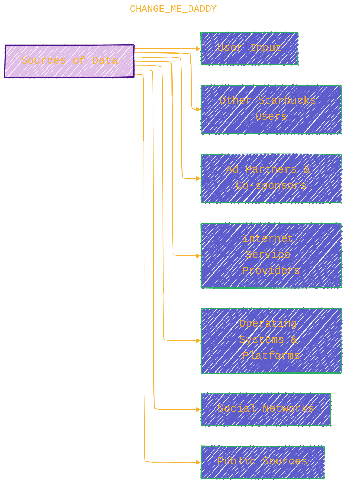
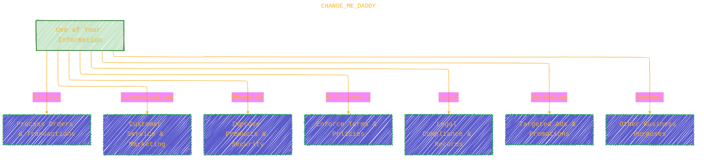
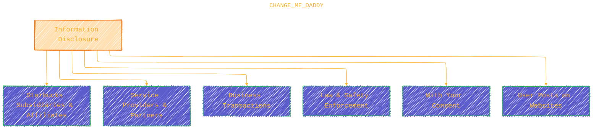

> ⚠️🏗️🚧🦺🧱🪵🪨🪚🛠️👷
> 
> This is a working draft in progress
> 
> 
>
> gif image is provided by [Giphy](https://giphy.com/gifs/spongebob-spongebob-squarepants-season-6-xT3i1dp3WjezioIadi)
> 
> ⚠️🏗️🚧🦺🧱🪵🪨🪚🛠️👷

----

# Starbucks Privacy Notice - Starbucks Coffee Company

Click to show/hide the full disclaimer.

   
> <ins>📢 **Disclaimer** 🚨</ins>
>
> This document contains my personal notes on the topic,
> compiled from publicly available documentation and various cited sources.
> The materials are intended for educational purposes (<ins>sometimes, entertainment purposes</ins>), personal study, and reference.
> The content is dual-licensed:
> 1. **MIT License:** Applies to all code implementations (Swift, Mermaid, and other programming languages).
> 2. **Creative Commons Attribution-ShareAlike 4.0 International License (CC BY-SA 4.0):** Applies to all non-code content, including text, explanations, diagrams, and illustrations.

---

## Starbucks Privacy Notice - Visual & Mathematical Concept Summary ☕🔐

This document summarizes the Starbucks Privacy Notice, including its data collection, usage, privacy rights, disclosure practices, security measures, and participation in the Data Privacy Framework. Below, I provide **diagrams** and **mathematical notations** to effectively capture all the core principles, concepts, and complexities in the notice in a visually engaging and precise format.

---

### 🌐 1. **Applicability And Scope**: Services & Third Parties Relationship

*Note:* Starbucks is **not responsible** for linked third-party sites' policies.

---

### 📋 2. **Information Categories Collected**

---

### 📊 3. **Data Sources**

- Directly from users (forms, interactions).
- Other users (gifts, shared orders).
- Advertising partners, co-sponsors.
- ISPs, analytic providers.
- Operating systems/platforms.
- Social networks.
- Publicly available sources.

---

### 🌀 4. **Use Cases for Collected Data**

#### Starbucks uses data for functions such as

- Service Provisioning
- Customer Communication
- Research & Development
- Terms & Policies Enforcement
- Legal Compliance
- Targeted Advertising
- Consent-based purposes

---

### 🔁 5. **Information Sharing and Disclosure**

#### Starbucks may share information for purposes such as

- Internal sharing within affiliates.
- Service Providers & Business Partners.
- Business Transactions (mergers, acquisitions).
- Lawful requests and safety reasons.
- With your consent.
- User-generated content on websites.

---

### 🍪 6. **Cookies & Web Technologies**

Starbucks uses:

- Web Beacons: Track page visits, emails.
- JavaScript: Functional speed and usage monitoring.
- Entity Tags: Browser caching validation.
- HTML5 local storage: Persistent client-side data.

**Uses:**

- Service functionality.
- Performance monitoring (non-identifiable).
- User convenience.
- Marketing personalization.

---

### 🛡️ 7. **Data Protection**

- Starbucks employs reasonable technical, physical, administrative safeguards.
- No 100% guarantee due to internet's inherent risks.
- Users responsible for device & password security.

---

### ⏳ 8. **Data Retention**

- Data retained only as necessary for service and legal compliance.
- Stored on servers worldwide.
- Transfers protected with safeguards in compliance with law.

---

### 👶 9. **Children's Privacy**

- Not intended for under 13.
- Does not knowingly collect/dispatch info of children 13 to 16.

---

### 📶 10. **Starbucks Wi-Fi**

- Available in stores, subject to separate terms of use.

---

### 🎛️ 11. **Privacy Choices & Rights**

| Choice Type                  | Description                                                                                                          |
|-----------------------------|----------------------------------------------------------------------------------------------------------------------|
| Location Services            | Enable/disable location permissions to customize services and marketing.                                            |
| Voice Ordering              | Enable microphone/speech recognition permissions.                                                                    |
| Email & Notifications        | Opt-in or opt-out of marketing communications.                                                                       |
| Text Messages               | Consent and opt-out options for marketing texts.                                                                     |
| Data Access, Correction, Deletion | Rights to access or delete personal data, subject to verification and exceptions.                                     |
| Opt-out of targeted advertising | Available through links and browser signals.                                                                        |
| Appeals                     | Right to appeal data handling decisions.                                                                              |

---

### 📈 12. **Privacy Metrics (Jan-Dec 2024)**

| Metric            | Number     | Completed | Not Completed | Average Time (days) |
|-------------------|------------|-----------|---------------|---------------------|
| Right to Know      | 1,237      | 463       | 760           | 7                   |
| Right to Delete    | 3,513      | 1,948     | 1,514         | 11                  |

(*Incomplete requests due to verification issues, duplicates, or no data found.*)

---

### 💳 13. **Starbucks® Rewards Privacy**

- Collects similar personal info to provide Rewards program benefits.
- Sharing with partners like delivery companies.
- Participation is voluntary.
- Withdrawal deletes rewards and ends benefits.
- No monetary value assigned to information collected.
- Supports marketing and customer loyalty.

---

### ⚖️ 14. **Participation In Data Privacy Framework (DPF)**

#### Framework Compliance

- EU-U.S. DPF
- UK Extension to EU-U.S. DPF
- Swiss-U.S. DPF

**Features:**

- Certified by U.S. Dept of Commerce.
- Governs data transfer from EU, UK, Switzerland.
- Federal Trade Commission enforces compliance.
- Unresolved disputes referred to TRUSTe.
- Arbitration available for unresolved complaints.

Strict adherence to **DPF Principles** ensures:

- Transparency
- Accountability
- Security in cross-border data flow

---

### 📞 15. **Contact Information**

Country | Entity Name | Contact Info
--- | --- | ---
Canada | Starbucks Corporation (Canada) | 800-Starbuc (782-7282)
France | Starbucks Coffee France SAS | +33 01 44 76 72 00
Germany | AmRest Coffee Deutschland Sp. Z oo & Co. KG | +49 (0) 89.551.555.990
U.K. | Starbucks Coffee Company (UK) Limited | +44 333 005 0449
U.S. | Starbucks Reserve | 800-Starbuc (782-7282)

(**Contact Email:** [privacy@starbucks.com](https://www.starbucks.com/terms/privacy-notice/))

---

## Mathematical & Formal Notations Summary

---

### ✨ Data Minimization and Limited Use Principle

Let \( D \) denote the personal data collected, and let \( P \) be the set of permitted purposes.

$$
\text{Data Minimization: } \quad |D| \to \min \quad \text{subject to} \quad \forall p \in P, \ D_p \subseteq D
$$

Where \( D_p \) is the subset of data used for purpose \( p \), ensuring only data strictly necessary for \( p \) is collected/used.

---

### 📊 Privacy Rights Metric — Completion Rate

For a metric \( M \), requests received \( R \), requests completed \( C \), and average days \( T \):

$$
\text{Completion Rate} = \frac{C}{R} \times 100\%, \quad \text{Average Time} = T \, \text{days}
$$

E.g., Right to Know:

$$
R = 1237, \quad C = 463, \quad \Rightarrow \quad \text{Completion Rate} = \frac{463}{1237} \approx 37.4\%
$$

---

### 🔒 Security Risk Model (Conceptual)

Let \( L \) denote likelihood of breach, \( S \) the strength of security controls, then residual risk \( R \):

$$
R = L \times (1 - S), \quad 0 \leq S \leq 1, \quad 0 \leq R \leq 1
$$

The document admits \( S < 1 \), so \( R > 0 \), meaning no guaranteed perfect security.

---

## 🌟 Summary of Key Points from Starbucks Privacy Notice

| Topic                  | Summary                                                                                   | Link/Reference                                                          |
|------------------------|-------------------------------------------------------------------------------------------|------------------------------------------------------------------------|
| Applicability          | Applies to Starbucks websites, apps, stores, etc., excluding third-party sites.           | [Privacy Notice #1](https://www.starbucks.com/terms/privacy-notice/#applicability-and-scope) |
| Data Collected         | Identifiers, financial, commercial, network activity, location, audio/visual, inferences | [Privacy Notice #3](https://www.starbucks.com/terms/privacy-notice/#information-we-collect)  |
| Data Use               | Service delivery, communication, research, compliance, marketing                        | [Privacy Notice #5](https://www.starbucks.com/terms/privacy-notice/#how-we-use-your-information) |
| Disclosure             | Shared with partners, affiliates, legal requests, consent                               | [Privacy Notice #6](https://www.starbucks.com/terms/privacy-notice/#how-we-disclose-your-information) |
| Protection             | Reasonable security measures, but no absolute guarantee                                 | [Privacy Notice #8](https://www.starbucks.com/terms/privacy-notice/#how-we-protect-your-information) |
| Retention              | Data retained only as necessary                                                        | [Privacy Notice #9](https://www.starbucks.com/terms/privacy-notice/#retention)                 |
| User Rights            | Access, correction, deletion, opt-out of marketing, appeals                             | [Privacy Notice #12](https://www.starbucks.com/terms/privacy-notice/#your-choices-rights)     |
| Rewards Program        | Operates with similar data, voluntary participation, data-driven loyalty               | [Privacy Notice #13](https://www.starbucks.com/terms/privacy-notice/#notice-of-financial-incentive) |
| Data Privacy Framework | Starbucks complies with EU-US DPF, UK DPF, Swiss DPF                                  | [Privacy Notice #15](https://www.starbucks.com/terms/privacy-notice/#participation-in-the-privacy-shield-frameworks) |

---

## References

- Starbucks Privacy Notice - Official: <https://www.starbucks.com/terms/privacy-notice/>
- EU-U.S. Data Privacy Framework: <https://www.dataprivacyframework.gov/>
- TRUSTe Dispute Resolution: <https://feedback-form.truste.com/watchdog/request>
- Consumer Health Data Privacy Notice for WA and NV: <https://www.starbucks.com/consumer-health-data-privacy-notice/>

-----

<!-- 

---
>**Licenses:**
>
>- **MIT License:**   - Full text in [LICENSE](LICENSE) file.
>- **Creative Commons Attribution-ShareAlike 4.0 International**: [CC BY-SA 4.0](https://creativecommons.org/licenses/by-sa/4.0/)  - Legal details in [LICENSE-CC-BY-SA-4.0](THE_PAST/LICENSE-CC-BY-SA-4.0) and at [Creative Commons official site](https://creativecommons.org/licenses/by-sa/4.0/).
>
---
