  
⚠️🏗️🚧🦺🧱🪵🪨🪚🛠️👷

  
This is a working draft in progress...

  
  <blockquote>
	  <i>gif image is provided by <a href="https://giphy.com/gifs/spongebob-spongebob-squarepants-season-6-xT3i1dp3WjezioIadi">Giphy</a></i>
     
  </blockquote>
  
⚠️🏗️🚧🦺🧱🪵🪨🪚🛠️👷

---

# arXiv License Information

Click to show/hide the full disclaimer.

   
> <ins>📢 **Disclaimer** 🚨</ins>
>
> This document contains my personal notes on the topic,
> compiled from publicly available documentation and various cited sources.
> The materials are intended for educational purposes (<ins>sometimes, entertainment purposes</ins>), personal study, and reference.
> The content is dual-licensed:
> 1. **MIT License:** Applies to all code implementations (Swift, Mermaid, and other programming languages).
> 2. **Creative Commons Attribution-ShareAlike 4.0 International License (CC BY-SA 4.0):** Applies to all non-code content, including text, explanations, diagrams, and illustrations.

----

## arXiv's Mission: A Permanent Hub for Knowledge 📚

arXiv serves as a vital repository for scholarly articles. Its core principles are:

1.  **Permanent Record**: Every article and version submitted is archived indefinitely. ⏳
2.  **Open Access**: Anyone can freely view and download articles. 🌍

To achieve this, arXiv needs permission from submitters to host and distribute their work. This is where licenses come into play!

```mermaid
---
title: "arXiv's Mission: A Permanent Hub for Knowledge 📚"
author: "Cong Le"
version: "1.0"
license(s): "MIT, CC BY-SA 4.0"
copyright: "Copyright (c) 2025 Cong Le. All Rights Reserved."
config:
  layout: elk
  theme: base
  look: handDrawn
---
%%%%%%%% Mermaid version v11.4.1-b.14
%%%%%%%% Available curve styles include the following keywords:
%% basis, bumpX, bumpY, cardinal, catmullRom, linear, monotoneX, monotoneY, natural, step, stepAfter, stepBefore.
%%{
  init: {
    'flowchart': { 'htmlLabels': true, 'curve': 'basis' },
    'fontFamily': 'American Typewriter, monospace',
    'logLevel': 'fatal',
    'themeVariables': {
      'primaryColor': '#22BB',
      'primaryTextColor': '#F8B229',
      'lineColor': '#F8B229',
      'primaryBorderColor': '#27AE60',
      'secondaryColor': '#E2F1',
      'secondaryTextColor': '#6C3483',
      'secondaryBorderColor': '#A569BD',
      'fontSize': '20px'
    }
  }
}%%
flowchart TD
    A["arXiv.org Platform"] -->|serves as| B("Permanent Scholarly Repository")
    B --> C{"Core Functions"}
    C --> C1["Archives All Submissions & Versions 💾"]
    C --> C2["Provides Free Viewing & Download for All Users 🧑‍💻👩‍🏫👨‍🎓"]

    A --> |requires for distribution| D("Submitter's Permission")
    D --> |granted via| E["License Chosen by Submitter 📝"]
    E --> F("Submitter Must Have Right to Grant License ✅")

    style A fill:#f9f2,stroke:#333,stroke-width:2px
    style B fill:#2CC2,stroke:#333,stroke-width:2px, color: #2BB
    style E fill:#2C29,stroke:#333,stroke-width:2px, color: #FFF
```

---

## The Submitter's Journey: Choosing the Right License 🚀

Selecting a license is a crucial step for any submitter. arXiv emphasizes that this choice is **irrevocable** for each version of an article. Here's the recommended process:

```mermaid
---
title: "The Submitter's Journey: Choosing the Right License 🚀"
author: "Cong Le"
version: "1.0"
license(s): "MIT, CC BY-SA 4.0"
copyright: "Copyright (c) 2025 Cong Le. All Rights Reserved."
config:
  layout: elk
  theme: base
  look: handDrawn
---
%%%%%%%% Mermaid version v11.4.1-b.14
%%%%%%%% Available curve styles include the following keywords:
%% basis, bumpX, bumpY, cardinal, catmullRom, linear, monotoneX, monotoneY, natural, step, stepAfter, stepBefore.
%%{
  init: {
    'flowchart': { 'htmlLabels': true, 'curve': 'basis' },
    'fontFamily': 'American Typewriter, monospace',
    'logLevel': 'fatal',
    'themeVariables': {
      'primaryColor': '#22BB',
      'primaryTextColor': '#F8B229',
      'lineColor': '#F8B229',
      'primaryBorderColor': '#27AE60',
      'secondaryColor': '#E2F1',
      'secondaryTextColor': '#6C3483',
      'secondaryBorderColor': '#A569BD',
      'fontSize': '20px'
    }
  }
}%%
flowchart TD
    subgraph License_Decision_Process["License Decision Process for arXiv Submissions"]
    style License_Decision_Process fill:#2CC2,stroke:#333,stroke-width:2px, color: #2BB
    direction LR
        S["Start:<br/>Prepare Submission for arXiv"] --> A("Step 1:<br/>Read & Understand Submission Terms 📖")
        A --> B("Step 2:<br/>Understand Meanings & Implications of Each License 🤔")
        B --> C("Step 3:<br/>Check Funder & Journal Policies 🏛️➡️📰")
        C --> |Use Services like| C_Tool(["Sherpa Romeo"])
        C --> D("Step 4:<br/>Consult Colleagues 💬")
        D --> E("Step 5:<br/>Remember Irrevocability & Permanence ⚠️")
        E --> F["Choose Appropriate License ✅"]
        F --> G["Submit to arXiv 🎉"]
    end

    style S fill:#3F32,stroke:#333,stroke-width:2px
    style G fill:#F2A2,stroke:#333,stroke-width:2px
    style E fill:#f21d,stroke:#333,stroke-width:2px
```

----

## Decoding the Licenses: A Visual Guide 📜

arXiv offers several licenses. For all except CC Zero, the **original copyright holder retains ownership**. arXiv encourages liberal licenses for reuse.

Let's look at the options:

---

### Creative Commons (CC) Licenses

These licenses provide a standardized way to grant public permission to share and use creative work on conditions of the author's choice.

#### 1. CC BY 4.0 (Attribution)

*   **Allows**: Distribute, Remix, Adapt, Build upon (even commercially 💰).
*   **Requires**: Attribution to the creator (BY).
*   **Visual Key**: 🧑‍🎨 ✅ | 🔄 ✅ | 🛠️ ✅ | 💼 ✅
*   *Publisher Note*: Many journals allow preprints with CC BY. Always check!

```mermaid
---
title: "CC BY 4.0 (Attribution)"
author: "Cong Le"
version: "1.0"
license(s): "MIT, CC BY-SA 4.0"
copyright: "Copyright (c) 2025 Cong Le. All Rights Reserved."
config:
  theme: base
---
%%%%%%%% Mermaid version v11.4.1-b.14
%%{
  init: {
    'fontFamily': 'American Typewriter, monospace',
    'logLevel': 'fatal',
    'mindmap': {
	    'nodeAlign': 'center',
	    'padding': 20
    },
    'themeVariables': {
      'primaryColor': '#FC82',
      'primaryTextColor': '#F8B229',
      'primaryBorderColor': '#27AE60',
      'secondaryColor': '#EBF3',
      'secondaryTextColor': '#6C3483',
      'secondaryBorderColor': '#A569BD',
      'fontSize': '20px'
    }
  }
}%%
mindmap
  root)"CC BY 4.0"(
    ::icon(fa fa-creative-commons)
    Allows))"Allows"((
      ("Distribution")
      ("Remixing")
      ("Adaptation")
      ("Building Upon")
      ("Commercial Use 💰")
    Requires))"Requires"((
      ("Attribution <br/>(BY) 🧑‍🎨")
    Ideal_for))"Ideal for"((
      ("Maximum dissemination and use")
      ("Preprints if journal agrees")
```

---

#### 2. CC BY-SA 4.0 (Attribution-ShareAlike)

*   **Allows**: Distribute, Remix, Adapt, Build upon (even commercially 💰).
*   **Requires**:
	*   Attribution to the creator (BY).
	*   Modified material must be licensed under identical terms (SA - ShareAlike 🔗).
*   **Visual Key**: 🧑‍🎨 ✅ | 🔄 ✅ | 🛠️ ✅ | 💼 ✅ | 🔗 ✅
*   *Key Point*: If you adapt it, your version must also be CC BY-SA.

```mermaid
---
title: "CC BY-SA 4.0 (Attribution-ShareAlike)"
author: "Cong Le"
version: "1.0"
license(s): "MIT, CC BY-SA 4.0"
copyright: "Copyright (c) 2025 Cong Le. All Rights Reserved."
config:
  theme: base
---
%%%%%%%% Mermaid version v11.4.1-b.14
%%{
  init: {
    'fontFamily': 'American Typewriter, monospace',
    'logLevel': 'fatal',
    'mindmap': {
	    'nodeAlign': 'center',
	    'padding': 20
    },
    'themeVariables': {
      'primaryColor': '#FC82',
      'primaryTextColor': '#F8B229',
      'primaryBorderColor': '#27AE60',
      'secondaryColor': '#EBF3',
      'secondaryTextColor': '#6C3483',
      'secondaryBorderColor': '#A569BD',
      'fontSize': '20px'
    }
  }
}%%
mindmap
  root)"CC BY-SA 4.0"(
    ::icon(fa fa-creative-commons)
    Allows))"**Allows**"((
      ("Distribution")
      ("Remixing")
      ("Adaptation")
      ("Building Upon")
      ("Commercial Use 💰")
    Requires))"**Requires**"((
      ("Attribution <br/> (BY) 🧑‍🎨")
      ("ShareAlike <br/>(SA) 🔗 <br/>- Modified material under identical terms")
    Inspired_by))"**Inspired by**"((
      ("Copyleft licenses")
```

---

#### 3. CC BY-NC-SA 4.0 (Attribution-NonCommercial-ShareAlike)

*   **Allows**: Distribute, Remix, Adapt, Build upon (Non-commercially ONLY 🚫💼).
*   **Requires**:
	*   Attribution to the creator (BY).
	*   Modified material must be licensed under identical terms (SA - ShareAlike 🔗).
*   **Visual Key**: 🧑‍🎨 ✅ | 🔄 ✅ | 🛠️ ✅ | 💼 ❌ | 🔗 ✅

```mermaid
---
title: "CC BY-NC-SA 4.0 (Attribution-NonCommercial-ShareAlike)"
author: "Cong Le"
version: "1.0"
license(s): "MIT, CC BY-SA 4.0"
copyright: "Copyright (c) 2025 Cong Le. All Rights Reserved."
config:
  theme: base
---
%%%%%%%% Mermaid version v11.4.1-b.14
%%{
  init: {
    'fontFamily': 'American Typewriter, monospace',
    'logLevel': 'fatal',
    'mindmap': {
	    'nodeAlign': 'center',
	    'padding': 20
    },
    'themeVariables': {
      'primaryColor': '#FC82',
      'primaryTextColor': '#F8B229',
      'primaryBorderColor': '#27AE60',
      'secondaryColor': '#EBF3',
      'secondaryTextColor': '#6C3483',
      'secondaryBorderColor': '#A569BD',
      'fontSize': '20px'
    }
  }
}%%
mindmap
  root))"**CC BY-NC-SA 4.0**"((
    ::icon(fa fa-creative-commons)
    Allows))"**Allows**"((
      (Distribution)
      (Remixing)
      (Adaptation)
      (Building Upon)
      (Non-Commercial Use ONLY 🚫💼)
    Requires))"**Requires**"((
      ("Attribution <br/>(BY) 🧑‍🎨")
      ("ShareAlike <br/>(SA) 🔗 <br/>- Modified material under identical terms")
```

---

#### 4. CC BY-NC-ND 4.0 (Attribution-NonCommercial-NoDerivatives)

*   **Allows**: Copy and Distribute material in unadapted form ONLY (No Derivatives 🚫🛠️), for non-commercial purposes ONLY (🚫💼).
*   **Requires**: Attribution to the creator (BY).
*   **Visual Key**: 🧑‍🎨 ✅ | 🔄 ❌ | 🛠️ ❌ | 💼 ❌
*   *Publisher Note*: Often used for "accepted manuscripts," possibly with an embargo. Check journal policies!

```mermaid
---
title: "CC BY-NC-ND 4.0 (Attribution-NonCommercial-NoDerivatives)"
author: "Cong Le"
version: "1.0"
license(s): "MIT, CC BY-SA 4.0"
copyright: "Copyright (c) 2025 Cong Le. All Rights Reserved."
config:
  theme: base
---
%%%%%%%% Mermaid version v11.4.1-b.14
%%{
  init: {
    'fontFamily': 'American Typewriter, monospace',
    'logLevel': 'fatal',
    'mindmap': {
	    'nodeAlign': 'center',
	    'padding': 20
    },
    'themeVariables': {
      'primaryColor': '#FC82',
      'primaryTextColor': '#F8B229',
      'primaryBorderColor': '#27AE60',
      'secondaryColor': '#EBF3',
      'secondaryTextColor': '#6C3483',
      'secondaryBorderColor': '#A569BD',
      'fontSize': '20px'
    }
  }
}%%
mindmap
  root)"**CC BY-NC-ND 4.0**"(
    ::icon(fa fa-creative-commons)
    Allows))"**Allows**"((
      (Copying)
      (Distribution)
      (Non-Commercial Use ONLY 🚫💼)
      ("Unadapted Form ONLY<br/>(NoDerivatives) 🚫🛠️")
    Requires))"**Requires**"((
      ("Attribution<br/>(BY) 🧑‍🎨")
    Often_used_for))"**Often used for**"((
      (Accepted Manuscripts with publisher agreement)
```

---

### arXiv.org Specific License

#### 5. arXiv.org Perpetual, non-exclusive license 1.0

  
  
  <i>Click here 👉🏼 <a href="https://arxiv.org/licenses/nonexclusive-distrib/1.0/license.html">the arXiv.org perpetual, non-exclusive license 1.0</a> to see the full text.
 

*   **Grants arXiv**: Limited rights to distribute the article.
*   **Limits Reuse**: Restricts reuse by other entities/individuals.
*   **Visual Key**: arxiv ✅ | 🌍 🔄 ⚠️
*   *Special Case*: If funders/governments require a different license not listed, authors can select this and note the other license on the first page of the article (as long as it doesn't restrict arXiv's own license).

---

### Public Domain Dedication

#### 6. CC Zero (CC0)

*   **What it is**: A public dedication tool. Creators give up their copyright.
*   **Result**: Work enters the worldwide public domain 🌐.
*   **Allows**: Reusers to distribute, remix, adapt, build upon in any medium/format with NO conditions.
*   **Visual Key**: 🧑‍🎨 💨 | 🔄 ✅ | 🛠️ ✅ | 💼 ✅ | (No strings attached!)
*   **Warning ⚠️**: You lose control of the article's copyright. This conflicts with many publishers' requirements as copyright transfer is not possible.

```mermaid
---
title: "CC Zero (CC0)"
author: "Cong Le"
version: "1.0"
license(s): "MIT, CC BY-SA 4.0"
copyright: "Copyright (c) 2025 Cong Le. All Rights Reserved."
config:
  layout: elk
  theme: base
  look: handDrawn
---
%%%%%%%% Mermaid version v11.4.1-b.14
%%%%%%%% Available curve styles include the following keywords:
%% basis, bumpX, bumpY, cardinal, catmullRom, linear, monotoneX, monotoneY, natural, step, stepAfter, stepBefore.
%%{
  init: {
    'flowchart': { 'htmlLabels': true, 'curve': 'basis' },
    'fontFamily': 'American Typewriter, monospace',
    'logLevel': 'fatal',
    'themeVariables': {
      'primaryColor': '#22BB',
      'primaryTextColor': '#F8B229',
      'lineColor': '#F8B229',
      'primaryBorderColor': '#27AE60',
      'secondaryColor': '#E2F1',
      'secondaryTextColor': '#6C3483',
      'secondaryBorderColor': '#A569BD',
      'fontSize': '20px'
    }
  }
}%%
flowchart TD
    CC0["CC Zero<br/>(Public Domain Dedication)"] --> |Creator Action| GA("Gives Up Copyright 👋")
    GA --> PD["Work Enters Worldwide Public Domain 🌍"]
    PD --> RU{"Reuser Freedoms"}
    RU --> RU1["Distribute ✅"]
    RU --> RU2["Remix ✅"]
    RU --> RU3["Adapt ✅"]
    RU --> RU4["Build Upon ✅"]
    RU --> RU5["Commercial Use ✅"]
    RU --> RU6["No Conditions Attached! 🥳"]
    CC0 --> Conflict(("Conflicts with many publisher requirements <br/> (no copyright to transfer)"))

    style CC0 fill:#F3CD,stroke:#F39C12,stroke-width:2px
    style Conflict fill:#DD21,stroke:#C0392B,stroke-width:2px
```

---

### License Features at a Glance

Here's a simplified table summarizing key permissions:

| License              | Attribution (BY) | ShareAlike (SA) | Non-Commercial (NC) | No Derivatives (ND) | Commercial Use | Right to Distribute Work | Copyright Holder Control |
| -------------------- | :--------------: | :-------------: | :-----------------: | :-----------------: | :------------: | :----------------------: | :----------------------: |
| **CC BY 4.0**        | ✅               | ➖              | ➖                  | ➖                  | ✅             | ✅                       | Retained                 |
| **CC BY-SA 4.0**     | ✅               | ✅              | ➖                  | ➖                  | ✅             | ✅                       | Retained                 |
| **CC BY-NC-SA 4.0**  | ✅               | ✅              | ✅                  | ➖                  | ❌             | ✅ (Non-Comm.)           | Retained                 |
| **CC BY-NC-ND 4.0**  | ✅               | ➖              | ✅                  | ✅                  | ❌             | ✅ (Unadapted, Non-Comm.) | Retained                 |
| **arXiv.org License**| Implied for arXiv| ➖              | Implied for others  | Implied for others  | ⚠️Generally No | ✅ (for arXiv)           | Retained                 |
| **CC Zero (CC0)**    | ➖ (Not required)| ➖              | ➖                  | ➖                  | ✅             | ✅                       | Relinquished 💨          |

*(➖ = Not a primary component of this license type, ⚠️ = Complex/conditional)*

---

## Metadata Licensing 📄

It's important to note:
A [Creative Commons CC0 1.0 Universal Public Domain Dedication](https://creativecommons.org/publicdomain/zero/1.0/) will apply to **all metadata** submitted to arXiv. This means information like title, authors, abstract, etc., is freely available.

## Copyright Considerations & Publisher PDFs ©️

*   **Copyright Ownership**: Generally, with most licenses (except CC0), the original copyright holder maintains ownership.
*   **Publisher PDFs**: PDFs obtained from publisher websites or proofs often belong to the publisher. Submitting these if they prohibit or impair arXiv's redistribution license will lead to rejection.
	*   **Permissible if**: Explicit permission for open access redistribution is given.
*   **Special Copyright Statements**: If a publisher allows upload to arXiv with a specific copyright statement, this statement should be on the **first page of the submission text**, not in the metadata.

```mermaid
---
title: "Copyright Considerations & Publisher PDFs ©️"
author: "Cong Le"
version: "1.0"
license(s): "MIT, CC BY-SA 4.0"
copyright: "Copyright (c) 2025 Cong Le. All Rights Reserved."
config:
  layout: elk
  theme: base
  look: handDrawn
---
%%%%%%%% Mermaid version v11.4.1-b.14
%%%%%%%% Available curve styles include the following keywords:
%% basis, bumpX, bumpY, cardinal, catmullRom, linear, monotoneX, monotoneY, natural, step, stepAfter, stepBefore.
%%{
  init: {
    'flowchart': { 'htmlLabels': true, 'curve': 'basis' },
    'fontFamily': 'American Typewriter, monospace',
    'logLevel': 'fatal',
    'themeVariables': {
      'primaryColor': '#22BB',
      'primaryTextColor': '#F8B229',
      'lineColor': '#F8B229',
      'primaryBorderColor': '#27AE60',
      'secondaryColor': '#E2F1',
      'secondaryTextColor': '#6C3483',
      'secondaryBorderColor': '#A569BD',
      'fontSize': '20px'
    }
  }
}%%
flowchart LR
    subgraph Copyright_Handling["Copyright Handling"]
    style Copyright_Handling fill:#2CC2,stroke:#333,stroke-width:2px, color: #2BB
        A["Original Copyright"] -->|Generally| B("Retained by Author/Original Holder")
        B -->|Exception| C["CC Zero (CC0) chosen"]
        C --> D("Author Relinquishes Copyright 💨")

        P["Publisher-Supplied PDF"] --> Q{"Has Copyright Notice?"}
        Q -- Yes --> R{"Notice Prohibits/Impairs arXiv Redistribution?"}
        R -- Yes --> S["Submission Rejected by arXiv ❌"]
        R -- "No / Explicit Permission Given" --> T["Submission Permissible ✅"]

        U["Special Copyright Statement Required by Publisher"] --> V("Place on First Page of Manuscript Text 📄")
        V --> W("Do NOT put in Metadata")
    end
    style D fill:#FBF2,stroke:#C0392B,stroke-width:1px
    style S fill:#FB21,stroke:#C0392B,stroke-width:1px
    style T fill:#F5E3,stroke:#2ECC71,stroke-width:1px
```

## Key Takeaways & Responsibilities 🔑

*   **Irrevocability**: The license chosen for each version of an article is permanent and cannot be changed.
*   **Submitter's Responsibility**: It's up to the submitter to pick the correct license considering all factors (funders, journals, personal intent).
*   **Open Access Champion**: arXiv champions open access, but recognizes diverse needs.
*   **Metadata is CC0**: All article metadata is dedicated to the public domain.

If you have questions, arXiv encourages reaching out to their [User Support team](https://info.arxiv.org/help/contact.html). For reuse queries, see their [reuse help page](https://info.arxiv.org/help/license/reuse.html).

---

<!-- 

---
>**Licenses:**
>
>- **MIT License:**   - Full text in [LICENSE](LICENSE) file.
>- **Creative Commons Attribution-ShareAlike 4.0 International**: [CC BY-SA 4.0](https://creativecommons.org/licenses/by-sa/4.0/)  - Legal details in [LICENSE-CC-BY-SA-4.0](THE_PAST/LICENSE-CC-BY-SA-4.0) and at [Creative Commons official site](https://creativecommons.org/licenses/by-sa/4.0/).
>
---

**References:**

*   arXiv. (n.d.). *License and copyright - arXiv info*. Retrieved from [https://info.arxiv.org/help/license/index.html](https://info.arxiv.org/help/license/index.html)
*   Creative Commons. (n.d.). *About CC Licenses*. Retrieved from [https://creativecommons.org/about/cclicenses/](https://creativecommons.org/about/cclicenses/)
*   Sherpa Romeo. (n.d.). *About Sherpa Romeo*. Retrieved from [https://v2.sherpa.ac.uk/romeo/about.html](https://v2.sherpa.ac.uk/romeo/about.html)

----